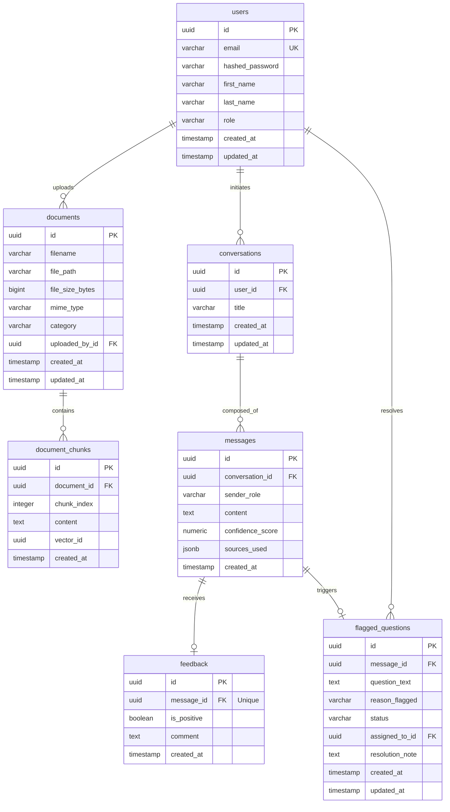
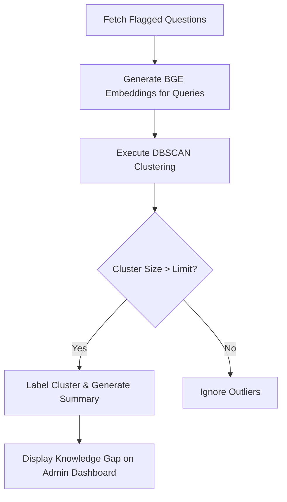
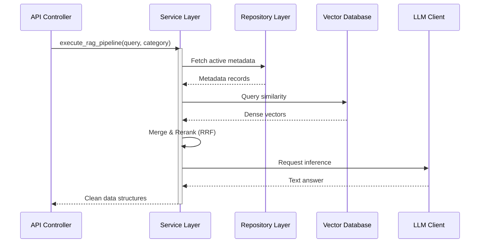
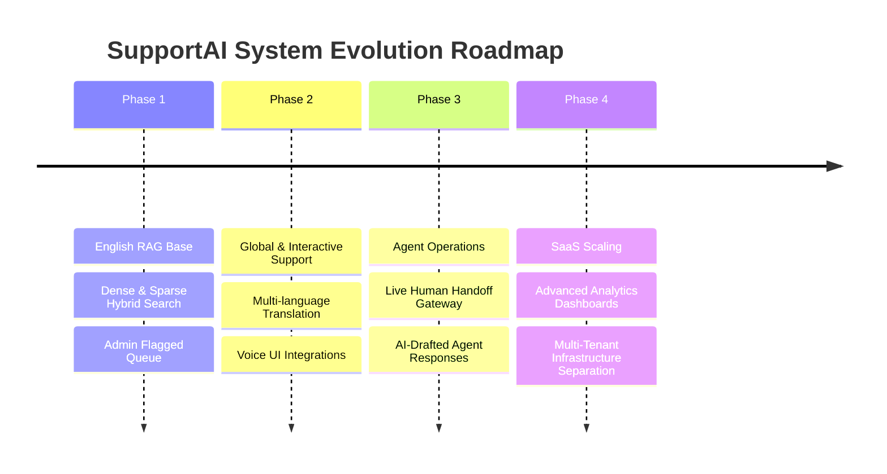

# Software Architecture Specification

**Project Name:** SupportAI – AI-Powered Customer Support Platform  
**Document Version:** 1.0.0  
**Date:** June 24, 2026  
**Status:** Approved for Technical Review  
**Target Audience:** Technical Review Board, Engineering Team, Security Auditors  

---

## Executive Summary

SupportAI is an enterprise-grade, AI-powered customer support platform designed to automate and streamline customer service operations. By utilizing Retrieval-Augmented Generation (RAG), the platform enables organizations to ingest proprietary documentation (FAQs, User Guides, Product Manuals, Policies, and Knowledge Base Articles) and serve accurate, grounded, and context-aware responses to customer queries via a ChatGPT-style interface. 

The primary business objective of SupportAI is to achieve high deflection rates of routine support tickets while maintaining a strict safety net: queries with low-confidence responses are seamlessly flagged and escalated to administrators for manual review. Administrators are equipped with dashboards to manage knowledge bases, review flagged questions, identify knowledge gaps, and audit system analytics.

To ensure production-readiness while keeping execution feasible for a small engineering team, the architecture relies on a decoupled, service-oriented structure. The tech stack utilizes React/TypeScript on the frontend, FastAPI on the backend, PostgreSQL for transactional state, Qdrant for vector search, and Llama 3.1 8B Instruct hosted on Groq for low-latency inference. This document details the architectural decisions, database schemas, data flows, security controls, and deployment strategies required to build and scale SupportAI.

---

## Table of Contents

1. [Architectural Decisions & Technical Justifications](#1-architectural-decisions--technical-justifications)
   - [1.1 Relational Database: PostgreSQL](#11-relational-database-postgresql)
   - [1.2 Vector Database: Qdrant](#12-vector-database-qdrant)
   - [1.3 Large Language Model: Llama 3.1 8B Instruct via Groq](#13-large-language-model-llama-31-8b-instruct-via-groq)
   - [1.4 Embedding Model: BGE Embeddings (bge-small-en-v1.5)](#14-embedding-model-bge-embeddings-bge-small-en-v15)
   - [1.5 Retrieval Strategy: Hybrid Search vs. Pure Vector Search](#15-retrieval-strategy-hybrid-search-vs-pure-vector-search)
   - [1.6 Backend Framework: FastAPI](#16-backend-framework-fastapi)
2. [Database Schema & Design](#2-database-schema--design)
   - [2.1 Database Schema Definition (DDL)](#21-database-schema-definition-ddl)
   - [2.2 Entity-Relationship (ER) Diagram](#22-entity-relationship-er-diagram)
3. [RAG Pipeline & Architecture](#3-rag-pipeline--architecture)
   - [3.1 Data Flow Pipeline](#31-data-flow-pipeline)
   - [3.2 System Sequence Diagram](#32-system-sequence-diagram)
4. [Search Retrieval & Analytics Engine](#4-search-retrieval--analytics-engine)
   - [4.1 BM25 Keyword Matching](#41-bm25-keyword-matching)
   - [4.2 Dense Vector Search](#42-dense-vector-search)
   - [4.3 Reciprocal Rank Fusion (RRF)](#43-reciprocal-rank-fusion-rrf)
   - [4.4 Confidence Scoring Mechanics](#44-confidence-scoring-mechanics)
   - [4.5 Knowledge Gap Detection & Clustering](#45-knowledge-gap-detection--clustering)
5. [Security Architecture](#5-security-architecture)
   - [5.1 Authentication & Authorization](#51-authentication--authorization)
   - [5.2 Data Protection & Encryption](#52-data-protection--encryption)
   - [5.3 File Ingestion Validation](#53-file-ingestion-validation)
   - [5.4 Network & API Security](#54-network--api-security)
6. [Deployment Architecture](#6-deployment-architecture)
   - [6.1 Topology Diagram](#61-topology-diagram)
   - [6.2 Component Details & Hosting Strategy](#62-component-details--hosting-strategy)
7. [Design Patterns](#7-design-patterns)
   - [7.1 Repository Pattern](#71-repository-pattern)
   - [7.2 Service Layer Pattern](#72-service-layer-pattern)
   - [7.3 Dependency Injection](#73-dependency-injection)
   - [7.4 Strategy Pattern](#74-strategy-pattern)
8. [Future Roadmap](#8-future-roadmap)

---

## 1. Architectural Decisions & Technical Justifications

### 1.1 Relational Database: PostgreSQL

The platform requires a transactional database to store core application state, user accounts, conversation threads, message logs, user feedback, and metadata about ingested documents. 

| Database Checked | Selected | Justification / Alternatives Analysis |
| :--- | :--- | :--- |
| **PostgreSQL** | **Yes** | **Chosen.** Offers strict ACID compliance, robust support for relational schemas, powerful indexing, and advanced JSONB types for semi-structured log archiving. It is highly mature, works seamlessly with SQLAlchemy/Alembic, and scales vertically to handle millions of records easily. |
| **MySQL / MariaDB** | No | Lacks equivalent JSONB query efficiency and advanced window functions required for complex analytics query generation (e.g., query trends and rolling satisfaction rates). |
| **MongoDB** | No | Document store. Inadequate for highly relational structures (such as cascading deletions of conversation history, user authentication mappings, and audit trails of flagged questions). Risk of data inconsistency without rigid schemas. |
| **SQLite** | No | Embedded database. Unsuitable for multi-user production workloads due to database-level write-locking constraints, lack of concurrent write scaling, and missing advanced analytical features. |

### 1.2 Vector Database: Qdrant

Ingested document chunks must be transformed into high-dimensional vectors and stored in a specialized index for low-latency similarity queries.

| Vector DB Checked | Selected | Justification / Alternatives Analysis |
| :--- | :--- | :--- |
| **Qdrant** | **Yes** | **Chosen.** Written in Rust, Qdrant provides exceptional search throughput, low latency, and efficient memory usage. It features robust filtering on payloads (metadata properties like category, upload timestamp, or status), has a clean REST/gRPC API, offers an official Python client, and can be run locally in Docker or hosted in Qdrant Cloud. |
| **Pinecone** | No | Proprietary SaaS-only. Introduces vendor lock-in, lacks self-hosting/local development options, and can incur higher operational costs at scale compared to open-source self-hosted or managed container alternatives. |
| **Milvus** | No | Architecturally complex. Milvus requires ZooKeeper, MinIO, Pulsar, and multiple microservice components, making it over-engineered and difficult for a small engineering team to deploy and maintain. |
| **pgvector (Postgres)** | No | Performance bottlenecks. While pgvector simplifies operations by keeping vectors in PostgreSQL, running HNSW indexes on a shared transactional DB introduces resource contention during heavy indexing workloads, impacting the responsiveness of the web app. |

### 1.3 Large Language Model: Llama 3.1 8B Instruct via Groq

Selecting the core Large Language Model requires balancing intelligence, cost, speed, and deployment effort.

| LLM Option Checked | Selected | Justification / Alternatives Analysis |
| :--- | :--- | :--- |
| **Llama 3.1 8B Instruct (via Groq)** | **Yes** | **Chosen.** Llama 3.1 8B is a state-of-the-art open-weights model optimized for instruction following and dialogue. Accessing it via Groq's LPU (Language Processing Unit) inference engine provides ultra-fast token-generation rates (typically >200 tokens/sec). This yields near-instant responses, matching proprietary models at a fraction of the cost, while keeping deployment trivial. |
| **GPT-4o / Claude 3.5 Sonnet** | No | Highly intelligent but significantly more expensive per token. For scoped RAG tasks restricted to uploaded documentation, an 8B parameters model is highly sufficient, making the cost-efficiency of GPT-4o unnecessary. |
| **Self-Hosted Llama 3.1 8B on AWS/GCP** | No | High infrastructure overhead. Running an 8B model requires expensive GPU instances (e.g., NVIDIA A10G or V100), cold-start latency management, autoscaling configuration, and dedicated ML engineer maintenance, which is impractical for a small team. |
| **Local CPU Hosting (Ollama/llama.cpp)** | No | Extremely slow response times under concurrent production workloads. Unreliable throughput and high latency. |

### 1.4 Embedding Model: BGE Embeddings (bge-small-en-v1.5)

The embedding model transforms parsed text chunks into vector embeddings. 

| Embedding Checked | Selected | Justification / Alternatives Analysis |
| :--- | :--- | :--- |
| **BAAI/bge-small-en-v1.5** | **Yes** | **Chosen.** A top-performing model on the MTEB (Massive Text Embedding Benchmark) leaderboard. It yields a compact 384-dimensional dense vector space. This small dimensionality minimizes index size and maximizes search speed in Qdrant, while the model is lightweight enough to run locally on the FastAPI backend CPU without causing GPU dependency. |
| **OpenAI text-embedding-3-small** | No | Network call latency. Generating embeddings via external API adds network latency and external cost for every query and chunk generation. BGE runs locally, ensuring zero dependency on external network speeds during indexing. |
| **bge-large-en-v1.5** | No | Generates 1024-dimensional vectors. This triples the storage requirement in the vector index and significantly slows down similarity searches while providing only negligible improvements in retrieval accuracy for standard English text. |

### 1.5 Retrieval Strategy: Hybrid Search vs. Pure Vector Search

| Retrieval Strategy | Selected | Justification / Alternatives Analysis |
| :--- | :--- | :--- |
| **Hybrid Search (Vector + BM25 + RRF)** | **Yes** | **Chosen.** Support documentation contains domain-specific terminology, part numbers, exact error codes, and unique feature names. Pure semantic search often misses these exact keyword matches, returning irrelevant context. Hybrid search executes BM25 keyword matching alongside vector similarity, merging the lists using Reciprocal Rank Fusion (RRF). This delivers optimal search precision. |
| **Pure Vector Search** | No | Prone to "hallucinatory" matching when synonyms overlap, and fails on exact alphanumeric queries (e.g., retrieving manual section for model "X-900" might return model "X-800" if they share similar surrounding text structure). |
| **Pure Keyword Search (BM25/Elastic)** | No | Lacks semantic understanding. Fails when customers phrase questions using different vocabulary from the official documentation (e.g., asking "how do I change my password" vs. the document title "Resetting User Credentials"). |

### 1.6 Backend Framework: FastAPI

The backend must serve APIs to both the React frontend and process heavy document upload streams.

| Backend Checked | Selected | Justification / Alternatives Analysis |
| :--- | :--- | :--- |
| **FastAPI** | **Yes** | **Chosen.** FastAPI is a modern, high-performance web framework for Python. Built on ASGI and Starlette, it natively supports async programming, essential for handling concurrent I/O operations (like database queries, vector DB lookups, and streaming LLM tokens). It also features built-in input validation via Pydantic and automatically generates interactive OpenAPI/Swagger documentation. |
| **Django** | No | Heavy and opinionated. Django is structured primarily around synchronous operations, and its built-in ORM lacks native async support. It introduces excessive boilerplate and component locking that is counterproductive for a decoupled API-only microservice stack. |
| **Flask** | No | Lacks built-in support for asynchronous request handling, type hinting, and automatic OpenAPI schema generation. Implementing these requires stacking third-party extensions, leading to a fragmented codebase. |
| **Node.js (Express)** | No | While highly performant for async, Node.js lacks mature, built-in numerical computing and AI integration ecosystems. Implementing chunking, embeddings parsing, and BM25 local calculation is far more complex in JS/TS than in Python. |

---

## 2. Database Schema & Design

The relational database acts as the single source of truth for administrative and application state. Below is the technical specification of the tables.

### 2.1 Database Schema Definition (DDL)

#### 2.1.1 Table: `users`
Stores user credentials and roles.
* **id:** `UUID` (Primary Key, Default: `gen_random_uuid()`)
* **email:** `VARCHAR(255)` (Unique, Indexed, Not Null)
* **hashed_password:** `VARCHAR(255)` (Not Null)
* **first_name:** `VARCHAR(100)` (Nullable)
* **last_name:** `VARCHAR(100)` (Nullable)
* **role:** `VARCHAR(50)` (Not Null, Checked constraint: `role IN ('Admin', 'Support_Agent', 'Customer')`)
* **created_at:** `TIMESTAMP WITH TIME ZONE` (Default: `CURRENT_TIMESTAMP`, Not Null)
* **updated_at:** `TIMESTAMP WITH TIME ZONE` (Default: `CURRENT_TIMESTAMP`, On Update: `CURRENT_TIMESTAMP`)

#### 2.1.2 Table: `documents`
Stores metadata of uploaded files. 
* **id:** `UUID` (Primary Key, Default: `gen_random_uuid()`)
* **filename:** `VARCHAR(255)` (Not Null)
* **file_path:** `VARCHAR(512)` (Not Null - points to storage bucket or local path)
* **file_size_bytes:** `BIGINT` (Not Null)
* **mime_type:** `VARCHAR(100)` (Not Null)
* **category:** `VARCHAR(100)` (Indexed, Default: 'General', Not Null)
* **uploaded_by_id:** `UUID` (Foreign Key -> `users(id)`, On Delete: `SET NULL`, Nullable)
* **created_at:** `TIMESTAMP WITH TIME ZONE` (Default: `CURRENT_TIMESTAMP`, Not Null)
* **updated_at:** `TIMESTAMP WITH TIME ZONE` (Default: `CURRENT_TIMESTAMP`)

#### 2.1.3 Table: `document_chunks`
Stores text chunks extracted from documents.
* **id:** `UUID` (Primary Key, Default: `gen_random_uuid()`)
* **document_id:** `UUID` (Foreign Key -> `documents(id)`, On Delete: `CASCADE`, Not Null)
* **chunk_index:** `INTEGER` (Not Null)
* **content:** `TEXT` (Not Null)
* **vector_id:** `UUID` (Not Null - Maps to the unique point ID stored in Qdrant index)
* **created_at:** `TIMESTAMP WITH TIME ZONE` (Default: `CURRENT_TIMESTAMP`, Not Null)

#### 2.1.4 Table: `conversations`
Maintains conversational sessions.
* **id:** `UUID` (Primary Key, Default: `gen_random_uuid()`)
* **user_id:** `UUID` (Foreign Key -> `users(id)`, On Delete: `CASCADE`, Nullable - allows anonymous guest chat if needed)
* **title:** `VARCHAR(255)` (Default: 'New Chat', Not Null)
* **created_at:** `TIMESTAMP WITH TIME ZONE` (Default: `CURRENT_TIMESTAMP`, Not Null)
* **updated_at:** `TIMESTAMP WITH TIME ZONE` (Default: `CURRENT_TIMESTAMP`)

#### 2.1.5 Table: `messages`
Stores individual conversation logs.
* **id:** `UUID` (Primary Key, Default: `gen_random_uuid()`)
* **conversation_id:** `UUID` (Foreign Key -> `conversations(id)`, On Delete: `CASCADE`, Not Null)
* **sender_role:** `VARCHAR(50)` (Not Null, Checked constraint: `sender_role IN ('User', 'Assistant')`)
* **content:** `TEXT` (Not Null)
* **confidence_score:** `NUMERIC(4, 3)` (Nullable - populated only for 'Assistant' messages)
* **sources_used:** `JSONB` (Nullable - stores arrays of referenced document chunk IDs and names)
* **created_at:** `TIMESTAMP WITH TIME ZONE` (Default: `CURRENT_TIMESTAMP`, Not Null)

#### 2.1.6 Table: `feedback`
Logs user interactions with AI responses.
* **id:** `UUID` (Primary Key, Default: `gen_random_uuid()`)
* **message_id:** `UUID` (Foreign Key -> `messages(id)`, On Delete: `CASCADE`, Unique, Not Null)
* **is_positive:** `BOOLEAN` (Not Null - True for Thumbs Up, False for Thumbs Down)
* **comment:** `TEXT` (Nullable - optional text feedback)
* **created_at:** `TIMESTAMP WITH TIME ZONE` (Default: `CURRENT_TIMESTAMP`, Not Null)

#### 2.1.7 Table: `flagged_questions`
Escalates queries to administrators.
* **id:** `UUID` (Primary Key, Default: `gen_random_uuid()`)
* **message_id:** `UUID` (Foreign Key -> `messages(id)`, On Delete: `SET NULL`, Nullable)
* **question_text:** `TEXT` (Not Null)
* **reason_flagged:** `VARCHAR(100)` (Not Null, e.g., 'LOW_CONFIDENCE', 'USER_DISLIKE', 'UNANSWERED')
* **status:** `VARCHAR(50)` (Default: 'Pending', Not Null, Checked constraint: `status IN ('Pending', 'Reviewed', 'Resolved')`)
* **assigned_to_id:** `UUID` (Foreign Key -> `users(id)`, On Delete: `SET NULL`, Nullable)
* **resolution_note:** `TEXT` (Nullable)
* **created_at:** `TIMESTAMP WITH TIME ZONE` (Default: `CURRENT_TIMESTAMP`, Not Null)
* **updated_at:** `TIMESTAMP WITH TIME ZONE` (Default: `CURRENT_TIMESTAMP`)

---

### 2.2 Entity-Relationship (ER) Diagram



---

## 3. RAG Pipeline & Architecture

### 3.1 Data Flow Pipeline

The RAG architecture is split into two primary pipelines: the **Ingestion Pipeline** (executed when administrators upload knowledge documents) and the **Retrieval & Generation Pipeline** (executed when users ask questions).

#### Ingestion Pipeline
1. **Document Upload:** The Admin uploads a PDF or TXT file through the admin interface.
2. **Validation:** The backend validates file format, size, and MIME-type.
3. **Parsing:** A text extractor (e.g., PyPDF2 or custom text parser) extracts raw characters and cleans white spaces.
4. **Chunking:** The parsed text is split using a `RecursiveCharacterTextSplitter`. Text is chunked with a target chunk size of 500 characters and a 10% overlap (50 characters) to ensure contextual continuity at boundaries.
5. **Embedding Generation:** Each text chunk is passed through the local `BGE-small` model instance, creating a 384-dimensional dense vector representing the semantic content.
6. **Relational Storage:** The metadata is logged in PostgreSQL (`documents` and `document_chunks` tables).
7. **Vector Indexing:** The generated embeddings are upserted into Qdrant alongside a payload containing the `chunk_id`, `document_id`, `category`, and the raw text string.

#### Retrieval & Generation Pipeline
1. **Query Ingestion:** The customer submits a question through the chat interface.
2. **Parallel Retrieval:**
   - **BM25 Search:** The FastAPI backend executes a local BM25 keyword search across all `document_chunks` related to the specified category scope.
   - **Dense Vector Search:** The query is embedded via `BGE-small`, and Qdrant is queried to retrieve the top 10 most semantically similar vectors.
3. **Reranking (Reciprocal Rank Fusion - RRF):** The rankings from BM25 and Vector Search are unified. Chunks are sorted by their RRF score.
4. **Context Construction:** The top $K$ chunks (typically 3 to 5) that exceed a minimum confidence threshold are retrieved.
5. **Prompt Synthesis:** A structured system prompt is built, embedding the retrieved document chunks as grounded context alongside the user's query:
   ```text
   System: You are SupportAI, an assistant that answers questions using ONLY the provided contexts.
   If the context does not contain the answer, reply: "I am sorry, but I do not have enough information to answer that question."
   Context:
   ---
   [Context 1]
   ---
   [Context 2]
   
   User: [User Query]
   ```
6. **LLM Generation:** The context and query are transmitted to the Llama 3.1 8B model via Groq's high-speed API.
7. **Post-processing & Confidence Scoring:** The API response is parsed. A final confidence score is generated based on retrieval metrics. If the confidence falls below a configured threshold (e.g., 0.65), the question is escalated to `flagged_questions` in PostgreSQL, while the assistant returns a graceful response.
8. **Client Rendering:** The answer, confidence score, source attributions, and feedback toggles are returned to the React frontend.

---

### 3.2 System Sequence Diagram

```mermaid
sequenceDiagram
    autonumber
    actor Customer as Customer / Admin
    participant FE as React Frontend
    participant BE as FastAPI Backend
    database DB as PostgreSQL DB
    database VDB as Qdrant Vector DB
    participant Groq as Groq (Llama 3.1)

    %% INGESTION WORKFLOW
    Note over Customer, VDB: Administrative Ingestion Pipeline
    Customer->>FE: Upload Document (PDF/TXT)
    FE->>BE: POST /api/v1/admin/documents
    activate BE
    BE->>BE: Validate File & Parse Text
    BE->>BE: Chunk Text (Recursive Splitter)
    BE->>BE: Generate Vector Embeddings (BGE-small)
    BE->>DB: INSERT into documents & document_chunks
    BE->>VDB: Upsert Vectors & Chunk Payload
    BE-->>FE: Return Upload Success Status
    deactivate BE
    FE-->>Customer: Display Ingestion Status

    %% QUERY WORKFLOW
    Note over Customer, Groq: Customer Query & RAG Pipeline
    Customer->>FE: Input Query "How do I..."
    FE->>BE: POST /api/v1/chat/message
    activate BE
    BE->>DB: Record User Message
    
    par Keyword Search
        BE->>DB: Fetch Candidate Chunks for BM25
        DB-->>BE: Return BM25 Scores
    and Semantic Search
        BE->>BE: Embed Query with BGE-small
        BE->>VDB: Query Vector Similarity
        VDB-->>BE: Return Similar Vectors + Scores
    end

    BE->>BE: Execute Reciprocal Rank Fusion (RRF)
    BE->>BE: Filter Chunks & Synthesize Prompt
    BE->>Groq: Request LLM Completion (Context + Prompt)
    activate Groq
    Groq-->>BE: Return Grounded Response Text
    deactivate Groq

    BE->>BE: Calculate Final Confidence Score
    alt Confidence < Threshold (0.65)
        BE->>DB: INSERT into flagged_questions
    end

    BE->>DB: Record Assistant Message & Attributions
    BE-->>FE: Return AI Response, Confidence, and Sources
    deactivate BE
    FE-->>Customer: Render Message & Feedback UI
```

---

## 4. Search Retrieval & Analytics Engine

The retrieval process sits at the core of SupportAI. In order to handle both structured product specifications and unstructured natural language queries, the system implements a production-grade Hybrid Search engine.

### 4.1 BM25 Keyword Matching

BM25 (Best Matching 25) is a probabilistic retrieval function that ranks document chunks based on the query terms appearing in each chunk, regardless of their semantic similarity.

The score for a document chunk $D$ given a query $Q$ (containing terms $q_1, q_2, \dots, q_n$) is calculated as:

$$\text{score}(D, Q) = \sum_{i=1}^{n} \text{IDF}(q_i) \cdot \frac{f(q_i, D) \cdot (k_1 + 1)}{f(q_i, D) + k_1 \cdot \left(1 - b + b \cdot \frac{|D|}{\text{avgdl}}\right)}$$

Where:
* $f(q_i, D)$ is the term frequency of $q_i$ in chunk $D$.
* $|D|$ is the length of the chunk in words.
* $\text{avgdl}$ is the average chunk length across the entire database.
* $k_1$ is a tuning parameter controlling term frequency scaling (configured to $1.2$).
* $b$ is a tuning parameter controlling document length normalization (configured to $0.75$).

The Inverse Document Frequency $\text{IDF}(q_i)$ is defined as:

$$\text{IDF}(q_i) = \ln \left( \frac{N - n(q_i) + 0.5}{n(q_i) + 0.5} + 1 \right)$$

Where $N$ is the total number of document chunks in the system, and $n(q_i)$ is the number of chunks containing term $q_i$.

*Implementation Note:** BM25 calculations run locally in the FastAPI service using an in-memory index built dynamically (or periodically cached) for the active documents. This avoids the cost of deploying a full Elasticsearch cluster.

---

### 4.2 Dense Vector Search

Dense vector search measures the conceptual similarity between the query and the document chunks.
1. The user's query $Q$ is converted into a 384-dimensional dense vector $\mathbf{v}_Q$ using BGE-small.
2. Qdrant performs an approximate nearest neighbor (ANN) search using the HNSW (Hierarchical Navigable Small World) index.
3. The similarity metric is **Cosine Similarity**, defined as:

$$\text{sim}(\mathbf{v}_Q, \mathbf{v}_D) = \frac{\mathbf{v}_Q \cdot \mathbf{v}_D}{\|\mathbf{v}_Q\| \|\mathbf{v}_D\|}$$

---

### 4.3 Reciprocal Rank Fusion (RRF)

To combine the strengths of BM25 and Vector Search, we implement Reciprocal Rank Fusion (RRF). RRF relies on the ranks of the returned items rather than their raw scores, avoiding the challenge of calibrating and normalizing scores across entirely different distributions.

The RRF score for a chunk $d$ is:

$$\text{RRF\_Score}(d \in D) = \sum_{m \in M} \frac{1}{k + r_m(d)}$$

Where:
* $M$ is the set of retrieval methods (in our case, $M = \{\text{BM25}, \text{Vector}\}$).
* $r_m(d)$ is the rank of chunk $d$ in the output of retrieval method $m$ (1-indexed). If a chunk does not appear in a method's top results, $r_m(d) \to \infty$, contributing $0$ to the sum.
* $k$ is a constant smoothing parameter (configured to $60$), which prevents high-ranking items from disproportionately dominating the fused results.

```text
Example RRF Aggregation:
Query: "Model X-900 battery duration"
BM25 Top 3 results:       [Chunk A (Rank 1), Chunk B (Rank 2), Chunk C (Rank 3)]
Vector Top 3 results:     [Chunk B (Rank 1), Chunk D (Rank 2), Chunk A (Rank 3)]

Calculating RRF scores (with k = 60):
- Chunk A: 1/(60+1) [BM25] + 1/(60+3) [Vector] = 0.01639 + 0.01587 = 0.03226
- Chunk B: 1/(60+2) [BM25] + 1/(60+1) [Vector] = 0.01612 + 0.01639 = 0.03251 (Winner)
- Chunk C: 1/(60+3) [BM25] + 0 = 0.01587
- Chunk D: 0 + 1/(60+2) [Vector] = 0.01612
```

---

### 4.4 Confidence Scoring Mechanics

To prevent the LLM from hallucinating answers when no relevant information is present in the database, the system computes a **Message Confidence Score** ($CS$).

$$CS = w_{\text{sim}} \cdot \bar{S}_{\text{top}} + w_{\text{RRF}} \cdot \left( \frac{\text{RRF}(d_1)}{\text{RRF}_{\text{max}}} \right)$$

Where:
* $\bar{S}_{\text{top}}$ is the average cosine similarity of the top 3 chunks returned by Qdrant.
* $\text{RRF}(d_1)$ is the rank-fusion score of the top-ranked chunk.
* $\text{RRF}_{\text{max}}$ is the maximum possible RRF score ($2 / (k+1) \approx 0.0327$ for two methods).
* $w_{\text{sim}}$ and $w_{\text{RRF}}$ are weights balancing the two metrics (configured to $w_{\text{sim}} = 0.70$ and $w_{\text{RRF}} = 0.30$).

**Escalation Logic:**
* **$CS \ge 0.65$:** System proceeds with generating the RAG response.
* **$0.50 \le CS < 0.65$:** System responds using the LLM but flags the message as `LOW_CONFIDENCE`, automatically adding it to the administrator queue for validation.
* **$CS < 0.50$:** The system bypasses LLM generation to prevent hallucinations, responds with a generic fallback message ("*I'm sorry, I cannot find relevant information in the documentation. I have escalated this query to our support team.*"), and writes an entry into the `flagged_questions` table with `reason_flagged = 'UNANSWERED'`.

---

### 4.5 Knowledge Gap Detection & Clustering

To assist administrators in continuously improving the knowledge base, the platform runs a nightly **Knowledge Gap Detection** pipeline:



1. **Extraction:** The system fetches all queries logged in the `flagged_questions` table with status `Pending` within the last 30 days.
2. **Embedding:** The raw questions are converted to embeddings.
3. **Clustering:** A DBSCAN (Density-Based Spatial Clustering of Applications with Noise) algorithm is executed on the vectors. Cosine distance is used as the metric, with parameters:
   - $\epsilon = 0.15$ (maximum distance between two points to be considered neighbors).
   - $\text{MinPoints} = 5$ (minimum cluster size).
4. **Knowledge Gap Synthesis:** For each generated cluster, the system identifies the centroid (the most representative customer question) and calls Llama 3.1 via Groq to summarize the shared topic of the cluster. This summary is logged as a "Knowledge Gap Topic" on the administrator dashboard, pointing to the exact documentation category that needs to be updated.

---

## 5. Security Architecture

SupportAI implements a zero-trust model at the API layer to protect proprietary corporate data and customer information.

### 5.1 Authentication & Authorization

* **JWT Authentication:** The system uses standard JSON Web Tokens (JWT) for session management.
  - Algorithms: `HS256` for signing.
  - Expiration: Access tokens expire in 15 minutes; Refresh tokens are securely stored in HTTP-only, SameSite cookies with a 7-day expiration.
* **Password Hashing:** Passwords stored in `users` are hashed using the `bcrypt` algorithm with a work factor of 12 rounds.
* **Role-Based Access Control (RBAC):** Every API endpoint is decorated with dependency-based role requirements.

| API Endpoint | Category | Customer Permission | Support Agent Permission | Admin Permission |
| :--- | :--- | :--- | :--- | :--- |
| `GET /api/v1/chat/*` | Chat | Read/Write (Self) | Read/Write (Self) | Read/Write (All) |
| `POST /api/v1/feedback` | Chat | Write (Self) | Write (Self) | Read/Write (All) |
| `GET /api/v1/admin/dashboard` | Admin | Denied | Read-Only | Read/Write |
| `POST /api/v1/admin/documents` | Admin | Denied | Denied | Read/Write |
| `DELETE /api/v1/admin/documents/*`| Admin | Denied | Denied | Read/Write |
| `PATCH /api/v1/admin/flagged/*` | Admin | Denied | Read/Write | Read/Write |

---

### 5.2 Data Protection & Encryption

* **Encryption in Transit:** All traffic is forced over HTTPS using TLS 1.3.
* **Encryption at Rest:**
  - PostgreSQL database storage is encrypted at rest using AES-256.
  - Qdrant Cloud indexes are stored on encrypted block volumes.
* **Database Isolation:** PostgreSQL row-level security (RLS) policies restrict users to reading only their own conversations, preventing horizontal privilege escalation.

### 5.3 File Ingestion Validation

Admin file uploads represent a major attack vector (e.g., malware or denial of service through oversized files).
* **MIME-Type Whitelisting:** The server inspects the magic byte signature of files (not just the extension) to ensure that only `application/pdf` and `text/plain` are accepted.
* **Size Limitations:** File size is strictly capped at **10MB** per upload.
* **Sanitization:** To prevent PDF exploits, parsing libraries are executed within isolated sandbox environments (Docker container runtimes with restricted system privileges).
* **Filename Cleansing:** All uploaded filenames are stripped of non-alphanumeric characters and renamed using UUIDs on disk to prevent path traversal attacks (e.g., `../../etc/passwd`).

### 5.4 Network & API Security

* **Rate Limiting:** Protects endpoints from brute-force attacks and abuse.
  - Chat endpoint: Max 30 requests per minute per IP.
  - Upload endpoint: Max 10 requests per minute per Admin.
* **Input Validation:** Every endpoint uses Pydantic models to strictly enforce type constraints, preventing buffer overflows and SQL injection. SQLAlchemy's parameterized queries are strictly used, neutralizing SQL-i vulnerabilities.
* **CORS Policies:** Configured with strict origin constraints, allowing API requests only from verified domain names. Wildcard origins (`*`) are disallowed.

---

## 6. Deployment Architecture

To support a small engineering team, the deployment architecture leverages fully managed PaaS and SaaS offerings that scale horizontally while minimizing maintenance overhead.

### 6.1 Topology Diagram

```mermaid
graph TB
    subgraph ClientZone [Client Browser]
        SPA["React SPA (Vite)"]
    end

    subgraph CDN [Vercel Edge Network]
        SPA_Host["Static Content Hosting / CDN"]
    end

    subgraph ApplicationZone [Railway PaaS Cloud]
        API["FastAPI Backend (Docker Container)"]
        PostgresDB["PostgreSQL Instance"]
    end

    subgraph ManagedSaaS [SaaS Providers]
        Qdrant["Qdrant Cloud (Managed Vector DB)"]
        Groq["Groq API (LPU Inference Engine)"]
    end

    SPA -->|HTTPS / API Requests| SPA_Host
    SPA_Host --> SPA
    SPA -->|REST API over TLS 1.3| API
    
    API -->|SQL queries / SQLAlchemy| PostgresDB
    API -->|REST/gRPC calls| Qdrant
    API -->|REST HTTPS (Model Inferences)| Groq
```

---

### 6.2 Component Details & Hosting Strategy

1. **Frontend Hosting (Vercel):**
   - The React single-page application is compiled via Vite and deployed to Vercel.
   - Global CDN deployment reduces load times.
   - Uses Vercel's built-in Edge middleware to route API requests securely.
2. **Backend Application Server (Railway):**
   - The FastAPI backend is packaged as a Docker container.
   - Deployed on Railway with automatic scaling.
   - Configured with environment-based health checks to handle automatic container failover.
3. **Transactional Database (Railway Postgres Add-on):**
   - Railway manages a dedicated PostgreSQL instance.
   - Automatic nightly backups with point-in-time recovery (PITR).
   - Configured with connection pooling (using connection scaling limits in FastAPI) to prevent database starvation under spike loads.
4. **Vector DB Index (Qdrant Cloud):**
   - Hosted on Qdrant's managed SaaS platform.
   - Isolated cluster configuration with automated index backups and security patches.
5. **Inference Execution (Groq Cloud):**
   - Leverages Groq's API key management.
   - Outsources GPU scaling, cold starts, and token billing management.

---

## 7. Design Patterns

To maintain a clean, maintainable, and testable codebase, the FastAPI backend implements four classic enterprise design patterns.

### 7.1 Repository Pattern

The Repository Pattern separates the domain model from data-access logic. Instead of calling SQLAlchemy queries directly inside API route handlers, all database operations are encapsulated in Repository classes.

* **Usage:** A `ConversationRepository` manages CRUD operations for conversations, and a `DocumentRepository` handles database insertions for documents.
* **Benefits:** Handlers remain database-agnostic. Unit tests can mock the repository layers using in-memory arrays without connecting to a live PostgreSQL database.

```python
# Conceptual Implementation
class ConversationRepository:
    def __init__(self, db_session: Session):
        self.db = db_session

    def get_by_id(self, conversation_id: UUID) -> Optional[Conversation]:
        return self.db.query(Conversation).filter(Conversation.id == conversation_id).first()

    def create(self, user_id: UUID, title: str) -> Conversation:
        conversation = Conversation(user_id=user_id, title=title)
        self.db.add(conversation)
        self.db.commit()
        return conversation
```

---

### 7.2 Service Layer Pattern

The Service Layer acts as a transaction boundary and orchestrates business logic. API controllers only handle incoming requests, validate payloads, and call the service layer.

* **Usage:** The `RAGService` orchestrates document fetching, vector search, RRF execution, prompt assembly, and Groq API calls.
* **Benefits:** Prevents "Fat Controllers" and keeps business logic reusable. The same `RAGService` can be invoked by a REST API endpoint or a CLI management command.



---

### 7.3 Dependency Injection

Dependency Injection (DI) passes dependent objects into a class or function rather than letting the class instantiate them internally.

* **Usage:** FastAPI's `Depends` system injected into route endpoints.
* **Benefits:** Facilitates testing. During tests, the PostgreSQL session database dependency can be swapped with a mock or SQLite instance, and the security checker dependency can be mocked to simulate admin sessions.

```python
# API Route utilizing Dependency Injection
@router.post("/chat/message", response_model=MessageResponse)
async def send_message(
    payload: MessageCreateSchema,
    rag_service: RAGService = Depends(get_rag_service),
    current_user: User = Depends(get_current_active_user)
):
    return await rag_service.process_user_query(payload.conversation_id, payload.content, current_user.id)
```

---

### 7.4 Strategy Pattern

The Strategy Pattern defines a family of algorithms, encapsulates each one, and makes them interchangeable at runtime.

* **Usage:** Swappable retrieval strategies. The system defines a base `RetrievalStrategy` interface with concrete implementations: `VectorRetrievalStrategy`, `BM25RetrievalStrategy`, and `HybridRetrievalStrategy`.
* **Benefits:** Enables administrators to change the retrieval algorithm via configuration without modifying the core codebase. It also simplifies running A/B tests on different search algorithms.

```python
from abc import ABC, abstractmethod

class RetrievalStrategy(ABC):
    @abstractmethod
    def retrieve(self, query: str, limit: int) -> list[DocumentChunk]:
        pass

class HybridRetrievalStrategy(RetrievalStrategy):
    def retrieve(self, query: str, limit: int) -> list[DocumentChunk]:
        # Implement BM25 + Vector + RRF
        pass
```

---

## 8. Future Roadmap

While the initial version focuses on delivering a reliable English-language RAG pipeline, the system's design accommodates the following high-priority roadmap capabilities:



* **Multi-language Support:** Integration of multilingual embedding models (e.g., `Cohere Multilingual` or `mBERT`) along with machine-translation middleware to allow customers to query documentation and receive responses in their native languages.
* **Voice Support:** Adding WebRTC voice channels to the frontend, utilizing OpenAI Whisper for speech-to-text input and ElevenLabs or Cartesia for low-latency text-to-speech output.
* **Live Human Handoff:** Implementing WebSockets to route conversations to live customer support agents via a shared inbox when confidence scores remain low or when requested by the customer.
* **AI-Drafted Agent Responses:** Equipping agent dashboards with an AI copilot that drafts response suggestions based on historical tickets and private internal wikis.
* **Advanced Analytics:** Building deep business intelligence dashboards tracking average resolution times, ROI metrics (ticket deflection cost savings), and customer satisfaction trends over time.
* **Multi-Tenant SaaS Support:** Refactoring the database schema to support logical separation of data using a tenant identifier (`tenant_id`), enabling SupportAI to be sold as a multi-tenant subscription software service.
