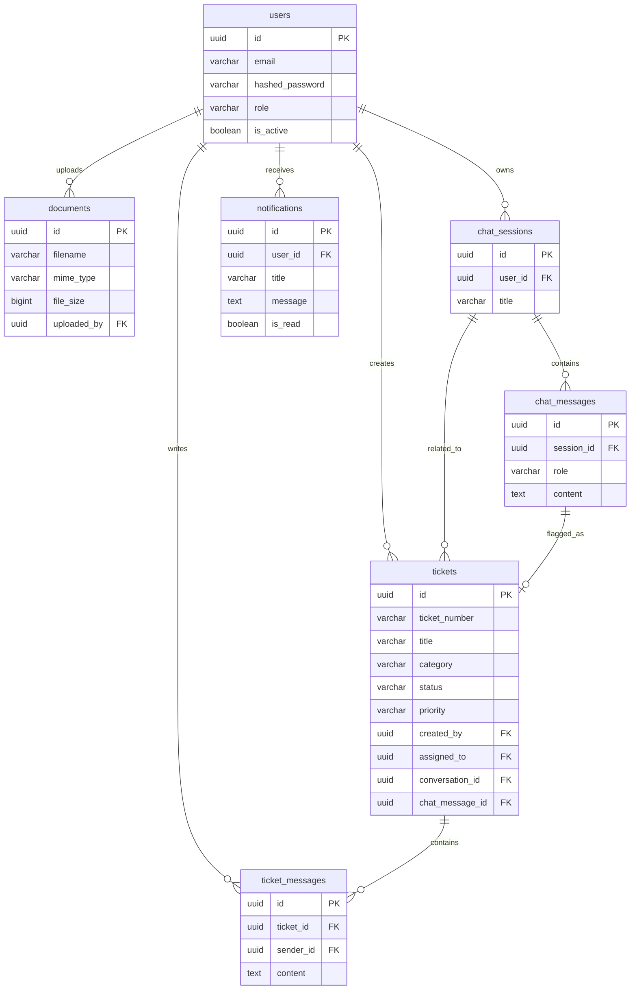
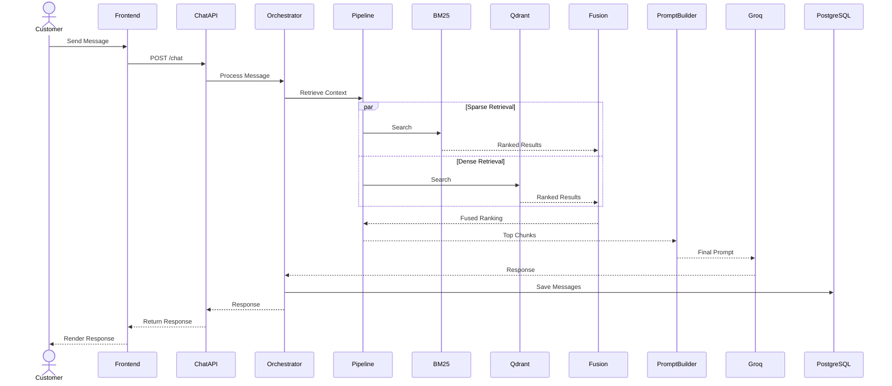
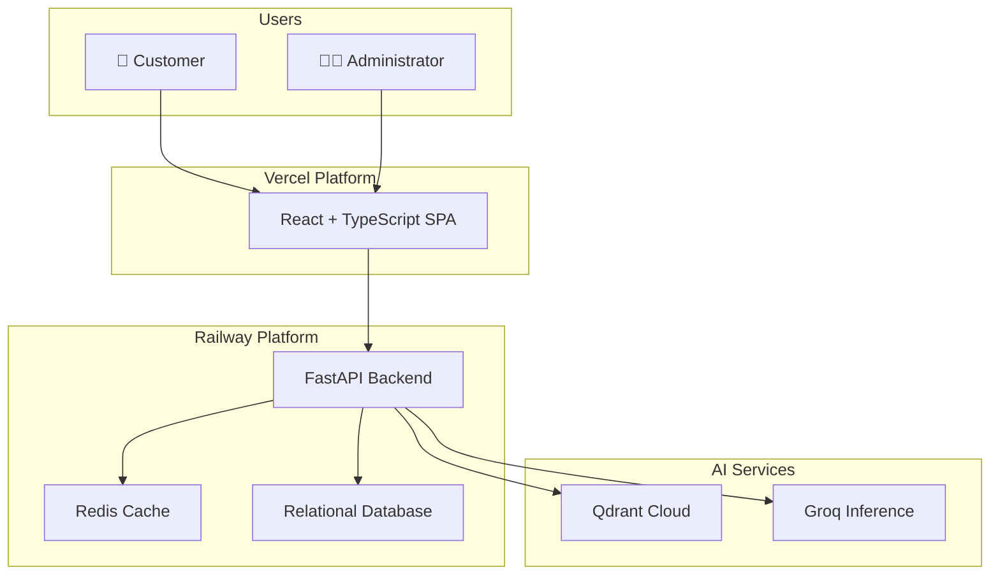
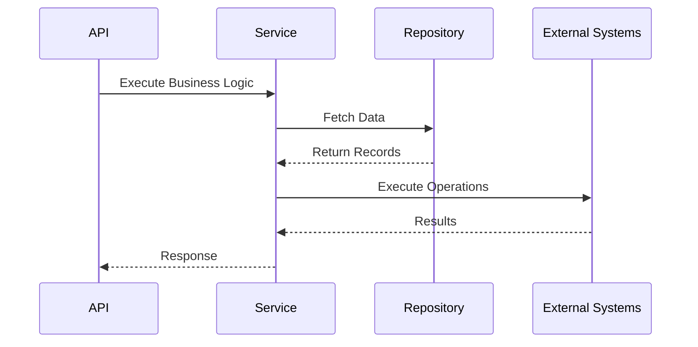
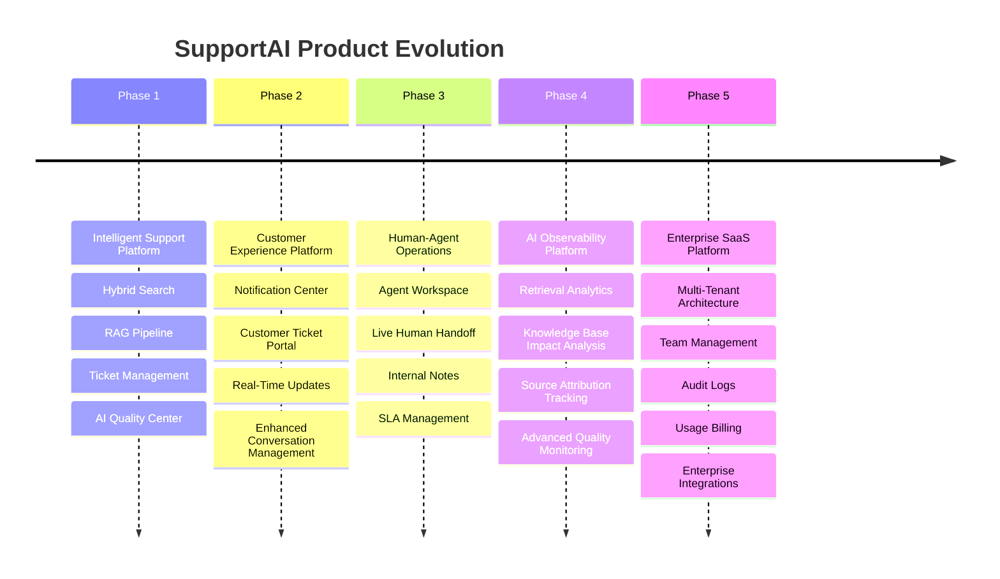

# Software Architecture Specification

**Project Name:** SupportAI – AI-Powered Customer Support Platform  
**Document Version:** 3.0.0  
**Date:** July 2026  
**Status:** Production Architecture Specification  
**Target Audience:** Engineering Team, Technical Review Board, Architects, Security Auditors

---

## Executive Summary

SupportAI is a production-oriented AI-powered customer support platform that combines Retrieval-Augmented Generation (RAG), hybrid search, conversation management, ticket escalation workflows, notification management, and AI quality monitoring into a unified customer support experience.

The platform enables organizations to deploy intelligent support systems powered by enterprise knowledge retrieval. Customers interact through a modern conversational interface while administrators manage knowledge bases, monitor AI performance, analyze support trends, resolve escalated tickets, and continuously improve answer quality.

SupportAI uses a modular layered architecture built with React, FastAPI, PostgreSQL, Redis, Qdrant, and Groq-hosted Large Language Models.

Key platform capabilities include:

- Hybrid Search (BM25 + Dense Vector Retrieval + RRF Fusion)
- Retrieval-Augmented Generation (RAG)
- Persistent Multi-Session Conversations
- Ticket Management System
- Notification Management
- AI Quality Center
- Analytics Dashboard
- Knowledge Base Management
- Role-Based Access Control (RBAC)
- Production Security Hardening
- Automated Testing and Validation

The architecture emphasizes scalability, maintainability, observability, reliability, security, and future SaaS extensibility.

Unlike traditional chatbot implementations, SupportAI incorporates a human-in-the-loop support workflow. Customer-reported AI failures are escalated into tickets that can be reviewed, resolved, and tracked through administrative workflows while simultaneously providing insight into AI quality and knowledge base effectiveness.

This document describes the technical architecture, database design, retrieval pipeline, security controls, deployment model, and future evolution strategy of the SupportAI platform.

---

## Table of Contents

1. [Architectural Decisions & Technical Justifications](#1-architectural-decisions--technical-justifications)
   - [1.1 Relational Database](#11-relational-database)
   - [1.2 Vector Database](#12-vector-database)
   - [1.3 Large Language Model](#13-large-language-model)
   - [1.4 Embedding Model](#14-embedding-model)
   - [1.5 Retrieval Strategy](#15-retrieval-strategy)
   - [1.6 Backend Framework](#16-backend-framework)

2. [Database Schema & Design](#2-database-schema--design)
   - [2.1 Database Schema Definition](#21-database-schema-definition)
   - [2.2 Entity Relationship Diagram](#22-entity-relationship-diagram)

3. [RAG Pipeline & Architecture]
   - [3.1 Document Ingestion Pipeline]
   - [3.2 Retrieval & Generation Pipeline]
   - [3.3 Sequence Diagram]
   - [3.4 AI Failure Escalation Workflow]
   - [3.5 Architectural Limitations]

4. [Search Retrieval & Analytics Engine]
   - [4.1 BM25 Keyword Matching]
   - [4.2 Dense Vector Search]
   - [4.3 Reciprocal Rank Fusion]
   - [4.4 AI Quality Monitoring]
   - [4.5 Human-in-the-Loop Escalation]
   - [4.6 Current Retrieval Limitations]
   - [4.7 Future Retrieval Analytics Architecture]

5. [Security Architecture]

6. [Deployment Architecture]

7. [Design Patterns]

8. [Future Roadmap]

---

---

# 1. Architectural Decisions & Technical Justifications

This section documents the major architectural decisions made during the design and implementation of SupportAI. Each technology was selected after evaluating alternatives against performance, scalability, maintainability, developer productivity, operational complexity, and long-term extensibility.

---

## 1.1 Relational Database Layer

SupportAI requires a transactional database for storing users, chat sessions, chat messages, documents, tickets, notifications, and administrative data.

| Database Evaluated | Selected    | Justification                                                                                                                                                                      |
| ------------------ | ----------- | ---------------------------------------------------------------------------------------------------------------------------------------------------------------------------------- |
| PostgreSQL         | Yes         | Preferred production database due to ACID compliance, indexing capabilities, JSON support, analytics features, and scalability. Integrates seamlessly with SQLAlchemy and Alembic. |
| MySQL / MariaDB    | No          | Less flexibility for analytical workloads and advanced JSON operations.                                                                                                            |
| MongoDB            | No          | Document-oriented storage is less suitable for SupportAI's highly relational entities and workflows.                                                                               |
| SQLite             | Development | Used during development and rapid prototyping. Not ideal for large-scale production workloads.                                                                                     |

### Decision

SupportAI is designed around a relational data model because customer support workflows contain highly connected entities:

- Users
- Chat Sessions
- Chat Messages
- Documents
- Tickets
- Ticket Messages
- Notifications

Relational databases provide strong consistency guarantees and simplify auditing, analytics, and reporting.

---

## 1.2 Vector Database: Qdrant

SupportAI uses semantic search as part of its Retrieval-Augmented Generation (RAG) architecture.

| Vector Database Evaluated | Selected | Justification                                                                                                                 |
| ------------------------- | -------- | ----------------------------------------------------------------------------------------------------------------------------- |
| Qdrant                    | Yes      | High-performance vector search, metadata filtering, cloud-hosted options, open-source availability, excellent Python support. |
| Pinecone                  | No       | Vendor lock-in and higher operational cost.                                                                                   |
| Milvus                    | No       | Operational complexity exceeds project requirements.                                                                          |
| pgvector                  | No       | Increases resource contention on the primary transactional database.                                                          |

### Decision

Qdrant was selected because it provides:

- Fast vector similarity search
- Metadata filtering
- Cloud and self-hosted deployment options
- Efficient memory usage
- Native support for dense vector retrieval

Qdrant stores document chunk embeddings and serves as the semantic retrieval engine for the RAG pipeline.

---

## 1.3 Large Language Model: Llama 3.1 8B Instruct via Groq

SupportAI requires a fast, cost-effective language model capable of generating grounded customer support responses.

| Model Option Evaluated       | Selected | Justification                                                                         |
| ---------------------------- | -------- | ------------------------------------------------------------------------------------- |
| Llama 3.1 8B Instruct (Groq) | Yes      | Excellent balance of performance, speed, quality, and cost.                           |
| GPT-4o                       | No       | Higher operational cost for comparable RAG use cases.                                 |
| Claude Sonnet                | No       | Strong quality but unnecessary cost overhead for document-grounded support workflows. |
| Self-Hosted Models           | No       | Increased infrastructure complexity and operational burden.                           |
| Local CPU Inference          | No       | Insufficient throughput for production workloads.                                     |

### Decision

SupportAI uses:

- Groq Inference Platform
- Llama 3.1 8B Instruct

Benefits:

- Low latency
- High throughput
- Reduced infrastructure costs
- Strong instruction-following capabilities
- Excellent performance for retrieval-grounded conversations

---

## 1.4 Embedding Architecture

SupportAI uses a provider-agnostic embedding architecture rather than tightly coupling the system to a single embedding model.

### Current Production Provider

- BAAI/bge-small-en-v1.5
- 384-dimensional embeddings

### Architectural Improvements

SupportAI implements:

- EmbeddingProviderFactory
- Provider abstraction layer
- Dynamic vector dimension discovery
- Runtime collection configuration

### Benefits

- Future migration flexibility
- Reduced vendor lock-in
- Simplified testing
- Easier model upgrades
- Support for multiple embedding providers

### Future Supported Providers

Potential future providers include:

- OpenAI Embeddings
- Voyage AI
- Cohere Embeddings
- Enterprise-hosted models

The retrieval layer remains unchanged regardless of embedding provider.

---

## 1.5 Retrieval Strategy: Hybrid Search

SupportAI uses Hybrid Search to maximize retrieval accuracy.

| Retrieval Strategy                  | Selected | Justification                                    |
| ----------------------------------- | -------- | ------------------------------------------------ |
| Hybrid Search (BM25 + Vector + RRF) | Yes      | Best overall retrieval quality.                  |
| Pure Vector Search                  | No       | Can miss exact keywords and product identifiers. |
| Pure BM25 Search                    | No       | Lacks semantic understanding.                    |

### Hybrid Search Components

#### Sparse Retrieval

BM25 handles:

- Exact keywords
- Product names
- Error codes
- Technical identifiers

#### Dense Retrieval

Vector search handles:

- Semantic similarity
- Natural language queries
- Paraphrased questions
- Concept matching

#### Reciprocal Rank Fusion (RRF)

Results from both retrievers are merged using RRF to create a single ranked list.

Benefits:

- Better recall
- Better precision
- Improved grounding quality
- Reduced retrieval failures

---

## 1.6 Backend Framework: FastAPI

SupportAI requires a modern, high-performance backend framework capable of serving both AI workflows and standard application APIs.

| Framework Evaluated | Selected | Justification                                                    |
| ------------------- | -------- | ---------------------------------------------------------------- |
| FastAPI             | Yes      | Async support, validation, OpenAPI generation, high performance. |
| Django              | No       | Excessive framework overhead for API-first architecture.         |
| Flask               | No       | Requires multiple extensions to reach comparable functionality.  |
| Express.js          | No       | Less mature ecosystem for AI and retrieval workloads.            |

### Decision

FastAPI provides:

- Asynchronous request handling
- Pydantic validation
- Automatic API documentation
- High throughput
- Clean dependency injection

FastAPI acts as the central application layer connecting customers, administrators, AI services, databases, and analytics systems.

---

## 1.7 Ticket Management Architecture

SupportAI implements a human-in-the-loop support workflow to handle situations where AI responses are insufficient or require human review.

### Workflow

```text
Customer Question
        ↓
AI Response
        ↓
Customer Flags Response
        ↓
Ticket Created
        ↓
Admin Review
        ↓
Support Reply
        ↓
Customer Notification
        ↓
Resolution
```

### Benefits

- Human fallback support
- Improved customer satisfaction
- Visibility into AI failures
- Continuous support quality improvement
- Better issue tracking and auditing

### Architectural Decision

Rather than creating a separate escalation platform, SupportAI integrates ticket management directly into the customer support workflow.

---

## 1.8 AI Quality Center

SupportAI includes an AI Quality Center for monitoring support quality and identifying improvement opportunities.

### Analytics Provided

- Total Flagged Responses
- Open Tickets
- Resolved Tickets
- Resolution Time Analysis
- Report Reason Distribution
- Ticket Status Distribution
- Most Reported Questions
- Recent Flagged Responses

### Benefits

- Visibility into AI performance
- Faster issue detection
- Better administrative decision-making
- Data-driven knowledge base improvements

### Architectural Decision

Quality monitoring is built directly into the platform using ticket and conversation data rather than relying on external analytics tools.

---

## 1.9 Notification Architecture

SupportAI includes an integrated notification subsystem.

### Workflow

```text
Ticket Updated
        ↓
Notification Created
        ↓
Customer Notification Center
        ↓
Read / Unread Tracking
```

### Notification Types

- Ticket Updates
- Support Replies
- Resolution Notifications
- Administrative Alerts

### Benefits

- Improved customer communication
- Faster response awareness
- Reduced support friction
- Better user engagement

---

## 1.10 Architectural Principles

The following principles guide all technical decisions within SupportAI:

### Scalability

Support future growth without major redesign.

### Maintainability

Keep services modular and easy to extend.

### Reliability

Ensure graceful handling of failures.

### Security

Protect customer and administrative data.

### Observability

Enable monitoring, analytics, and auditing.

### Extensibility

Support future AI providers, retrieval strategies, and enterprise features.

## These principles ensure SupportAI remains adaptable as the platform evolves from an AI support assistant into a comprehensive customer support ecosystem.

# 2. Database Schema & Design

The relational database serves as the system of record for authentication, knowledge management, conversations, ticket workflows, notifications, and administrative operations.

The schema is designed around strongly-related entities and follows normalized relational modeling principles.

---

## 2.1 Core Entities

### 2.1.1 Table: `users`

Stores platform users and administrators.

| Column          | Type         | Description                 |
| --------------- | ------------ | --------------------------- |
| id              | UUID (PK)    | Unique user identifier      |
| email           | VARCHAR(255) | Unique email address        |
| hashed_password | VARCHAR(255) | bcrypt password hash        |
| role            | ENUM         | Admin, Customer             |
| is_active       | BOOLEAN      | Account status              |
| created_at      | TIMESTAMP    | Creation timestamp          |
| updated_at      | TIMESTAMP    | Last modification timestamp |

---

### 2.1.2 Table: `documents`

Stores uploaded knowledge base documents.

| Column      | Type                 | Description                |
| ----------- | -------------------- | -------------------------- |
| id          | UUID (PK)            | Unique document identifier |
| filename    | VARCHAR(255)         | Original filename          |
| mime_type   | VARCHAR(100)         | File type                  |
| file_size   | BIGINT               | File size in bytes         |
| uploaded_by | UUID (FK → users.id) | Uploading administrator    |
| category    | VARCHAR(100)         | Document category          |
| created_at  | TIMESTAMP            | Upload timestamp           |
| updated_at  | TIMESTAMP            | Last update timestamp      |

---

### 2.1.3 Table: `chat_sessions`

Stores customer conversations.

| Column     | Type                 | Description             |
| ---------- | -------------------- | ----------------------- |
| id         | UUID (PK)            | Session identifier      |
| user_id    | UUID (FK → users.id) | Session owner           |
| title      | VARCHAR(255)         | Session title           |
| created_at | TIMESTAMP            | Creation timestamp      |
| updated_at | TIMESTAMP            | Last activity timestamp |

---

### 2.1.4 Table: `chat_messages`

Stores messages belonging to chat sessions.

| Column     | Type                         | Description        |
| ---------- | ---------------------------- | ------------------ |
| id         | UUID (PK)                    | Message identifier |
| session_id | UUID (FK → chat_sessions.id) | Parent session     |
| role       | ENUM                         | user, assistant    |
| content    | TEXT                         | Message content    |
| created_at | TIMESTAMP                    | Creation timestamp |

### Design Note

SupportAI intentionally does not persist retrieval metadata or document attribution with chat messages.

This design simplifies conversation persistence while keeping retrieval infrastructure independent of chat storage.

---

### 2.1.5 Table: `tickets`

Represents escalated support requests and flagged AI responses.

| Column           | Type                         | Description                         |
| ---------------- | ---------------------------- | ----------------------------------- |
| id               | UUID (PK)                    | Ticket identifier                   |
| ticket_number    | VARCHAR(50)                  | Human-readable ticket number        |
| title            | VARCHAR(255)                 | Ticket title                        |
| description      | TEXT                         | Ticket details                      |
| category         | ENUM                         | REPORT, GENERAL, BUG, FEATURE       |
| status           | ENUM                         | OPEN, IN_PROGRESS, RESOLVED, CLOSED |
| priority         | ENUM                         | LOW, MEDIUM, HIGH, CRITICAL         |
| created_by       | UUID (FK → users.id)         | Customer                            |
| assigned_to      | UUID (FK → users.id)         | Administrator                       |
| conversation_id  | UUID (FK → chat_sessions.id) | Related chat session                |
| chat_message_id  | UUID (FK → chat_messages.id) | Related AI message                  |
| report_reason    | VARCHAR(100)                 | Flag reason                         |
| customer_comment | TEXT                         | Additional context                  |
| created_at       | TIMESTAMP                    | Creation timestamp                  |
| updated_at       | TIMESTAMP                    | Last update timestamp               |
| closed_at        | TIMESTAMP                    | Resolution timestamp                |

### Design Note

Flagged Questions are implemented as Ticket records where `chat_message_id` is populated.

There is no separate flagged_questions table in the current architecture.

---

### 2.1.6 Table: `ticket_messages`

Stores communication within tickets.

| Column     | Type                   | Description        |
| ---------- | ---------------------- | ------------------ |
| id         | UUID (PK)              | Message identifier |
| ticket_id  | UUID (FK → tickets.id) | Parent ticket      |
| sender_id  | UUID (FK → users.id)   | Message author     |
| content    | TEXT                   | Reply content      |
| created_at | TIMESTAMP              | Creation timestamp |

### Design Note

Ticket replies are stored independently from chat messages.

Customer chat views dynamically interleave ticket replies at read time without duplicating records.

---

### 2.1.7 Table: `notifications`

Stores customer and administrative notifications.

| Column     | Type                 | Description             |
| ---------- | -------------------- | ----------------------- |
| id         | UUID (PK)            | Notification identifier |
| user_id    | UUID (FK → users.id) | Notification recipient  |
| title      | VARCHAR(255)         | Notification title      |
| message    | TEXT                 | Notification body       |
| is_read    | BOOLEAN              | Read status             |
| created_at | TIMESTAMP            | Creation timestamp      |

---

## 2.2 Entity Relationship Diagram



---

## 2.3 Architectural Decisions

### Why Tickets Instead of Flagged Questions?

Earlier designs used a dedicated `flagged_questions` table.

This was replaced with a unified Ticket architecture because:

- Single source of truth
- Better workflow management
- Support replies
- Status tracking
- Assignment support
- Resolution history
- Analytics integration

### Why Ticket Messages Are Separate?

Support replies are not stored inside chat_messages.

Benefits:

- Preserves AI conversation integrity
- Prevents message duplication
- Simplifies orchestration
- Supports independent ticket workflows

### Why Retrieval Metadata Is Not Persisted?

The current architecture prioritizes retrieval performance and chat simplicity.

As a result:

- document attribution is not stored
- retrieval scores are not stored
- source coverage analytics are unavailable

Future versions may introduce a MessageSource junction table to support Knowledge Base Impact Analysis.

---

# 3. RAG Pipeline & Architecture

SupportAI implements a Retrieval-Augmented Generation (RAG) architecture that combines document retrieval, semantic search, hybrid ranking, and LLM inference to generate grounded customer support responses.

The architecture is divided into two major workflows:

1. Document Ingestion Pipeline
2. Retrieval & Generation Pipeline

---

## 3.1 Document Ingestion Pipeline

The ingestion pipeline transforms uploaded knowledge base documents into searchable vector representations.

### Workflow

```text
Document Upload
        ↓
Validation
        ↓
Text Extraction
        ↓
Chunking
        ↓
Embedding Generation
        ↓
Metadata Persistence
        ↓
Vector Indexing
```

### Step 1 — Document Upload

Administrators upload documents through the Knowledge Base Management interface.

Supported document types include:

- PDF
- TXT
- Markdown
- Other supported text formats

---

### Step 2 — Validation

The backend validates:

- MIME type
- File extension
- File size limits
- Filename safety

Invalid files are rejected before processing.

---

### Step 3 — Text Extraction

Document content is extracted using local parsers.

Responsibilities:

- Raw text extraction
- Encoding normalization
- Content cleanup
- Structural preservation where possible

---

### Step 4 — Chunking

SupportAI uses recursive document chunking.

Current implementation:

- RecursiveCharacterTextSplitter
- Configurable chunk size
- Configurable overlap

Benefits:

- Better retrieval quality
- Reduced context fragmentation
- Improved semantic continuity

---

### Step 5 — Embedding Generation

Chunk embeddings are generated through the EmbeddingProviderFactory.

Current provider:

- BAAI/bge-small-en-v1.5
- 384 dimensions

Architecture benefits:

- Provider abstraction
- Future model replacement
- Runtime dimension discovery

---

### Step 6 — Metadata Persistence

Document metadata is stored in PostgreSQL.

Stored information includes:

- Document metadata
- Ownership
- Upload timestamps
- File information
- Version metadata

---

### Step 7 — Vector Indexing

Embeddings are stored in Qdrant.

Payload metadata includes:

- document_id
- chunk_id
- tenant_id
- mime_type
- file_size
- language
- version

Qdrant collections are configured dynamically based on discovered embedding dimensions.

---

## 3.2 Retrieval & Generation Pipeline

The retrieval pipeline executes whenever a customer sends a message.

### Workflow

```text
Customer Query
        ↓
Chat API
        ↓
Chat Orchestrator
        ↓
Hybrid Retrieval
        ↓
Context Assembly
        ↓
Prompt Construction
        ↓
Groq LLM
        ↓
Response Generation
        ↓
Conversation Persistence
```

---

### Step 1 — Query Submission

The customer submits a message through the chat interface.

The message is forwarded to the Chat API.

---

### Step 2 — Chat Orchestrator

The Chat Orchestrator coordinates:

- Session retrieval
- Conversation history
- Retrieval pipeline execution
- Prompt construction
- LLM invocation
- Response persistence

The orchestrator acts as the central control layer for all chat operations.

---

### Step 3 — Hybrid Retrieval

SupportAI uses Hybrid Search.

#### BM25 Retrieval

Handles:

- Keywords
- Product identifiers
- Error codes
- Exact phrase matching

#### Dense Retrieval

Handles:

- Semantic similarity
- Natural language understanding
- Concept matching

#### Reciprocal Rank Fusion (RRF)

Results from BM25 and Dense Retrieval are merged using Reciprocal Rank Fusion.

Benefits:

- Improved recall
- Improved precision
- Better grounding quality

---

### Step 4 — Context Assembly

The highest-ranked chunks are selected and assembled into a context window.

Responsibilities:

- Duplicate removal
- Ranking preservation
- Context size management

---

### Step 5 — Prompt Construction

The Prompt Builder generates a structured prompt.

Example:

```text
You are SupportAI.

Use only the provided context to answer.

If the answer cannot be determined from the context, state that you do not have enough information.

Context:
[Retrieved Chunks]

Question:
[Customer Question]
```

---

### Step 6 — LLM Inference

The final prompt is sent to:

- Groq Inference Platform
- Llama 3.1 8B Instruct

Responsibilities:

- Grounded answer generation
- Instruction following
- Context utilization

---

### Step 7 — Persistence

After generation:

- User message is stored
- Assistant response is stored
- Session timestamps are updated

Current architecture intentionally does NOT persist:

- Retrieval scores
- Source attribution
- Document-level impact mappings

These may be introduced in future releases.

---

## 3.3 Sequence Diagram



---

## 3.4 AI Failure Escalation Workflow

SupportAI provides a human-in-the-loop fallback mechanism.

### Workflow

```text
Customer Question
        ↓
AI Response
        ↓
Customer Flags Response
        ↓
Ticket Created
        ↓
Admin Review
        ↓
Support Reply
        ↓
Customer Notification
        ↓
Resolution
```

### Benefits

- Human fallback support
- Improved customer experience
- Better issue tracking
- AI quality monitoring
- Continuous improvement feedback loop

---

## 3.5 Architectural Limitations

Current limitations include:

### Retrieval Attribution

Document attribution is not currently persisted.

As a result:

- Most Flagged Documents cannot be calculated
- Source Coverage metrics are unavailable
- Knowledge Base Impact Analysis is unavailable

### Future Enhancement

A future release may introduce:

```text
chat_message
        ↓
message_source
        ↓
document
```

---

### 4.2 Dense Vector Search

Dense vector search measures the conceptual similarity between the query and the document chunks.

1. The user's query $Q$ is converted into a 384-dimensional dense vector $\mathbf{v}_Q$ using BGE-small.
2. Qdrant performs an approximate nearest neighbor (ANN) search using the HNSW (Hierarchical Navigable Small World) index.
3. The similarity metric is **Cosine Similarity**, defined as:

$$\text{sim}(\mathbf{v}_Q, \mathbf{v}_D) = \frac{\mathbf{v}_Q \cdot \mathbf{v}_D}{\|\mathbf{v}_Q\| \|\mathbf{v}_D\|}$$

---

### 4.3 Reciprocal Rank Fusion (RRF)

To combine the strengths of BM25 and Vector Search, we implement Reciprocal Rank Fusion (RRF). RRF relies on the ranks of the returned items rather than their raw scores, avoiding the challenge of calibrating and normalizing scores across entirely different distributions.

The RRF score for a chunk $d$ is:

$$\text{RRF\_Score}(d \in D) = \sum_{m \in M} \frac{1}{k + r_m(d)}$$

Where:

- $M$ is the set of retrieval methods (in our case, $M = \{\text{BM25}, \text{Vector}\}$).
- $r_m(d)$ is the rank of chunk $d$ in the output of retrieval method $m$ (1-indexed). If a chunk does not appear in a method's top results, $r_m(d) \to \infty$, contributing $0$ to the sum.
- $k$ is a constant smoothing parameter (configured to $60$), which prevents high-ranking items from disproportionately dominating the fused results.

```text
Example RRF Aggregation:
Query: "Model X-900 battery duration"
BM25 Top 3 results:       [Chunk A (Rank 1), Chunk B (Rank 2), Chunk C (Rank 3)]
Vector Top 3 results:     [Chunk B (Rank 1), Chunk D (Rank 2), Chunk A (Rank 3)]

Calculating RRF scores (with k = 60):
- Chunk A: 1/(60+1) [BM25] + 1/(60+3) [Vector] = 0.01639 + 0.01587 = 0.03226
- Chunk B: 1/(60+2) [BM25] + 1/(60+1) [Vector] = 0.01612 + 0.01639 = 0.03251 (Winner)
- Chunk C: 1/(60+3) [BM25] + 0 = 0.01587
- Chunk D: 0 + 1/(60+2) [Vector] = 0.01612
```

---

### 4.4 AI Quality Monitoring

SupportAI monitors AI quality using ticket activity and customer-reported feedback rather than retrieval-level confidence scoring.

Current quality metrics include:

- Total Flagged Responses
- Open Tickets
- Resolved Tickets
- Average Resolution Time
- Report Reason Distribution
- Ticket Status Distribution
- Most Reported Questions
- Recent Flagged Responses

These metrics are exposed through the AI Quality Center and are derived directly from persisted ticket and conversation data.

---

### 4.5 Human-in-the-Loop Escalation

SupportAI implements a human-in-the-loop support workflow to handle situations where AI-generated responses require review or correction.

```text
Customer Question
        ↓
AI Response
        ↓
Customer Flags Response
        ↓
Ticket Creation
        ↓
Admin Review
        ↓
Support Reply
        ↓
Customer Notification
        ↓
Resolution
```

Unlike earlier designs, escalation is initiated through customer reporting rather than confidence-score thresholds.

Benefits include:

- Improved customer trust
- Better support coverage
- Direct visibility into AI failures
- Actionable feedback for administrators
- Continuous quality improvement

---

### 4.6 Current Retrieval Limitations

The retrieval system intentionally prioritizes simplicity and performance.

The following information is currently not persisted:

- Retrieval scores
- Document attribution mappings
- Source-document relationships
- Retrieval confidence metrics

As a result, the platform cannot currently provide:

- Most Flagged Documents
- Source Attribution Coverage
- Retrieval Effectiveness Analytics
- Knowledge Base Impact Analysis

---

### 4.7 Future Retrieval Analytics Architecture

A future release may introduce document attribution persistence through a dedicated mapping layer.

```text
chat_message
        ↓
message_source
        ↓
document
```

This architecture would enable:

- Document impact analysis
- Retrieval effectiveness measurement
- Knowledge base coverage reporting
- Source attribution analytics
- Advanced AI Quality Center metrics

---

# 5. Security Architecture

SupportAI applies a defense-in-depth security strategy to protect customer data, administrative functions, and knowledge base assets.

---

## 5.1 Authentication & Authorization

### JWT Authentication

SupportAI uses JSON Web Tokens (JWT) for authentication.

- Algorithm: HS256
- Stateless authentication
- Protected API routes
- Token validation on every authenticated request

### Password Security

User passwords are:

- Hashed using bcrypt
- Never stored in plaintext
- Verified using secure password comparison

### Role-Based Access Control (RBAC)

SupportAI enforces authorization through dependency-based role validation.

Current Roles:

- Customer
- Admin

Administrative endpoints require explicit role verification before access is granted.

### Route Protection

| Endpoint Category        | Customer  | Admin       |
| ------------------------ | --------- | ----------- |
| Chat APIs                | Self Only | Full Access |
| Conversation History     | Self Only | Full Access |
| Knowledge Base           | Denied    | Full Access |
| Ticket Management        | Limited   | Full Access |
| AI Quality Center        | Denied    | Full Access |
| Administrative Dashboard | Denied    | Full Access |

---

## 5.2 Data Protection

### Encryption in Transit

All production traffic is secured using HTTPS/TLS.

### Secrets Management

Sensitive configuration is stored in environment variables:

- JWT Secret
- Database Credentials
- Groq API Key
- Qdrant API Key
- Redis Connection URL

Secrets are never committed to source control.

### Access Isolation

Customer access is restricted to:

- Their own conversations
- Their own tickets
- Their own notifications

Administrative operations require authenticated administrator accounts.

---

## 5.3 File Upload Security

Knowledge Base uploads undergo multiple validation steps.

### Validation Controls

- MIME Type Validation
- Extension Validation
- File Size Validation
- Filename Sanitization

### Supported Protections

- Invalid file rejection
- Oversized file rejection
- Path traversal prevention
- Filename normalization

### Security Goal

Prevent malicious uploads from entering the ingestion pipeline.

---

## 5.4 API Security

### Input Validation

All API requests are validated using Pydantic schemas.

Benefits:

- Type validation
- Request sanitization
- Schema enforcement
- Reduced attack surface

### SQL Injection Protection

SupportAI uses:

- SQLAlchemy ORM
- Parameterized queries

Direct SQL string concatenation is avoided.

### CORS Protection

Production deployments use strict CORS policies.

Characteristics:

- Explicit origin allow-list
- No wildcard origins
- Controlled browser access

---

## 5.5 Production Hardening

SupportAI includes additional production security measures.

### Administrative Protection

Administrative endpoints are protected using:

- JWT validation
- Role enforcement
- Dependency-based authorization

### File Upload Hardening

Upload validation includes:

- MIME verification
- Extension verification
- Size enforcement
- Filename sanitization

### Error Handling

The platform uses:

- Centralized exception handling
- Structured logging
- Request identifiers

These mechanisms improve debugging, auditing, and operational visibility.

---

## 5.6 Security Principles

SupportAI follows the following security principles:

- Least Privilege Access
- Defense in Depth
- Secure by Default
- Input Validation First
- Explicit Authorization
- Secure Secret Management
- Auditability and Traceability

## These principles guide all security-related architectural decisions across the platform.

# 6. Deployment Architecture

SupportAI is deployed using managed cloud services to reduce operational overhead while providing scalability, reliability, and maintainability.

The deployment architecture separates the frontend, backend, vector database, and AI inference services into independently managed components.

---

## 6.1 Deployment Topology



---

## 6.2 Frontend Deployment

### Vercel

The customer and administrator interfaces are deployed on Vercel.

Responsibilities:

- Static asset hosting
- Global CDN distribution
- TLS termination
- Frontend deployment automation

Benefits:

- Fast global delivery
- Simplified deployments
- Automatic HTTPS
- GitHub integration

---

## 6.3 Backend Deployment

### Railway

The FastAPI backend is containerized and deployed through Railway.

Responsibilities:

- API execution
- Authentication
- Chat orchestration
- Ticket workflows
- Analytics processing
- Notification management

Benefits:

- Managed infrastructure
- Simplified deployment
- Environment variable management
- Health monitoring

---

## 6.4 Database Layer

SupportAI uses a relational database for:

- Users
- Chat Sessions
- Chat Messages
- Tickets
- Ticket Messages
- Notifications
- Documents

The database acts as the primary system of record.

---

## 6.5 Redis Layer

Redis provides:

- Temporary caching
- Session acceleration
- Performance optimization

Redis is treated as an optimization layer rather than a critical dependency.

If Redis becomes unavailable, the platform continues operating using the primary database and retrieval systems.

---

## 6.6 Vector Database

### Qdrant Cloud

Qdrant stores vector embeddings for semantic retrieval.

Responsibilities:

- Embedding storage
- Similarity search
- Metadata filtering
- Vector indexing

Benefits:

- High-performance retrieval
- Managed infrastructure
- Scalability
- Metadata-aware search

---

## 6.7 AI Inference Layer

### Groq

SupportAI uses Groq-hosted Llama 3.1 8B Instruct models for response generation.

Responsibilities:

- Context-grounded generation
- Instruction following
- Conversational response synthesis

Benefits:

- Low latency
- High throughput
- Managed inference infrastructure

---

## 6.8 Docker Architecture

SupportAI uses Docker for local development, testing, and deployment consistency.

### Docker Compose

```yaml
services:
  backend:
    build: ./backend
    ports:
      - "5000:5000"
    env_file:
      - .env
    depends_on:
      - redis

  frontend:
    build: ./frontend
    ports:
      - "5173:5173"

  redis:
    image: redis:latest
    ports:
      - "6379:6379"
```

### Benefits

- Consistent development environments
- Simplified onboarding
- Environment parity
- Easier deployment automation

---

## 6.9 Deployment Workflow

### Backend Deployment

1. Developer pushes code to GitHub
2. Railway detects repository changes
3. Railway builds Docker image
4. Environment variables are injected
5. FastAPI service is deployed
6. Health checks validate deployment
7. Traffic is routed to the new version

### Frontend Deployment

1. Developer pushes code to GitHub
2. Vercel detects repository changes
3. Vite production build executes
4. Static assets are generated
5. Assets are deployed globally
6. CDN cache is refreshed

---

## 6.10 Environment Configuration

Sensitive configuration is managed through environment variables.

Examples include:

- DATABASE_URL
- JWT_SECRET_KEY
- GROQ_API_KEY
- QDRANT_API_KEY
- REDIS_URL

Environment-specific values are never committed to source control.

---

## 6.11 Deployment Principles

SupportAI deployment follows the following principles:

- Managed infrastructure over self-hosting
- Separation of concerns
- Independent scaling of components
- Secure communication over HTTPS
- Environment-based configuration
- Infrastructure simplification for small engineering teams

---

## 6.12 Future Deployment Evolution

Future versions may introduce:

- Kubernetes orchestration
- Multi-region deployment
- Dedicated worker infrastructure
- Distributed caching
- Multi-tenant deployment architecture
- Advanced observability platforms
- Automated disaster recovery

## This deployment model allows SupportAI to evolve without requiring major architectural redesign.

# 7. Design Patterns

SupportAI follows several proven enterprise software design patterns to ensure scalability, maintainability, testability, and clear separation of concerns.

---

## 7.1 Repository Pattern

The Repository Pattern abstracts database access behind dedicated repository classes.

Instead of embedding database queries inside API routes or business logic, all persistence operations are encapsulated within repositories.

### Current Repository Layer

Examples include:

- UserRepository
- ChatRepository
- TicketRepository
- DocumentRepository
- NotificationRepository

### Benefits

- Separation of concerns
- Easier testing
- Reusable data access logic
- Reduced code duplication
- Database abstraction

### Example

```python
class TicketRepository:

    def __init__(self, db_session):
        self.db = db_session

    def get_by_id(self, ticket_id):
        return (
            self.db.query(Ticket)
            .filter(Ticket.id == ticket_id)
            .first()
        )

    def create(self, ticket):
        self.db.add(ticket)
        self.db.commit()
        self.db.refresh(ticket)
        return ticket
```

---

## 7.2 Service Layer Pattern

The Service Layer encapsulates business logic and application workflows.

API routes remain thin and focus only on:

- Request validation
- Authentication
- Authorization
- Response formatting

Business logic is delegated to services.

### Current Services

Examples include:

- Chat Orchestrator
- RAG Pipeline
- Ticket Service
- Document Service
- Analytics Service
- Notification Service

### Benefits

- Reusable business logic
- Cleaner APIs
- Easier testing
- Better maintainability

### Service Flow



---

## 7.3 Dependency Injection Pattern

SupportAI uses FastAPI's dependency injection system.

Dependencies are injected into route handlers instead of being manually instantiated.

Examples include:

- Database sessions
- Current user context
- Authorization checks
- Services
- Configuration objects

### Benefits

- Improved testability
- Reduced coupling
- Easier mocking
- Better maintainability

### Example

```python
@router.get("/tickets/{ticket_id}")
async def get_ticket(
    ticket_id: str,
    current_user=Depends(get_current_active_user),
    db=Depends(get_db)
):
    ...
```

---

## 7.4 Layered Architecture Pattern

SupportAI follows a layered architecture that separates responsibilities across the application.

### Layers

```text
API Layer
      ↓
Service Layer
      ↓
Repository Layer
      ↓
Database / External Services
```

### Responsibilities

| Layer                | Responsibility                            |
| -------------------- | ----------------------------------------- |
| API Layer            | HTTP handling, validation, authentication |
| Service Layer        | Business logic and orchestration          |
| Repository Layer     | Data access                               |
| Infrastructure Layer | External systems and databases            |

### Benefits

- Clear separation of concerns
- Easier maintenance
- Improved scalability
- Better testing

---

## 7.5 Orchestrator Pattern

SupportAI uses an Orchestrator Pattern for chat processing.

The Chat Orchestrator coordinates multiple components involved in generating AI responses.

### Responsibilities

- Session management
- Conversation retrieval
- RAG execution
- Prompt construction
- LLM invocation
- Response persistence

### Workflow

```text
Customer Query
        ↓
Chat Orchestrator
        ↓
RAG Pipeline
        ↓
Prompt Builder
        ↓
Groq LLM
        ↓
Response Storage
```

### Benefits

- Centralized workflow management
- Reduced coupling
- Better extensibility
- Easier debugging

---

## 7.6 Factory Pattern

SupportAI uses the Factory Pattern for embedding provider management.

The EmbeddingProviderFactory creates embedding providers without exposing implementation details to higher-level services.

### Benefits

- Provider abstraction
- Future extensibility
- Easier model replacement
- Cleaner architecture

### Example

```text
EmbeddingProviderFactory
            ↓
     BGE Provider
            ↓
     Embedding Output
```

---

## 7.7 Pattern Summary

| Pattern               | Usage                         |
| --------------------- | ----------------------------- |
| Repository Pattern    | Database access abstraction   |
| Service Layer Pattern | Business logic management     |
| Dependency Injection  | FastAPI dependency management |
| Layered Architecture  | Separation of concerns        |
| Orchestrator Pattern  | Chat workflow coordination    |
| Factory Pattern       | Embedding provider creation   |

---

# 8. Future Roadmap

SupportAI is designed as a long-term AI-powered customer support platform. The current architecture provides a strong foundation for future expansion into enterprise support operations, AI observability, and multi-tenant SaaS deployments.

---

## 8.1 Product Evolution Roadmap



---

## 8.2 Customer Experience Roadmap

Future customer-facing improvements include:

### Customer Portal

- View active tickets
- View ticket history
- Track resolution progress
- Receive support updates

### Real-Time Notifications

- Ticket status updates
- Support replies
- System announcements
- Knowledge base updates

### Enhanced Conversations

- Conversation folders
- Conversation tags
- Advanced search
- Conversation export

### Voice Support

- Speech-to-text interactions
- Text-to-speech responses
- Voice-based customer support

---

## 8.3 AI Quality Center Roadmap

The AI Quality Center will evolve into a comprehensive observability platform for monitoring answer quality and retrieval effectiveness.

### Retrieval Analytics

Future metrics may include:

- Retrieval Success Rate
- Average Retrieval Quality
- Source Utilization
- Retrieval Coverage

### Knowledge Base Impact Analysis

Future document attribution persistence will enable:

- Most Flagged Documents
- Most Referenced Documents
- Document Quality Scoring
- Knowledge Base Coverage Analysis

### AI Performance Monitoring

- Escalation Trends
- Resolution Effectiveness
- Customer Feedback Analysis
- AI Quality Trend Analysis

---

## 8.4 Human Support Operations

SupportAI will expand beyond AI-only support by introducing human-agent workflows.

### Agent Workspace

Future features include:

- Shared ticket queues
- Internal comments
- Agent assignment
- Collaboration tools

### Live Human Handoff

Customers will be able to:

- Request human assistance
- Escalate unresolved issues
- Continue conversations with support agents

### SLA Management

Future enterprise capabilities include:

- Response time tracking
- Resolution targets
- Escalation policies
- SLA compliance reporting

---

## 8.5 Knowledge Base Intelligence

SupportAI aims to continuously improve organizational knowledge.

### Automated Knowledge Discovery

Future capabilities include:

- Knowledge gap identification
- Recurring issue detection
- Suggested documentation improvements
- AI-generated content recommendations

### Content Optimization

- Duplicate content detection
- Stale document detection
- Missing coverage identification
- Documentation health scoring

---

## 8.6 Enterprise SaaS Expansion

SupportAI is architected to support future SaaS commercialization.

### Multi-Tenant Architecture

Future enhancements include:

- Tenant isolation
- Tenant-specific knowledge bases
- Tenant-level analytics
- Tenant-specific branding

### Team Management

Organizations will be able to manage:

- Multiple administrators
- Support teams
- Department-level access
- Custom permissions

### Audit & Compliance

Future enterprise features include:

- Audit trails
- Activity logs
- Compliance reporting
- Security event monitoring

---

## 8.7 Integration Ecosystem

Future versions may integrate with external business systems.

Potential integrations include:

- Slack
- Microsoft Teams
- Zendesk
- Intercom
- Salesforce
- HubSpot
- Jira
- Email Platforms

---

## 8.8 Long-Term Vision

The long-term vision of SupportAI is to evolve from an AI-powered support assistant into a complete customer support intelligence platform.

The platform will combine:

- AI-powered support
- Human support operations
- Knowledge management
- Quality monitoring
- Business analytics
- Enterprise SaaS capabilities

while maintaining the core principles of scalability, reliability, security, and maintainability.
