# SupportAI – AI-Powered Customer Support Platform

### Software Architecture & Design Document

**Version:** 2.0
**Release:** Production Ready Edition
**Date:** July 2026
**Team Size:** 3 Developers

---

## Table of Contents

1. [Executive Summary](#1-executive-summary)
2. [Problem Statement](#2-problem-statement)
3. [Project Objectives](#3-project-objectives)
4. [Functional Requirements](#4-functional-requirements)
5. [Non-Functional Requirements](#5-non-functional-requirements)
6. [Technology Stack](#6-technology-stack)
7. [System Architecture](#7-system-architecture)
8. [Frontend Architecture](#8-frontend-architecture)
9. [Backend Architecture](#9-backend-architecture)
10. [Database Design](#10-database-design)
11. [Search Architecture](#11-search-architecture)
12. [RAG Workflow](#12-rag-workflow)
13. [API Design](#13-api-design)
14. [Design Patterns](#14-design-patterns)
15. [Security Architecture](#15-security-architecture)
16. [Deployment Architecture](#16-deployment-architecture)
17. [CI/CD Architecture](#17-cicd-architecture)
18. [Testing Strategy](#18-testing-strategy)
19. [Reliability & Resilience](#19-reliability--resilience)
20. [Enterprise Security Architecture](#20-enterprise-security-architecture)
21. [Risks & Mitigation](#21-risks--mitigation)
22. [Product Roadmap & Future Enhancements](#22-product-roadmap--future-enhancements)
23. [Future Architecture Evolution](#23-future-architecture-evolution)
24. [Conclusion](#24-conclusion)

---

# 1. Executive Summary

SupportAI is a production-oriented AI-powered customer support platform that combines Retrieval-Augmented Generation (RAG), hybrid search, human-in-the-loop ticket escalation, knowledge management, and AI quality monitoring into a unified support ecosystem.

The platform enables organizations to provide intelligent, scalable, and document-grounded customer support experiences. Customers interact through a conversational AI interface while administrators manage knowledge bases, resolve escalated issues, monitor support quality, and continuously improve AI performance through analytics and feedback.

SupportAI is built using a modular layered architecture centered around FastAPI, React, Qdrant, Redis, Groq-powered Large Language Models, and a relational database layer.

Key capabilities include:

- Hybrid Retrieval (BM25 + Dense Vector Search)
- Retrieval-Augmented Generation (RAG)
- Persistent Multi-Session Conversations
- Human-in-the-Loop Ticket Escalation
- Notification Management
- AI Quality Center
- Analytics Dashboard
- Knowledge Base Management
- Role-Based Access Control (RBAC)
- Production Security Hardening
- Automated Testing and Validation

The architecture emphasizes:

- Scalability
- Maintainability
- Reliability
- Security
- Extensibility

through layered services, repository abstractions, provider-agnostic AI components, and modern cloud deployment practices.

## SupportAI is designed not only to automate customer support interactions but also to provide organizations with visibility into AI performance, customer issues, and knowledge gaps, enabling continuous improvement of both support operations and AI answer quality.

## 2. Problem Statement

Customer support teams face increasing pressure to deliver fast, accurate, and consistent responses while managing growing volumes of customer inquiries.

Common challenges include:

- **High support volume** — repetitive questions consume valuable agent time and reduce operational efficiency.
- **Slow response times** — customers often wait for answers that already exist in documentation, FAQs, or internal knowledge bases.
- **Inconsistent support quality** — responses vary depending on the experience and availability of individual support agents.
- **Knowledge fragmentation** — critical information is spread across multiple documents, making it difficult to locate quickly.
- **Limited visibility into AI failures** — organizations often lack mechanisms to identify poor responses, recurring customer issues, or knowledge gaps.
- **Escalation bottlenecks** — unresolved questions require manual intervention, but many systems provide poor workflows for human review and resolution.

Existing solutions are often expensive, difficult to customize, or focused solely on automation without providing adequate visibility, quality monitoring, or human support workflows.

SupportAI addresses these challenges through a Retrieval-Augmented Generation (RAG) architecture that combines:

- AI-powered customer support
- Document-grounded response generation
- Persistent conversation management
- Human-in-the-loop ticket escalation
- Knowledge base administration
- AI quality monitoring and analytics

---

# 3. Project Objectives

| #   | Objective                                                                              |
| --- | -------------------------------------------------------------------------------------- |
| 1   | Deliver production-grade AI-powered customer support experiences                       |
| 2   | Build a robust Retrieval-Augmented Generation (RAG) pipeline                           |
| 3   | Enable persistent multi-session customer conversations                                 |
| 4   | Provide administrators with effective knowledge base management tools                  |
| 5   | Implement human-in-the-loop ticket escalation workflows                                |
| 6   | Monitor and improve AI response quality through customer feedback and ticket analytics |
| 7   | Ensure secure, reliable, and maintainable system operation                             |
| 8   | Maintain high software quality through testing and automated validation                |
| 9   | Support future scalability, extensibility, and enterprise adoption                     |
| 10  | Establish a modular architecture that simplifies future enhancements                   |

---

# 4. Functional Requirements

SupportAI provides AI-powered customer support through Retrieval-Augmented Generation (RAG), human-in-the-loop ticket escalation, knowledge base management, and administrative analytics.

---

## 4.1 Customer Features

### Authentication

- User Registration
- User Login
- Password Reset
- JWT-Based Authentication
- Protected Routes

### Chat Experience

- AI-Powered Customer Support Chat
- Persistent Chat Sessions
- Session History
- Session Rename
- Session Delete
- Session Search
- Rich Markdown Rendering
- Syntax Highlighted Code Blocks
- Auto Scroll & Chat Persistence

### Support Workflows

- Flag AI Responses
- Submit Report Reason
- Add Customer Comments
- Create Support Tickets
- View Notifications
- Receive Support Updates
- View Support Responses

### Conversation Management

- Create New Conversations
- Continue Existing Conversations
- Retrieve Historical Sessions
- Search Conversation History

---

## 4.2 Administrator Features

### Dashboard

- Platform Overview
- Ticket Statistics
- Customer Activity Monitoring
- Knowledge Base Overview

### Knowledge Base Management

- Upload Documents
- Delete Documents
- Search Documents
- View Document Metadata
- Document Processing Validation

### Conversation Management

- View Customer Conversations
- Inspect Chat Sessions
- Review Message History

### Flagged Questions Management

- Review Reported Responses
- Inspect Customer Context
- View Report Reasons
- View Customer Comments
- Navigate to Ticket Details

### Ticket Management

- View Ticket Details
- Update Ticket Status
- Assign Tickets
- Respond to Customers
- Track Resolution Progress
- View Ticket Timeline

### AI Quality Center

- Total Flagged Responses
- Open Ticket Tracking
- Resolved Ticket Tracking
- Average Resolution Time
- Report Reason Distribution
- Ticket Status Distribution
- Most Reported Questions
- Recent Flagged Responses

### Notifications

- Ticket Update Notifications
- Support Reply Notifications
- Administrative Alerts

---

## 4.3 Retrieval-Augmented Generation (RAG)

SupportAI uses a Retrieval-Augmented Generation workflow to produce grounded responses.

### Retrieval Features

- BM25 Retrieval
- Dense Vector Retrieval
- Reciprocal Rank Fusion (RRF)
- Context Assembly
- Prompt Construction

### Response Generation

- Context-Grounded Answers
- Source-Aware Prompting
- Session-Aware Conversations
- AI Response Generation via Groq

---

## 4.4 Ticket Management Workflow

SupportAI includes a human-in-the-loop escalation workflow for handling AI failures and customer-reported issues.

```text
Customer Question
        ↓
AI Response
        ↓
Customer Flags Response
        ↓
Ticket Created
        ↓
Admin Review
        ↓
Support Reply
        ↓
Customer Notification
        ↓
Resolution
```

### Ticket Capabilities

- Ticket Creation
- Ticket Status Tracking
- Support Agent Replies
- Customer Notifications
- Resolution Management
- Escalation Tracking

### Benefits

- Human fallback for complex issues
- Better customer support experience
- Improved visibility into AI failures
- Continuous quality improvement

---

## 4.5 AI Quality Monitoring

The AI Quality Center provides visibility into support quality using real ticket and conversation data.

### Current Capabilities

- Flagged Response Monitoring
- Ticket Volume Analysis
- Resolution Time Tracking
- Report Reason Analysis
- Most Reported Question Analysis
- Open vs Resolved Ticket Analysis

### Quality Improvement Goals

- Identify recurring customer issues
- Detect knowledge gaps
- Improve support workflows
- Improve AI response quality
- Guide future knowledge base updates

---

## 4.6 Notifications System

SupportAI includes an integrated notification system.

### Customer Notifications

- Ticket Updates
- Support Replies
- Resolution Notifications

### Administrator Notifications

- New Ticket Alerts
- Flagged Response Alerts
- Operational Updates

---

# 5. Non-Functional Requirements

Non-functional requirements define the quality attributes that SupportAI must satisfy beyond its functional capabilities. These requirements guide architectural decisions related to performance, scalability, security, reliability, and maintainability.

---

## Quality Attribute Requirements

| Category            | Requirement                                                                                                                               |
| ------------------- | ----------------------------------------------------------------------------------------------------------------------------------------- |
| **Performance**     | Typical chat responses should be generated within a few seconds under normal operating conditions.                                        |
| **Scalability**     | The architecture should support increasing numbers of users, documents, conversations, and tickets without major redesign.                |
| **Reliability**     | Critical customer support workflows must remain stable and recover gracefully from temporary failures.                                    |
| **Availability**    | The platform should remain accessible through managed cloud infrastructure and automated deployment processes.                            |
| **Security**        | Authentication, authorization, secure communication, and input validation must be enforced throughout the platform.                       |
| **Maintainability** | The codebase should remain modular, testable, and easy to extend through layered architecture and service separation.                     |
| **Usability**       | Customer and administrator interfaces should be responsive, intuitive, and accessible to both technical and non-technical users.          |
| **Extensibility**   | New AI models, retrieval strategies, analytics modules, and support workflows should be introduced with minimal architectural disruption. |
| **Portability**     | The platform should support local development and cloud deployment through containerized infrastructure.                                  |
| **Observability**   | Errors, operational events, and system behavior should be traceable through structured logging and monitoring mechanisms.                 |
| **Testability**     | Critical workflows should be verifiable through automated tests and manual end-to-end validation.                                         |

---

## Performance Requirements

| Requirement           | Target                               |
| --------------------- | ------------------------------------ |
| Chat Response Time    | Few seconds under normal load        |
| Knowledge Base Search | Near real-time retrieval             |
| Ticket Operations     | Immediate user feedback              |
| Dashboard Loading     | Responsive administrative experience |

### Design Considerations

- Redis caching reduces repeated retrieval costs.
- Hybrid search balances accuracy and performance.
- Repository abstraction simplifies optimization efforts.
- Qdrant enables efficient vector similarity search.

---

## Scalability Requirements

SupportAI should support growth in:

- Users
- Chat Sessions
- Documents
- Vector Embeddings
- Tickets
- Notifications

### Architectural Enablers

- Layered Architecture
- Repository Pattern
- Provider-Agnostic Components
- External Vector Database
- Managed Cloud Services

---

## Reliability Requirements

SupportAI should continue operating safely during temporary failures.

### Requirements

- Prevent data corruption.
- Preserve chat history.
- Protect ticket workflows.
- Maintain document integrity.
- Recover gracefully from service interruptions.

### Supporting Mechanisms

- Transaction Rollbacks
- Error Handling
- Retry Logic
- Controlled Failure Recovery

---

## Security Requirements

SupportAI must protect customer, administrator, and system data.

### Requirements

- JWT Authentication
- Role-Based Access Control (RBAC)
- Password Hashing (bcrypt)
- HTTPS/TLS Communication
- Input Validation
- Secure Secret Management

---

## Maintainability Requirements

The platform should remain easy to evolve over time.

### Requirements

- Clear separation of concerns
- Modular service design
- Repository abstraction
- Consistent API structure
- Structured documentation

---

## Usability Requirements

### Customer Experience

- Simple chat interface
- Persistent conversation history
- Clear notifications
- Responsive design

### Administrator Experience

- Centralized dashboards
- Knowledge Base management
- Ticket workflows
- AI Quality monitoring

---

## Testability Requirements

SupportAI must support continuous verification.

### Validation Methods

- Pytest
- ESLint
- TypeScript Build Verification
- Manual End-to-End Testing

### Current Validation Baseline

```text
Backend Tests: 45/45 Passed
Frontend Lint: Passed
Frontend Build: Passed
```

---

## Extensibility Requirements

The architecture should support future enhancements such as:

- Retrieval Attribution
- Knowledge Base Impact Analysis
- SLA Management
- Agent Assignment
- Multi-Tenant Support
- Enterprise Analytics

without requiring significant architectural redesign.

---

# 6. Technology Stack

SupportAI is built using a modern full-stack architecture designed for AI-powered customer support, retrieval-augmented generation (RAG), and scalable administrative operations.

---

## Frontend

| Layer         | Technology         | Purpose                                          |
| ------------- | ------------------ | ------------------------------------------------ |
| Framework     | React + TypeScript | Component-based frontend development             |
| Build Tool    | Vite               | Fast development and optimized production builds |
| Styling       | Tailwind CSS       | Responsive and utility-first UI design           |
| Routing       | React Router       | Client-side routing and navigation               |
| Icons         | Lucide React       | Consistent iconography                           |
| Notifications | Sonner             | Toast notifications and user feedback            |
| HTTP Client   | Axios              | Communication with backend APIs                  |

---

## Backend

| Layer          | Technology  | Purpose                                    |
| -------------- | ----------- | ------------------------------------------ |
| Framework      | FastAPI     | High-performance REST API                  |
| ORM            | SQLAlchemy  | Database abstraction and ORM               |
| Migrations     | Alembic     | Database schema versioning                 |
| Authentication | JWT (PyJWT) | Stateless authentication and authorization |
| Validation     | Pydantic    | Request and response validation            |
| Testing        | Pytest      | Backend testing and verification           |

---

## AI & Retrieval

| Component         | Technology                   | Purpose                            |
| ----------------- | ---------------------------- | ---------------------------------- |
| LLM Provider      | Groq                         | AI inference platform              |
| Language Model    | Llama 3.1 8B Instruct        | Response generation                |
| Vector Database   | Qdrant                       | Semantic search and vector storage |
| Sparse Retrieval  | BM25                         | Keyword-based retrieval            |
| Dense Retrieval   | Embedding Models             | Semantic retrieval                 |
| Fusion Strategy   | Reciprocal Rank Fusion (RRF) | Hybrid retrieval ranking           |
| Retrieval Pattern | RAG                          | Retrieval-Augmented Generation     |

---

## Data Layer

| Component           | Technology   | Purpose                                         |
| ------------------- | ------------ | ----------------------------------------------- |
| Relational Database | PostgreSQL   | Users, chats, tickets, notifications, documents |
| Cache Layer         | Redis        | Caching and performance optimization            |
| Vector Store        | Qdrant Cloud | Embedding storage and retrieval                 |

---

## DevOps & Deployment

| Tool           | Purpose                 |
| -------------- | ----------------------- |
| Git            | Version Control         |
| GitHub         | Source Code Hosting     |
| GitHub Actions | Continuous Integration  |
| Docker         | Containerization        |
| Railway        | Backend Hosting         |
| Vercel         | Frontend Hosting        |
| Qdrant Cloud   | Managed Vector Database |

---

## Architecture Patterns

| Pattern              | Purpose                      |
| -------------------- | ---------------------------- |
| Layered Architecture | Separation of concerns       |
| Repository Pattern   | Data access abstraction      |
| Service Layer        | Business logic encapsulation |
| RAG Architecture     | Grounded AI responses        |
| Hybrid Search        | Improved retrieval quality   |
| Provider Abstraction | Future AI model flexibility  |

---

# 7. System Architecture

SupportAI follows a modular AI-native architecture built around Retrieval-Augmented Generation (RAG), hybrid search, conversation management, support ticketing, and AI quality monitoring.

The system is composed of independently managed layers responsible for presentation, orchestration, retrieval, persistence, and AI generation.

---

## 7.1 Context View

The Context View illustrates the highest-level interaction between users, administrators, external AI providers, and supporting infrastructure.

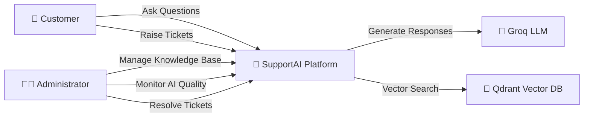

### Responsibilities

| Actor/System  | Responsibility                                                 |
| ------------- | -------------------------------------------------------------- |
| Customer      | Interacts with the AI assistant and receives support           |
| Administrator | Manages knowledge, tickets, analytics, and AI quality          |
| SupportAI     | Orchestrates retrieval, generation, persistence, and workflows |
| Groq          | Generates grounded responses                                   |
| Qdrant        | Stores vector embeddings and semantic indexes                  |

---

## 7.2 Container View

The Container View illustrates the deployable applications and infrastructure services used by SupportAI.

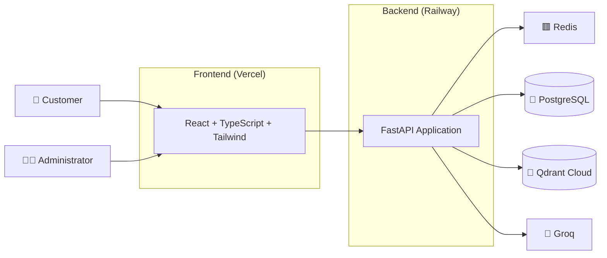

### Container Responsibilities

| Container       | Responsibility                                   |
| --------------- | ------------------------------------------------ |
| React Frontend  | Customer and administrator interfaces            |
| FastAPI Backend | APIs, orchestration, retrieval, ticket workflows |
| PostgreSQL      | Persistent relational storage                    |
| Redis           | Caching and session acceleration                 |
| Qdrant          | Semantic vector search                           |
| Groq            | LLM inference                                    |

---

## 7.3 Component View

The Component View illustrates the internal structure of the backend application.

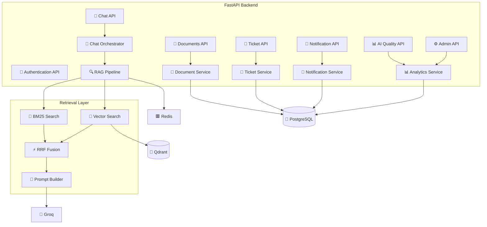

---

## 7.4 Runtime View

The Runtime View demonstrates how a customer question flows through the system.

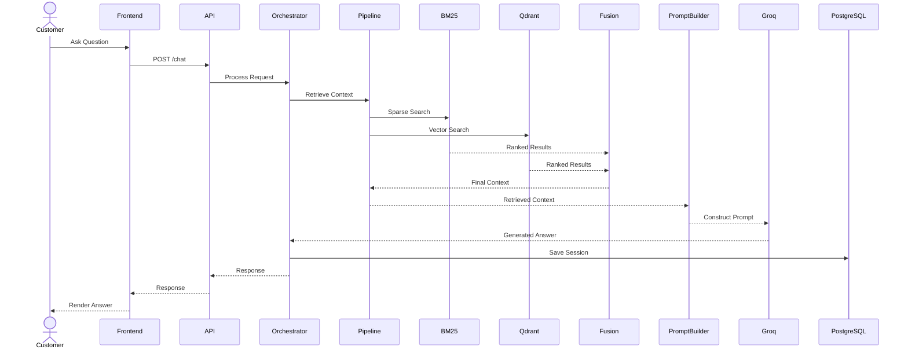

---

## 7.5 Support Ticket Workflow

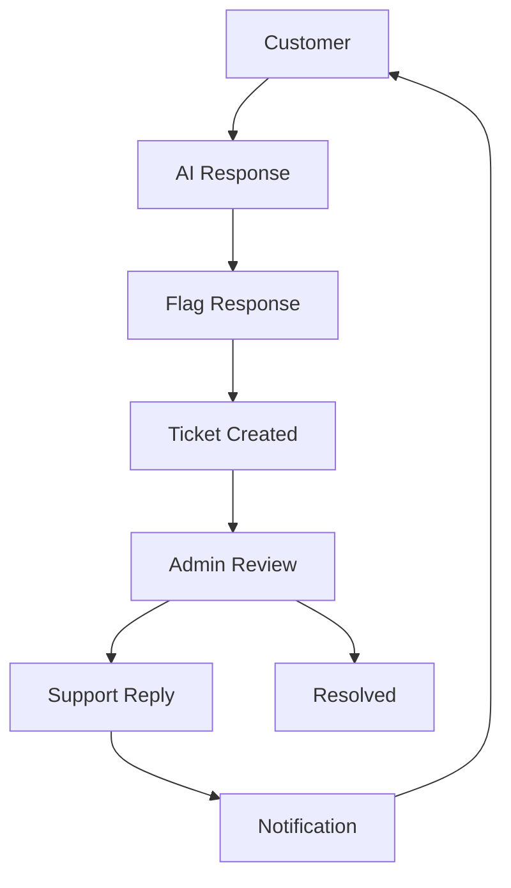

---

## 7.6 AI Quality Monitoring Flow

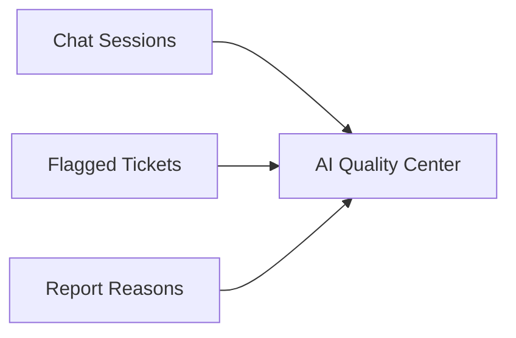

The AI Quality Center continuously monitors customer escalations, report reasons, support trends, and AI performance indicators to help administrators improve answer quality and knowledge base effectiveness.

# 8. Frontend Architecture

The SupportAI frontend is built as a modern Single Page Application (SPA) using React, TypeScript, Vite, and Tailwind CSS.

The architecture follows a feature-oriented design that separates pages, reusable components, routing, API services, and state management. This approach improves maintainability, scalability, and developer productivity as the platform evolves.

---

## Frontend Component Architecture

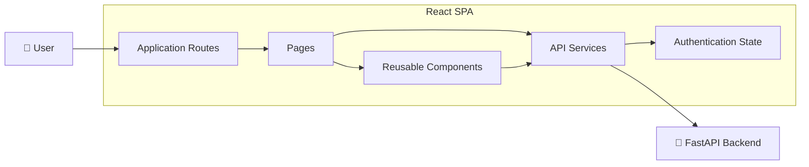

---

## Frontend Module Architecture

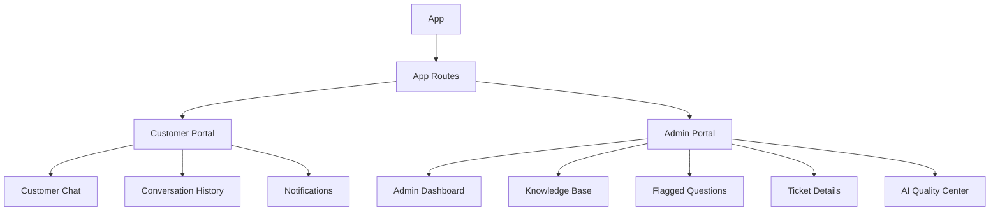

---

## Frontend Folder Structure

```text
src/

├── components/
│   ├── admin/
│   │   ├── dashboard/
│   │   ├── flagged/
│   │   ├── knowledge-base/
│   │   └── layout/
│   │
│   ├── chat/
│   │   ├── messages/
│   │   ├── sidebar/
│   │   └── input/
│   │
│   ├── notifications/
│   │
│   └── ui/
│
├── pages/
│   ├── admin/
│   │   ├── AdminDashboard.tsx
│   │   ├── AdminTicketDetails.tsx
│   │   ├── KnowledgeBase.tsx
│   │   ├── Conversations.tsx
│   │   ├── AIQuality.tsx
│   │   └── FlaggedQuestions.tsx
│   │
│   ├── customer/
│   │   ├── CustomerChat.tsx
│   │   ├── ConversationHistory.tsx
│   │   └── Notifications.tsx
│   │
│   └── auth/
│       ├── Login.tsx
│       └── Register.tsx
│
├── routes/
│   └── AppRoutes.tsx
│
├── services/
│   ├── auth.service.ts
│   ├── chat.service.ts
│   ├── ticket.service.ts
│   ├── notification.service.ts
│   ├── document.service.ts
│   └── admin.service.ts
│
├── hooks/
│
├── store/
│
├── types/
│
└── main.tsx
```

---

## Routing Architecture

SupportAI uses client-side routing to separate customer and administrator workflows.

### Customer Routes

| Route            | Purpose                 |
| ---------------- | ----------------------- |
| `/chat`          | Customer Chat Interface |
| `/history`       | Conversation History    |
| `/notifications` | Customer Notifications  |

### Authentication Routes

| Route       | Purpose           |
| ----------- | ----------------- |
| `/login`    | User Login        |
| `/register` | User Registration |

### Administrator Routes

| Route                      | Purpose                               |
| -------------------------- | ------------------------------------- |
| `/admin/dashboard`         | Dashboard Overview                    |
| `/admin/knowledge-base`    | Knowledge Base Management             |
| `/admin/conversations`     | Customer Conversations                |
| `/admin/flagged`           | Flagged Questions & Ticket Management |
| `/admin/flagged/:ticketId` | Ticket Details                        |
| `/admin/quality`           | AI Quality Center                     |

---

## Service Layer

All backend communication is centralized through dedicated service modules.

### Services

| Service                 | Responsibility                   |
| ----------------------- | -------------------------------- |
| auth.service.ts         | Authentication & JWT             |
| chat.service.ts         | Chat Sessions & Messages         |
| ticket.service.ts       | Ticket Operations                |
| notification.service.ts | Customer Notifications           |
| document.service.ts     | Knowledge Base Operations        |
| admin.service.ts        | Dashboard & AI Quality Analytics |

Benefits:

- Centralized API logic
- Better maintainability
- Easier testing
- Reduced code duplication

---

## State Management

SupportAI uses lightweight frontend state management.

### Managed State

- Authentication State
- User Information
- Chat Sessions
- Ticket Data
- Notifications

Benefits:

- Simplified architecture
- Predictable updates
- Reduced complexity

---

## Key Frontend Features

### Customer Portal

- Persistent Chat Sessions
- Conversation History
- Message Flagging
- Notifications
- Authentication

### Administrator Portal

- Dashboard Analytics
- Knowledge Base Management
- Conversation Review
- Flagged Question Management
- Ticket Resolution
- AI Quality Center

### Shared Features

- Protected Routes
- Loading States
- Error Handling
- Toast Notifications
- Responsive Design

---

## Architectural Improvements

The frontend architecture has evolved significantly from the initial prototype.

Key improvements include:

- Feature-based organization
- Dedicated service layer
- Unified Ticket & Flagged Question workflow
- AI Quality Center integration
- Modular routing structure
- Production-ready error handling
- Reusable UI components
- Scalable administrative tooling

## This architecture enables SupportAI to support both customer-facing AI interactions and administrative support operations within a single cohesive application.

# 9. Backend Architecture

The SupportAI backend follows a modular layered architecture designed for scalability, maintainability, reliability, and AI extensibility.

The architecture separates API routing, business logic, repositories, retrieval orchestration, external integrations, and infrastructure concerns.

---

## Backend Component Architecture

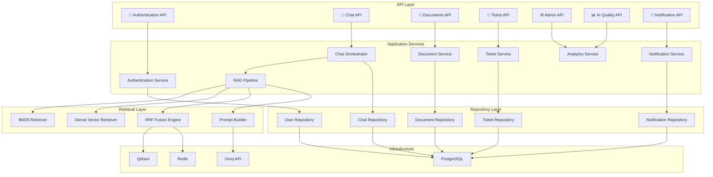

---

## Backend Folder Structure

```text
app/
├── api/
│   └── v1/
│       ├── auth.py
│       ├── chat.py
│       ├── documents.py
│       ├── tickets.py
│       ├── notifications.py
│       ├── quality.py
│       └── admin.py
│
├── services/
│   ├── orchestrator.py
│   ├── ticket_service.py
│   ├── notification_service.py
│   ├── analytics_service.py
│   ├── ingestion.py
│   │
│   └── retrieval/
│       ├── pipeline.py
│       ├── bm25_service.py
│       ├── fusion_service.py
│       ├── prompt_builder.py
│       └── query_rewriter.py
│
├── repositories/
│   ├── user_repo.py
│   ├── chat_repo.py
│   ├── ticket_repo.py
│   ├── document_repo.py
│   └── notification_repo.py
│
├── models/
│   ├── user.py
│   ├── document.py
│   ├── chat.py
│   ├── ticket.py
│   └── notification.py
│
├── schemas/
│   ├── auth.py
│   ├── chat.py
│   ├── document.py
│   ├── ticket.py
│   ├── notification.py
│   └── quality.py
│
├── db/
│   ├── session.py
│   ├── redis.py
│   └── qdrant.py
│
├── core/
│   ├── config.py
│   ├── security.py
│   ├── dependencies.py
│   └── logging.py
│
└── main.py
```

---

## Chat Request Flow

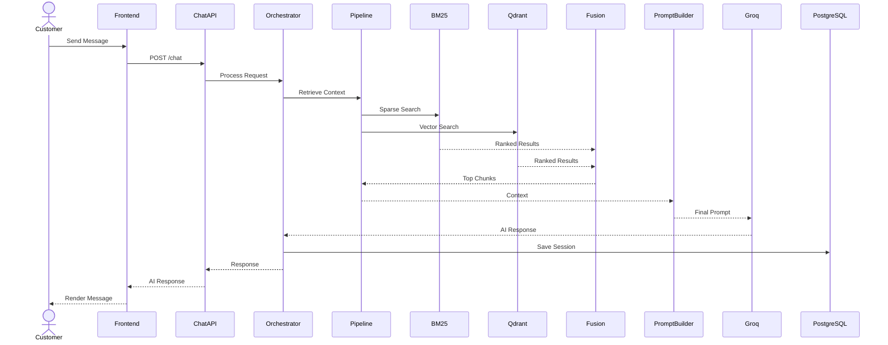

---

## Ticket Workflow

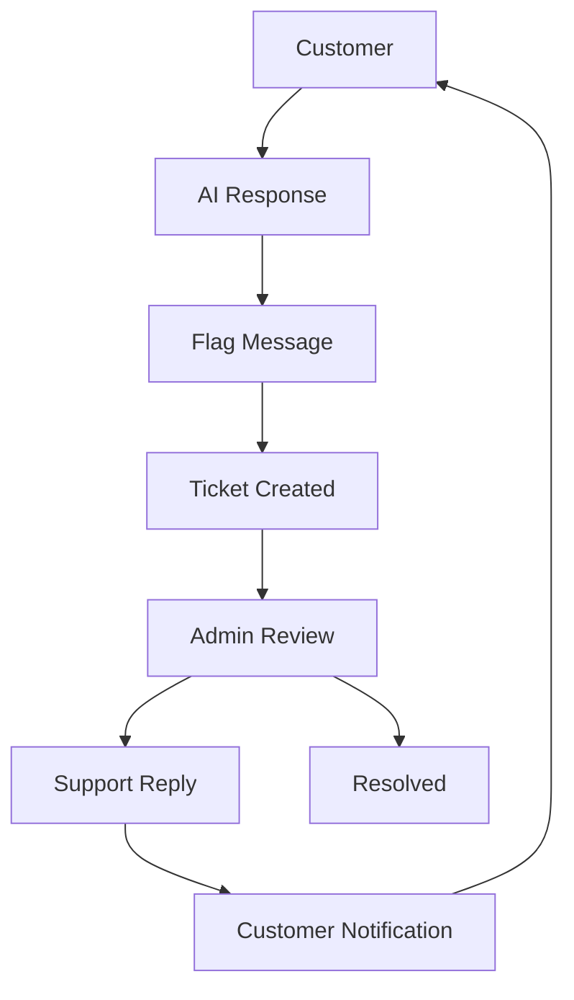

---

## AI Quality Monitoring Flow


### Key Architectural Improvements

- Chat Orchestrator introduced for centralized request handling.
- Retrieval Pipeline separated from API logic.
- Hybrid Search implemented using BM25 + Dense Retrieval + RRF Fusion.
- Ticket Management integrated into core architecture.
- Notification Service added.
- AI Quality Center added for analytics and monitoring.
- Repository Pattern adopted for database access.
- Security and logging centralized.
- Production hardening applied across ingestion and retrieval workflows.

# 10. Database Design

SupportAI uses PostgreSQL as the primary relational database and Qdrant as the vector database.

The relational layer stores users, conversations, tickets, notifications, analytics, and application metadata, while Qdrant stores semantic embeddings used by the Retrieval-Augmented Generation (RAG) pipeline.

---

## 10.1 Users

### `users`

| Column          | Type         | Description            |
| --------------- | ------------ | ---------------------- |
| id              | UUID (PK)    | Unique user identifier |
| email           | VARCHAR(255) | Unique email address   |
| hashed_password | TEXT         | Secure password hash   |
| role            | ENUM         | customer, admin        |
| is_active       | BOOLEAN      | Account status         |
| created_at      | TIMESTAMP    | Account creation time  |

### Responsibilities

- Authentication
- Authorization
- Role-based access control
- Ownership of conversations and tickets

---

## 10.2 Knowledge Base

### `documents`

| Column      | Type              | Description                |
| ----------- | ----------------- | -------------------------- |
| id          | UUID (PK)         | Unique document identifier |
| title       | VARCHAR(255)      | Document title             |
| filename    | TEXT              | Original filename          |
| file_type   | VARCHAR(50)       | pdf, txt, md, etc          |
| uploaded_by | UUID (FK → users) | Uploading administrator    |
| category    | VARCHAR(100)      | Business category          |
| created_at  | TIMESTAMP         | Upload timestamp           |
| is_active   | BOOLEAN           | Soft delete flag           |

### Responsibilities

- Knowledge base management
- Source document tracking
- Administrative organization

---

## 10.3 Chat System

### `chat_sessions`

| Column     | Type              | Description             |
| ---------- | ----------------- | ----------------------- |
| id         | UUID (PK)         | Session identifier      |
| user_id    | UUID (FK → users) | Session owner           |
| title      | VARCHAR(255)      | Session title           |
| created_at | TIMESTAMP         | Session creation        |
| updated_at | TIMESTAMP         | Last activity timestamp |

### `chat_messages`

| Column           | Type                      | Description          |
| ---------------- | ------------------------- | -------------------- |
| id               | UUID (PK)                 | Message identifier   |
| session_id       | UUID (FK → chat_sessions) | Parent session       |
| role             | ENUM                      | user, assistant      |
| content          | TEXT                      | Message body         |
| confidence_score | FLOAT                     | Retrieval confidence |
| created_at       | TIMESTAMP                 | Creation timestamp   |

### Responsibilities

- Persistent conversation history
- Session management
- AI response storage
- Conversation analytics

---

## 10.4 Ticket Management System

### `tickets`

| Column           | Type                      | Description                                               |
| ---------------- | ------------------------- | --------------------------------------------------------- |
| id               | UUID (PK)                 | Ticket identifier                                         |
| ticket_number    | VARCHAR(50)               | Human-readable ticket number                              |
| title            | VARCHAR(255)              | Ticket title                                              |
| description      | TEXT                      | Ticket description                                        |
| category         | ENUM                      | REPORT, GENERAL, BUG, FEATURE                             |
| priority         | ENUM                      | LOW, MEDIUM, HIGH, CRITICAL                               |
| status           | ENUM                      | OPEN, IN_PROGRESS, WAITING_FOR_CUSTOMER, RESOLVED, CLOSED |
| created_by       | UUID (FK → users)         | Customer                                                  |
| assigned_to      | UUID (FK → users)         | Administrator                                             |
| conversation_id  | UUID (FK → chat_sessions) | Related chat                                              |
| chat_message_id  | UUID (FK → chat_messages) | Flagged AI response                                       |
| report_reason    | VARCHAR(100)              | User-selected reason                                      |
| customer_comment | TEXT                      | Additional context                                        |
| created_at       | TIMESTAMP                 | Creation timestamp                                        |
| updated_at       | TIMESTAMP                 | Last modification                                         |

### Responsibilities

- Human escalation workflow
- AI response review
- Support operations
- Issue tracking

---

### `ticket_messages`

| Column     | Type                | Description        |
| ---------- | ------------------- | ------------------ |
| id         | UUID (PK)           | Message identifier |
| ticket_id  | UUID (FK → tickets) | Parent ticket      |
| sender_id  | UUID (FK → users)   | Message author     |
| content    | TEXT                | Reply content      |
| created_at | TIMESTAMP           | Timestamp          |

### Responsibilities

- Customer-agent communication
- Ticket discussion history
- Resolution workflow

---

## 10.5 Notification System

### `notifications`

| Column     | Type              | Description             |
| ---------- | ----------------- | ----------------------- |
| id         | UUID (PK)         | Notification identifier |
| user_id    | UUID (FK → users) | Recipient               |
| title      | VARCHAR(255)      | Notification title      |
| message    | TEXT              | Notification body       |
| is_read    | BOOLEAN           | Read status             |
| created_at | TIMESTAMP         | Creation timestamp      |

### Responsibilities

- Ticket updates
- System alerts
- Customer notifications
- Administrative notifications

---

## 10.6 Password Recovery

### `password_reset_tokens`

| Column     | Type              | Description        |
| ---------- | ----------------- | ------------------ |
| id         | UUID (PK)         | Token identifier   |
| user_id    | UUID (FK → users) | Associated user    |
| token      | TEXT              | Secure reset token |
| expires_at | TIMESTAMP         | Expiration time    |
| created_at | TIMESTAMP         | Creation timestamp |

### Responsibilities

- Secure password reset workflow
- Token validation
- Account recovery

---

## 10.7 Database Relationships

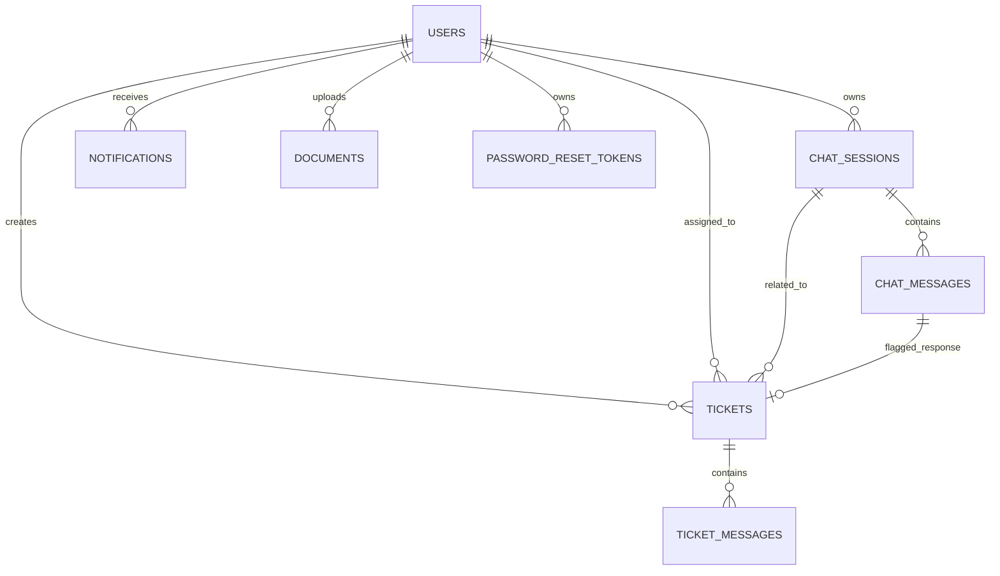

---

## 10.8 Vector Database Design (Qdrant)

SupportAI uses Qdrant as the semantic search engine.

Each stored vector contains:

- Chunk Embedding
- Document Metadata
- Document ID
- Filename
- Chunk Index
- File Type
- Language
- Version Metadata

Qdrant is responsible for:

- Dense Retrieval
- Semantic Similarity Search
- Hybrid Retrieval Support
- Vector Ranking

## The vector database works alongside PostgreSQL but is optimized for semantic retrieval rather than transactional workloads.

# 11. Search & Retrieval Architecture

SupportAI uses a Retrieval-Augmented Generation (RAG) architecture powered by Hybrid Search.

The retrieval system combines:

- Sparse Retrieval (BM25)
- Dense Vector Retrieval
- Reciprocal Rank Fusion (RRF)
- Prompt Engineering
- Large Language Model Generation

This approach improves answer quality, retrieval coverage, and factual grounding compared to using either retrieval strategy independently.

---

## 11.1 Retrieval Pipeline Overview

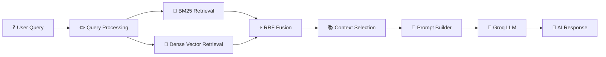

---

## 11.2 Sparse Retrieval (BM25)

SupportAI uses BM25 for keyword-based retrieval alongside dense vector search as part of its Hybrid Search architecture.

BM25 is highly effective when users reference:

- Product names
- Account identifiers
- Error codes
- Exact phrases
- Technical terminology

### Characteristics

- Lexical keyword retrieval
- Built from active document chunks stored in PostgreSQL
- Fast exact-match retrieval
- Strong precision for structured queries
- Complements dense vector retrieval

### Current Implementation

For the current deployment model, SupportAI maintains the BM25 index in memory within the backend application.

The index is generated from all active document chunks and provides low-latency keyword retrieval without requiring an external search engine.

### Refresh Strategy

The BM25 index is automatically rebuilt whenever:

- Documents are uploaded
- Documents are replaced
- Documents are deleted

This ensures that newly ingested knowledge becomes immediately searchable.

### Horizontal Scaling Considerations

In a multi-instance deployment, each backend replica maintains its own local BM25 index.

To ensure retrieval consistency across replicas, BM25 refresh events can be propagated through Redis Pub/Sub, allowing all application instances to rebuild their indexes whenever knowledge base changes occur.

## This architecture preserves retrieval consistency while supporting future horizontal scaling requirements.

## 11.3 Dense Vector Retrieval

SupportAI uses semantic vector search through Qdrant.

Each document chunk is converted into a vector embedding and stored inside Qdrant.

### Characteristics

- Semantic similarity search
- Concept-level understanding
- Handles paraphrased questions
- Supports natural language queries

### Embedding Architecture

SupportAI uses a provider-agnostic embedding system.

Benefits:

- Model replacement without code changes
- Dynamic embedding dimensions
- Future provider flexibility

### Vector Metadata

Each vector contains metadata including:

- document_id
- filename
- chunk_index
- file_type
- language
- version
- upload metadata

---

## 11.4 Hybrid Search

Neither sparse retrieval nor dense retrieval is sufficient on its own.

SupportAI combines both approaches to maximize recall and precision.

### Sparse Retrieval Strengths

- Exact keywords
- Product identifiers
- Error codes
- Technical terms

### Dense Retrieval Strengths

- Semantic understanding
- Synonyms
- Natural language
- Concept matching

### Hybrid Benefits

- Improved retrieval coverage
- Reduced hallucinations
- Better answer grounding
- Improved customer satisfaction

---

## 11.5 Reciprocal Rank Fusion (RRF)

SupportAI combines BM25 and Dense Retrieval results using Reciprocal Rank Fusion (RRF).

### Formula

```text
RRF Score = Σ [1 / (k + rank)]
```

Where:

- k = 60
- rank = result position in each retrieval list

### Benefits

- Eliminates manual weighting
- Robust ranking
- Improved retrieval consistency
- Better handling of diverse queries

### Fusion Flow

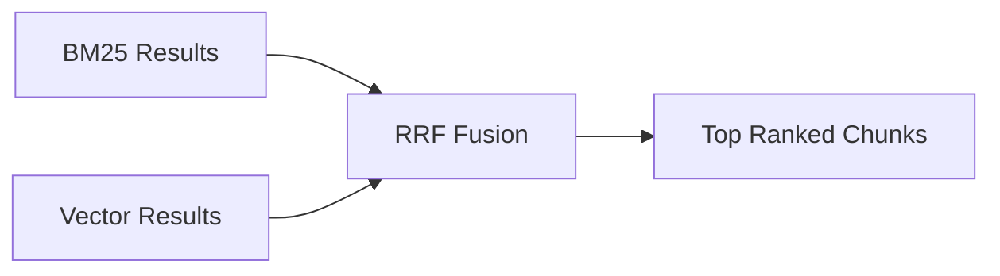

---

## 11.6 Context Selection

After fusion, the highest-ranked chunks are selected.

The retrieval pipeline:

1. Removes duplicate chunks
2. Preserves ranking order
3. Enforces context limits
4. Maximizes information density

The resulting context becomes the foundation of the LLM prompt.

---

## 11.7 Prompt Construction

SupportAI uses a dedicated Prompt Builder component.

Responsibilities:

- Context formatting
- System instruction injection
- User question formatting
- Hallucination prevention guidance

The Prompt Builder ensures the LLM receives structured, grounded context.

---

## 11.8 Response Generation

SupportAI uses Groq-hosted LLMs for inference.

### Responsibilities

- Generate final answers
- Follow system instructions
- Ground responses in retrieved context
- Avoid unsupported claims

The model is instructed to:

- Prefer retrieved information
- Acknowledge missing information
- Avoid hallucinating unsupported facts

---

## 11.9 Confidence Scoring

SupportAI calculates a confidence score for generated responses.

The confidence score is derived from retrieval quality signals such as:

- BM25 ranking strength
- Vector similarity strength
- Fusion ranking quality
- Context relevance

### Usage

Confidence scores are used by:

- Ticket Escalation
- Flagged Response Analysis
- AI Quality Center
- Knowledge Gap Detection

Low-confidence responses are surfaced to administrators for review.

---

## 11.10 Knowledge Gap Detection

SupportAI continuously monitors AI performance to identify gaps in the knowledge base.

Signals include:

- Flagged responses
- Repeated ticket creation
- Low-confidence answers
- Frequently unresolved questions

### Detection Workflow

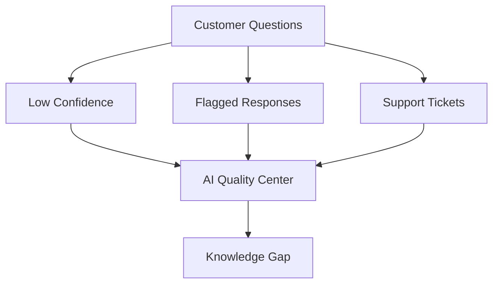

### Benefits

- Identify missing documentation
- Improve answer quality
- Reduce escalations
- Guide knowledge base expansion

---

## 11.11 Current Limitation

SupportAI currently does not persist document attribution data between retrieved chunks and generated responses.

As a result:

- Most Flagged Documents cannot be calculated
- Document Health Scores cannot be calculated
- Retrieval Attribution Analytics cannot be calculated

### Planned Enhancement (v1.1)

Introduce a Retrieval Attribution Layer:

ChatMessage
↔
MessageSource
↔
Document
↔
Chunk

## This will enable full Knowledge Base Impact Analysis within the AI Quality Center.

# 12. Retrieval-Augmented Generation (RAG) Workflow

SupportAI uses a Retrieval-Augmented Generation (RAG) architecture to ensure responses are grounded in verified knowledge base documents rather than relying solely on LLM memory.

The RAG workflow consists of two major stages:

1. Document Ingestion Pipeline
2. Query Processing Pipeline

This architecture significantly reduces hallucinations, improves factual accuracy, and enables scalable knowledge management.

---

## 12.1 Document Ingestion Pipeline

The ingestion pipeline transforms uploaded knowledge base documents into searchable semantic vectors.

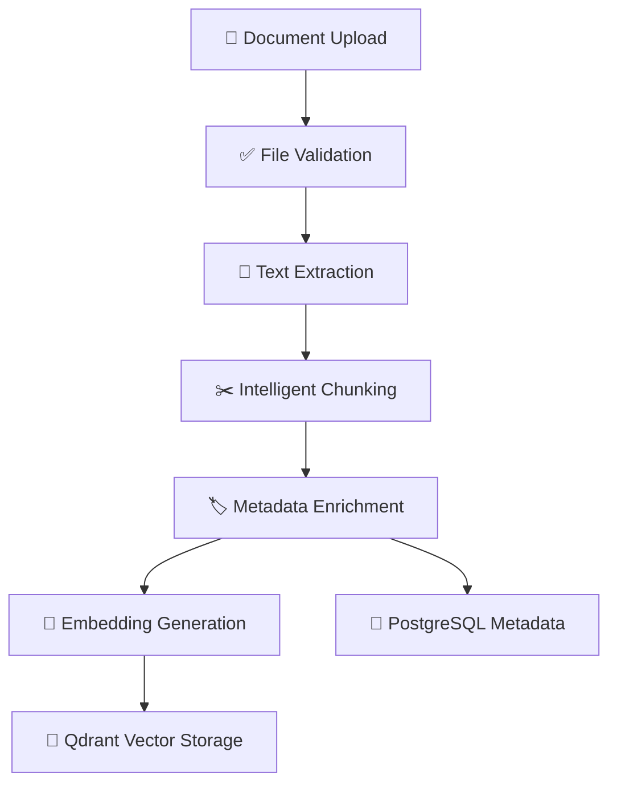

### Processing Stages

#### File Validation

Before processing, uploaded files undergo:

- MIME Type Validation
- Extension Validation
- File Size Validation
- Filename Sanitization

This prevents malicious uploads and invalid content.

---

#### Text Extraction

SupportAI extracts text from:

- PDF Documents
- Markdown Files
- Plain Text Files

Extracted text is normalized and cleaned before chunking.

---

#### Intelligent Chunking

SupportAI uses LangChain's Recursive Character Text Splitter.

Benefits:

- Preserves semantic meaning
- Reduces context fragmentation
- Improves retrieval accuracy

Chunk metadata includes:

- Document ID
- Filename
- Chunk Index
- Language
- Version
- Upload Metadata

---

#### Embedding Generation

Document chunks are converted into dense vector embeddings.

SupportAI uses a provider-agnostic embedding architecture allowing future model replacement without changing application logic.

---

#### Storage

Metadata and document information are stored in PostgreSQL.

Vector embeddings are stored in Qdrant for semantic retrieval.

---

## 12.2 Query Processing Pipeline

When a customer submits a question, SupportAI executes a hybrid retrieval workflow.

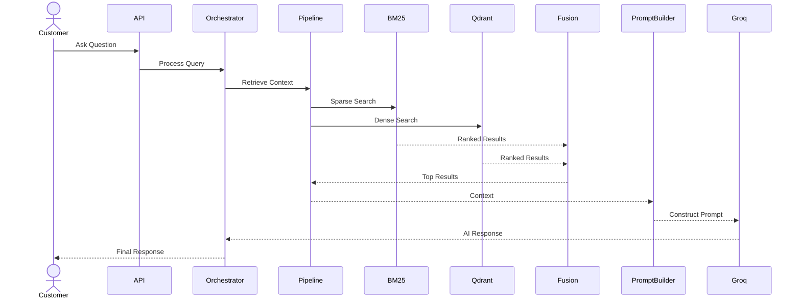

---

## 12.3 Hybrid Retrieval

SupportAI combines two retrieval strategies:

### BM25 Retrieval

Best for:

- Exact keywords
- Product names
- Error codes
- Technical identifiers

### Dense Retrieval

Best for:

- Natural language questions
- Synonyms
- Semantic similarity
- Concept matching

### Reciprocal Rank Fusion (RRF)

SupportAI combines both result sets using Reciprocal Rank Fusion.

Formula:

```text
RRF Score = Σ [1 / (k + rank)]
```

Where:

- k = 60
- rank = result position

Benefits:

- Improved retrieval accuracy
- Better ranking consistency
- Reduced dependence on manual weighting

---

## 12.4 Prompt Construction

Retrieved context is processed by the Prompt Builder.

Responsibilities:

- Context Formatting
- System Instruction Injection
- User Question Formatting
- Hallucination Prevention

The Prompt Builder ensures the LLM receives structured and grounded information.

---

## 12.5 Response Generation

SupportAI uses Groq-hosted LLMs to generate responses.

The model is instructed to:

- Prefer retrieved context
- Avoid unsupported claims
- Acknowledge missing information
- Remain grounded in available documents

This reduces hallucinations and improves answer reliability.

---

## 12.6 Confidence Scoring

SupportAI calculates a confidence score for each generated response.

The confidence score is derived from retrieval quality indicators including:

- BM25 Ranking Strength
- Vector Similarity Strength
- Fusion Ranking Quality
- Context Relevance

Confidence scores are used by:

- AI Quality Center
- Ticket Escalation
- Flagged Response Monitoring
- Knowledge Gap Detection

Low-confidence responses can be surfaced for administrative review.

---

## 12.7 Human-in-the-Loop Support Workflow

SupportAI incorporates human review through the Ticket Management System.

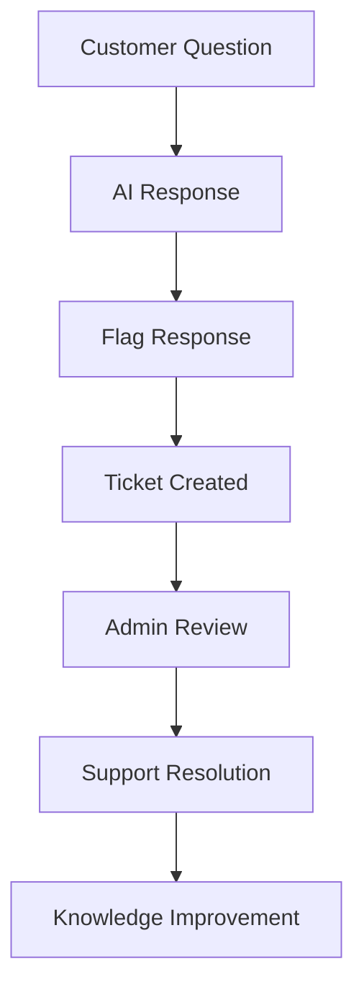

### Benefits

- Human oversight of AI failures
- Improved customer satisfaction
- Continuous quality monitoring
- Knowledge gap identification

---

## 12.8 Current Limitation

SupportAI currently does not persist document attribution data between retrieved chunks and generated responses.

Because document attribution is not persisted:

- Most Flagged Documents cannot be calculated.
- Document Health Scores cannot be calculated.
- Retrieval Attribution Analytics cannot be calculated.

### Planned Enhancement (v1.1)

Introduce a Retrieval Attribution Layer:

```text
ChatMessage
    ↕
MessageSource
    ↕
Document
    ↕
Chunk
```

This enhancement will enable:

- Knowledge Base Impact Analysis
- Retrieval Attribution Analytics
- Source Traceability
- Document Health Scoring

---

# 13. API Design

SupportAI exposes RESTful APIs under the `/api/v1` namespace.

Protected endpoints require:

```http
Authorization: Bearer <JWT_TOKEN>
```

Role-based access control (RBAC) determines whether a user may access Customer or Administrator functionality.

---

## 13.1 Authentication APIs

### Authentication

| Method | Endpoint                | Description                  | Access        |
| ------ | ----------------------- | ---------------------------- | ------------- |
| POST   | `/auth/register`        | Register a new account       | Public        |
| POST   | `/auth/login`           | Authenticate and receive JWT | Public        |
| GET    | `/auth/me`              | Get current user profile     | Authenticated |
| POST   | `/auth/forgot-password` | Request password reset       | Public        |
| POST   | `/auth/reset-password`  | Reset password using token   | Public        |

### Responsibilities

- User registration
- Authentication
- JWT issuance
- Password reset workflow
- Role identification

---

## 13.2 Chat APIs

### Chat Sessions

| Method | Endpoint              | Description              | Access   |
| ------ | --------------------- | ------------------------ | -------- |
| GET    | `/chat/sessions`      | List user chat sessions  | Customer |
| GET    | `/chat/sessions/{id}` | Retrieve session history | Customer |
| PATCH  | `/chat/sessions/{id}` | Rename session           | Customer |
| DELETE | `/chat/sessions/{id}` | Delete session           | Customer |

### Messaging

| Method | Endpoint        | Description                          | Access   |
| ------ | --------------- | ------------------------------------ | -------- |
| POST   | `/chat/message` | Send message and receive AI response | Customer |

### Ticket Escalation

| Method | Endpoint     | Description                        | Access   |
| ------ | ------------ | ---------------------------------- | -------- |
| POST   | `/chat/flag` | Flag AI response and create ticket | Customer |

---

## 13.3 Document Management APIs

### Knowledge Base Management

| Method | Endpoint            | Description                | Access |
| ------ | ------------------- | -------------------------- | ------ |
| GET    | `/documents`        | List uploaded documents    | Admin  |
| POST   | `/documents/upload` | Upload new document        | Admin  |
| DELETE | `/documents/{id}`   | Delete document            | Admin  |
| GET    | `/documents/search` | Search knowledge base      | Admin  |
| GET    | `/documents/{id}`   | Retrieve document metadata | Admin  |

### Responsibilities

- Knowledge base administration
- Document ingestion
- Search validation
- Metadata inspection

---

## 13.4 Ticket Management APIs

### Ticket Operations

| Method | Endpoint                 | Description             | Access |
| ------ | ------------------------ | ----------------------- | ------ |
| GET    | `/tickets`               | List tickets            | Admin  |
| GET    | `/tickets/{id}`          | Retrieve ticket details | Admin  |
| PATCH  | `/tickets/{id}`          | Update ticket           | Admin  |
| POST   | `/tickets/{id}/messages` | Add ticket reply        | Admin  |
| GET    | `/tickets/{id}/messages` | Retrieve ticket thread  | Admin  |

### Responsibilities

- Ticket review
- Escalation handling
- Customer support workflow
- Ticket resolution

---

## 13.5 Notification APIs

### Notifications

| Method | Endpoint                   | Description               | Access        |
| ------ | -------------------------- | ------------------------- | ------------- |
| GET    | `/notifications`           | Retrieve notifications    | Authenticated |
| PATCH  | `/notifications/{id}/read` | Mark notification as read | Authenticated |

### Responsibilities

- Ticket updates
- Support responses
- System alerts

---

## 13.6 Administrator APIs

### Dashboard

| Method | Endpoint           | Description          | Access |
| ------ | ------------------ | -------------------- | ------ |
| GET    | `/admin/dashboard` | Dashboard statistics | Admin  |

### Analytics

| Method | Endpoint           | Description        | Access |
| ------ | ------------------ | ------------------ | ------ |
| GET    | `/admin/analytics` | Platform analytics | Admin  |

### AI Quality Center

| Method | Endpoint             | Description        | Access |
| ------ | -------------------- | ------------------ | ------ |
| GET    | `/quality/analytics` | AI quality metrics | Admin  |

### Responsibilities

- Platform monitoring
- Quality analysis
- Operational visibility
- Business reporting

---

## 13.7 Example Chat Response

```json
{
  "session_id": "8f5b3d71-6ef8-4f1f-a50a-2c65c4f0d9aa",
  "message_id": "f7b82d15-90f5-49db-bf8a-4a5f4f3db25a",
  "role": "assistant",
  "content": "The refund period is 30 days from the date of purchase.",
  "confidence_score": 0.87,
  "created_at": "2026-07-18T10:15:30Z"
}
```

---

## 13.8 Error Handling

SupportAI APIs follow consistent HTTP status codes.

| Status Code | Meaning                 |
| ----------- | ----------------------- |
| 200         | Success                 |
| 201         | Resource Created        |
| 400         | Validation Error        |
| 401         | Authentication Required |
| 403         | Access Denied           |
| 404         | Resource Not Found      |
| 409         | Conflict                |
| 500         | Internal Server Error   |

Error responses follow a standardized JSON structure.

```json
{
  "detail": "Ticket not found"
}
```

---

## 13.9 API Design Principles

SupportAI APIs follow:

- RESTful resource design
- JWT-based authentication
- Role-based authorization
- Consistent validation
- Standardized error handling
- OpenAPI documentation via FastAPI Swagger UI
- Versioned API contracts (`/api/v1`)

---

# 14. Design Patterns

SupportAI leverages multiple architectural and software design patterns to improve maintainability, scalability, extensibility, and reliability.

| Pattern                                | Where Used                                                                        | Purpose                                                                          |
| -------------------------------------- | --------------------------------------------------------------------------------- | -------------------------------------------------------------------------------- |
| **Layered Architecture**               | Entire backend                                                                    | Separates API, services, repositories, and infrastructure concerns               |
| **Repository Pattern**                 | `chat_repo`, `ticket_repo`, `document_repo`, `notification_repo`                  | Encapsulates database access and persistence logic                               |
| **Service Layer Pattern**              | `ticket_service`, `notification_service`, `analytics_service`, `document_service` | Centralizes business logic and keeps API routers thin                            |
| **Dependency Injection**               | FastAPI `Depends()`                                                               | Injects repositories, services, authentication, and database sessions            |
| **Orchestrator Pattern**               | `ChatOrchestrator`                                                                | Coordinates retrieval, prompt construction, response generation, and persistence |
| **Pipeline Pattern**                   | RAG Retrieval Pipeline                                                            | Organizes retrieval into sequential processing stages                            |
| **Strategy Pattern**                   | Hybrid Search                                                                     | Allows BM25 and Dense Retrieval to operate behind a common retrieval abstraction |
| **Factory Pattern**                    | `EmbeddingProviderFactory`                                                        | Enables provider-agnostic embedding generation and future model replacement      |
| **Adapter Pattern**                    | Qdrant, Groq, Embedding Providers                                                 | Provides consistent interfaces for external services                             |
| **DTO / Schema Pattern**               | Pydantic Schemas                                                                  | Strong request/response validation and serialization                             |
| **Singleton Pattern**                  | Qdrant Client, Redis Client, Embedding Models                                     | Prevents expensive repeated initialization                                       |
| **Feature-Sliced Design**              | React Frontend                                                                    | Organizes frontend functionality by feature domain                               |
| **Observer-Like Notification Pattern** | Ticket & Notification Workflow                                                    | Generates notifications when support events occur                                |
| **Transaction Safety Pattern**         | Document Ingestion Pipeline                                                       | Prevents partial ingestion and orphaned vector records                           |
| **Fail-Fast Validation Pattern**       | Upload Validation & Authentication                                                | Rejects invalid requests before business processing                              |

---

## 14.1 Layered Architecture

SupportAI follows a layered architecture consisting of:

```text
API Layer
    ↓
Service Layer
    ↓
Repository Layer
    ↓
Database / Infrastructure
```

Benefits:

- Clear separation of concerns
- Improved maintainability
- Easier testing
- Simplified scaling

---

## 14.2 Repository Pattern

Repositories abstract direct database operations.

Examples:

```text
ChatRepository
TicketRepository
DocumentRepository
NotificationRepository
```

Benefits:

- Centralized data access
- Reduced duplication
- Easier mocking during testing
- Database implementation independence

---

## 14.3 Orchestrator Pattern

The Chat Orchestrator acts as the central coordinator for AI interactions.

Responsibilities:

- Conversation management
- Retrieval execution
- Prompt generation
- Response persistence
- Session updates

Benefits:

- Prevents router bloat
- Centralizes AI workflow management
- Simplifies future enhancements

---

## 14.4 Pipeline Pattern

The Retrieval-Augmented Generation workflow is implemented as a processing pipeline.

```text
User Query
    ↓
BM25 Retrieval
    ↓
Dense Retrieval
    ↓
RRF Fusion
    ↓
Context Selection
    ↓
Prompt Builder
    ↓
LLM Generation
```

Benefits:

- Modular processing stages
- Easier debugging
- Improved maintainability
- Extensible retrieval architecture

---

## 14.5 Factory Pattern

SupportAI uses an Embedding Provider Factory.

```text
EmbeddingProviderFactory
    ├── Local Embeddings
    ├── OpenAI Embeddings
    └── Future Providers
```

Benefits:

- Provider independence
- Easier experimentation
- Dynamic vector dimensions
- Reduced coupling

---

## 14.6 Strategy Pattern

Hybrid Search uses interchangeable retrieval strategies.

Strategies:

- BM25 Retrieval
- Dense Vector Retrieval

Benefits:

- Retrieval flexibility
- Improved testing
- Future retrieval expansion

---

## 14.7 Adapter Pattern

External services are wrapped through adapters.

Examples:

- Groq Adapter
- Qdrant Adapter
- Embedding Provider Adapter

Benefits:

- Simplified integrations
- Consistent interfaces
- Easier provider replacement

---

## 14.8 Feature-Sliced Frontend Architecture

The React frontend follows Feature-Sliced Design.

```text
features/
    ├── auth/
    ├── chat/
    ├── tickets/
    ├── documents/
    ├── notifications/
    └── quality/
```

Benefits:

- Better scalability
- Reduced coupling
- Easier onboarding
- Improved maintainability

---

## 14.9 Transaction Safety Pattern

SupportAI implements transaction-safe document ingestion.

Workflow:

```text
Document Upload
    ↓
PostgreSQL Insert
    ↓
Qdrant Insert
    ↓
Commit

Failure
    ↓
Rollback
```

Benefits:

- Prevents orphaned vectors
- Prevents partial ingestion
- Improves reliability

---

## 14.10 Design Pattern Benefits

The combination of these patterns enables:

- High maintainability
- Scalability
- Extensibility
- Reliability
- Testability
- Separation of concerns
- Future AI provider flexibility

---

# 15. Application Security

Security is a core design principle within SupportAI. The platform implements multiple layers of protection across authentication, authorization, API security, data protection, file processing, and infrastructure.

---

## 15.1 Authentication & Authorization

SupportAI uses JWT-based authentication combined with Role-Based Access Control (RBAC).

### Authentication Features

- JWT Access Tokens
- Secure Password Hashing
- Password Reset Workflow
- Protected API Endpoints
- Session Validation

### Password Security

- Passwords are never stored in plaintext.
- Passwords are hashed using bcrypt.
- Password reset tokens are time-limited.
- Reset tokens are validated before password changes.

### Role-Based Access Control (RBAC)

SupportAI defines two primary roles:

| Role          | Permissions                                           |
| ------------- | ----------------------------------------------------- |
| Customer      | Chat, Tickets, Notifications                          |
| Administrator | Knowledge Base, Analytics, Tickets, AI Quality Center |

Role enforcement is implemented through FastAPI dependency injection and route-level authorization checks.

### Security Flow

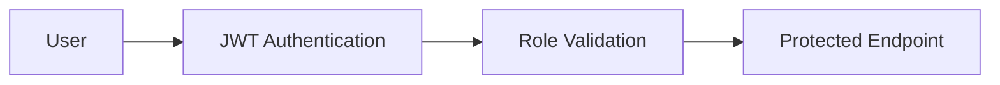

---

## 15.2 API Security

All API endpoints undergo strict validation before business logic execution.

### Protections

- Request Validation
- Schema Validation
- Type Enforcement
- Length Validation
- Authentication Validation
- Authorization Validation

### CORS Protection

Production deployments restrict requests to approved frontend origins.

Examples:

- Vercel Frontend
- Internal Development Environments

### Rate Limiting

SupportAI implements request throttling on critical endpoints including:

- Chat APIs
- Authentication APIs
- Password Reset APIs

Benefits:

- Prevents abuse
- Mitigates brute-force attacks
- Protects LLM resources

---

## 15.3 File Upload Security

Knowledge Base uploads undergo multiple security checks before processing.

### Validation Pipeline

```mermaid
flowchart LR

Upload["Document Upload"]

Mime["MIME Validation"]

Extension["Extension Validation"]

Size["File Size Validation"]

Filename["Filename Sanitization"]

Processing["Document Processing"]

Upload --> Mime

Mime --> Extension

Extension --> Size

Size --> Filename

Filename --> Processing
```

### Protections

- MIME Type Validation
- Extension Validation
- File Size Validation
- Filename Sanitization
- Invalid File Rejection

Benefits:

- Prevents malicious uploads
- Protects ingestion pipeline
- Reduces attack surface

---

## 15.4 Data Security

SupportAI protects sensitive data throughout the application lifecycle.

### Secrets Management

Sensitive values are stored as environment variables:

- Database URLs
- JWT Secrets
- Groq API Keys
- Redis Credentials
- Qdrant Credentials

No secrets are stored in source code.

### Encryption

Transport security is enforced through HTTPS.

Production deployments rely on:

- Railway TLS
- Vercel TLS

### Database Security

Access is restricted to authorized backend services only.

Benefits:

- Reduced attack surface
- Controlled data access
- Infrastructure isolation

---

## 15.5 Administrative Security

Administrator functionality receives additional protection.

### Protected Resources

- Document Upload
- Document Deletion
- Ticket Management
- AI Quality Center
- Analytics Dashboard

### Security Controls

- JWT Validation
- Role Verification
- Route Protection
- Authorization Dependencies

This creates a double-gated security model.

```text
JWT Authentication
        ↓
Role Verification
        ↓
Admin Endpoint Access
```

---

## 15.6 Prompt Security

SupportAI implements safeguards to reduce prompt manipulation risks.

### Protections

- User Input Validation
- Context Isolation
- Prompt Construction Controls
- Retrieval Grounding

The Prompt Builder ensures that generated responses remain grounded in retrieved knowledge base content.

### Goals

- Reduce hallucinations
- Reduce prompt injection risk
- Improve answer reliability

---

## 15.7 Error Handling & Security Monitoring

SupportAI implements centralized error handling.

### Features

- Global Exception Handler
- Structured Logging
- Request Tracking
- Error Correlation

Benefits:

- Faster incident investigation
- Improved observability
- Better debugging

---

## 15.8 Dependency Security

Dependencies are periodically audited.

### Areas Reviewed

- Python Packages
- Node Packages
- Authentication Libraries
- Database Drivers

Benefits:

- Reduced supply-chain risk
- Improved platform security
- Faster vulnerability remediation

---

## 15.9 Threat Model

| Threat               | Mitigation                         |
| -------------------- | ---------------------------------- |
| Unauthorized Access  | JWT Authentication + RBAC          |
| Privilege Escalation | Route-Level Authorization          |
| Credential Theft     | bcrypt + HTTPS                     |
| Brute Force Attacks  | Rate Limiting                      |
| Malicious Uploads    | File Validation Pipeline           |
| Prompt Injection     | Prompt Builder + Grounding         |
| Data Exfiltration    | CORS + Protected APIs              |
| Secret Leakage       | Environment Variables              |
| Orphaned Data        | Transaction Safety + Rollback      |
| API Abuse            | Request Validation + Rate Limiting |

---

## 15.10 Security Principles

SupportAI follows the following security principles:

- Defense in Depth
- Least Privilege
- Fail Fast Validation
- Secure Defaults
- Separation of Concerns
- Principle of Explicit Authorization

## These principles guide the design of authentication, authorization, file handling, API access, and operational security across the platform.

# 16. Deployment Architecture

SupportAI follows a cloud-native deployment architecture with a clear separation between frontend, backend, databases, caching, vector search, and AI inference services.

The platform is deployed using managed cloud services to simplify operations and reduce infrastructure overhead.

---

## 16.1 Production Deployment Overview

```mermaid
flowchart TB

subgraph Users

Customer["👤 Customer"]

Admin["👨‍💼 Administrator"]

end

subgraph Vercel["Vercel"]

Frontend["⚛️ React + TypeScript"]

end

subgraph Railway["Railway"]

Backend["🚀 FastAPI Backend"]

Redis["🟥 Redis"]

Postgres[("🐘 PostgreSQL")]

end

subgraph External["Managed Services"]

Qdrant[("🔎 Qdrant Cloud")]

Groq["🧠 Groq API"]

end

Customer --> Frontend

Admin --> Frontend

Frontend --> Backend

Backend --> Redis

Backend --> Postgres

Backend --> Qdrant

Backend --> Groq
```

---

## 16.2 Deployment Components

### Frontend (Vercel)

Technology Stack:

- React
- TypeScript
- Tailwind CSS
- Vite

Responsibilities:

- Customer Portal
- Admin Dashboard
- Ticket Management
- AI Quality Center
- Authentication UI

Benefits:

- Global CDN
- Automatic HTTPS
- Continuous Deployment
- Fast Edge Delivery

---

### Backend (Railway)

Technology Stack:

- FastAPI
- SQLAlchemy
- Alembic
- Redis Client
- Qdrant Client

Responsibilities:

- Authentication
- Chat Orchestration
- RAG Pipeline
- Ticket Management
- Notification Management
- AI Quality Analytics

Benefits:

- Managed deployment
- Automatic restarts
- Environment management
- Simplified scaling

---

### PostgreSQL

Responsibilities:

- Users
- Chat Sessions
- Chat Messages
- Tickets
- Ticket Messages
- Notifications
- Analytics Metadata

Benefits:

- ACID Transactions
- Strong Consistency
- Relational Integrity

---

### Redis

Responsibilities:

- Caching
- Session Acceleration
- Temporary Data Storage

Benefits:

- Low Latency
- Reduced Database Load
- Faster Response Times

---

### Qdrant Cloud

Responsibilities:

- Vector Storage
- Semantic Search
- Dense Retrieval

Benefits:

- High-Speed Vector Search
- Similarity Search
- Scalable Retrieval Infrastructure

---

### Groq

Responsibilities:

- Large Language Model Inference
- Response Generation

Benefits:

- Low Latency
- High Throughput
- Production-Grade AI Inference

---

## 16.3 Deployment Flow

```mermaid
sequenceDiagram

participant Developer

participant GitHub

participant Railway

participant Vercel

Developer->>GitHub: Push Code

GitHub->>Railway: Backend Deployment

GitHub->>Vercel: Frontend Deployment

Railway-->>Developer: Backend Live

Vercel-->>Developer: Frontend Live
```

### Backend Deployment

1. Push code to GitHub.
2. Railway automatically pulls latest changes.
3. Build process executes.
4. Environment variables are injected.
5. Application starts.
6. Health checks are performed.

### Frontend Deployment

1. Push code to GitHub.
2. Vercel automatically builds the application.
3. Static assets are optimized.
4. Global CDN distribution occurs.
5. Deployment becomes available.

---

## 16.4 Local Development Environment

SupportAI supports local development using Docker.

```yaml
services:
  backend:
    build: ./backend
    ports:
      - "8000:8000"
    env_file:
      - .env

  postgres:
    image: postgres:15

  qdrant:
    image: qdrant/qdrant
    ports:
      - "6333:6333"

  redis:
    image: redis:7
    ports:
      - "6379:6379"
```

### Local Services

| Service    | Purpose              |
| ---------- | -------------------- |
| Backend    | FastAPI Application  |
| PostgreSQL | Relational Database  |
| Redis      | Cache Layer          |
| Qdrant     | Vector Search Engine |

---

## 16.5 Environment Variables

SupportAI relies on environment-based configuration.

Examples:

```text
DATABASE_URL
JWT_SECRET_KEY
GROQ_API_KEY
QDRANT_URL
QDRANT_API_KEY
REDIS_URL
```

Benefits:

- Secure secret management
- Environment separation
- Simplified deployment

---

## 16.6 Scalability Considerations

The architecture supports future scaling through:

- Horizontal API scaling
- Managed PostgreSQL scaling
- Redis clustering
- Qdrant scaling
- Model replacement through provider abstraction

This allows SupportAI to evolve from a prototype into a production-grade AI support platform without major architectural changes.

---

# 17. CI/CD Architecture

SupportAI follows a Continuous Integration and Continuous Deployment (CI/CD) workflow to ensure that every code change is validated, tested, and deployed consistently.

The deployment process emphasizes:

- Code Quality
- Automated Validation
- Deployment Reliability
- Fast Iteration
- Regression Prevention

---

## 17.1 CI/CD Pipeline

```mermaid
flowchart LR

Developer["👨‍💻 Developer"]

GitHub["GitHub Repository"]

Commit["Commit & Push"]

Actions["GitHub Actions"]

Lint["Frontend Lint"]

Tests["Backend Tests"]

Build["Frontend Build"]

Railway["Railway Deployment"]

Vercel["Vercel Deployment"]

Production["Production Environment"]

Developer --> Commit

Commit --> GitHub

GitHub --> Actions

Actions --> Lint

Lint --> Tests

Tests --> Build

Build --> Railway

Build --> Vercel

Railway --> Production

Vercel --> Production
```

---

## 17.2 Continuous Integration

Every code change undergoes automated validation before deployment.

### Frontend Validation

```bash
npm run lint
npm run build
```

Purpose:

- Code Quality Enforcement
- Type Safety Validation
- Build Verification

### Backend Validation

```bash
pytest
```

Purpose:

- Regression Detection
- API Validation
- Service Verification

---

## 17.3 Continuous Deployment

### Frontend Deployment (Vercel)

Deployment Flow:

```text
GitHub Push
      ↓
Vercel Build
      ↓
Production Deployment
```

Responsibilities:

- Build React Application
- Optimize Static Assets
- Deploy to CDN
- Serve Customer & Admin Interfaces

---

### Backend Deployment (Railway)

Deployment Flow:

```text
GitHub Push
      ↓
Railway Build
      ↓
Application Startup
      ↓
Production Deployment
```

Responsibilities:

- Build FastAPI Application
- Inject Environment Variables
- Start API Services
- Connect Infrastructure Services

---

## 17.4 Validation Pipeline

SupportAI validates changes before deployment using:

| Validation              | Purpose                      |
| ----------------------- | ---------------------------- |
| ESLint                  | Frontend code quality        |
| TypeScript Build        | Type safety verification     |
| Pytest                  | Backend testing              |
| Manual E2E Verification | Critical workflow validation |

---

## 17.5 Database Migration Strategy

Database schema changes are managed using Alembic migrations.

### Migration Workflow

```text
Create Migration
        ↓
Review Migration
        ↓
Apply Migration
        ↓
Validate Application
```

Benefits:

- Controlled schema evolution
- Version tracking
- Reproducible deployments

---

## 17.6 Release Management

SupportAI uses Git tags to identify stable releases.

Examples:

```text
v0.9.1-pre-redis
v0.9.2
v1.0-quality-center
```

Benefits:

- Release traceability
- Easier rollback
- Deployment auditing

---

## 17.7 Rollback Strategy

If a deployment introduces issues:

1. Identify the last stable Git tag.
2. Revert to the stable version.
3. Redeploy the application.
4. Validate critical workflows.

### Protected Areas

Special attention is given to:

- Authentication
- Chat Sessions
- Ticket Management
- AI Quality Center
- Knowledge Base Operations

---

## 17.8 Deployment Principles

SupportAI follows the following deployment principles:

- Every deployment must be reproducible.
- Production code must pass automated validation.
- Infrastructure configuration is externalized through environment variables.
- Critical workflows require end-to-end verification.
- Stable releases are versioned through Git tags.

---

## 17.9 Current State

Current validation process includes:

- Frontend Linting
- Frontend Build Verification
- Backend Automated Tests
- Manual End-to-End Testing

Recent validation results:

```text
Backend Tests: 45/45 Passed
Frontend Lint: Passed
Frontend Build: Passed
```

## These checks help ensure production stability while enabling rapid development and deployment.

---

# 18. Testing Strategy

SupportAI follows a layered testing strategy designed to ensure reliability, correctness, maintainability, and production stability.

Testing is performed across multiple levels including automated backend tests, frontend validation, integration verification, and manual end-to-end workflow testing.

---

## 18.1 Testing Pyramid

```mermaid
flowchart TB

E2E["🎭 End-to-End Testing"]

Integration["🔗 Integration Testing"]

Unit["🧩 Unit Testing"]

Unit --> Integration

Integration --> E2E
```

Each layer validates a different aspect of the system.

---

## 18.2 Testing Coverage

| Test Type           | Scope                                | Examples                                         |
| ------------------- | ------------------------------------ | ------------------------------------------------ |
| Unit Testing        | Individual services and functions    | Authentication, Retrieval Logic, Ticket Service  |
| Integration Testing | Interaction between components       | PostgreSQL, Redis, Qdrant, Groq                  |
| API Testing         | Endpoint validation                  | Authentication, Chat, Tickets, Documents         |
| End-to-End Testing  | Complete user workflows              | Login → Chat → Flag Response → Ticket Resolution |
| Security Testing    | Authentication and authorization     | JWT Validation, RBAC Enforcement                 |
| Regression Testing  | Existing functionality after changes | Chat, RAG, Tickets, AI Quality Center            |

---

## 18.3 Backend Testing

SupportAI uses Pytest for backend validation.

### Areas Covered

- Authentication APIs
- Chat APIs
- Document Management
- Ticket Management
- Notification Workflows
- AI Quality Analytics
- Retrieval Pipeline Logic

### Validation Command

```bash
pytest
```

Recent validation results:

```text
45/45 Tests Passed
```

Benefits:

- Regression Prevention
- Service Validation
- API Verification

---

## 18.4 Frontend Testing

Frontend validation focuses on static analysis and build verification.

### Linting

```bash
npm run lint
```

Purpose:

- Code Quality
- Type Safety
- Consistency Enforcement

### Build Verification

```bash
npm run build
```

Purpose:

- Production Build Validation
- Dependency Verification
- TypeScript Compilation

Benefits:

- Early Error Detection
- Deployment Confidence

---

## 18.5 Integration Testing

Integration testing validates interactions between major platform components.

### Components Verified

- FastAPI ↔ PostgreSQL
- FastAPI ↔ Redis
- FastAPI ↔ Qdrant
- FastAPI ↔ Groq
- Chat Orchestrator ↔ Retrieval Pipeline

Benefits:

- Detect configuration issues
- Validate infrastructure connectivity
- Prevent deployment failures

---

## 18.6 End-to-End Testing

Critical customer and administrator workflows are manually verified before major releases.

### Customer Workflows

- Registration
- Login
- Chat Sessions
- Session Persistence
- Message Flagging
- Notification Viewing

### Administrator Workflows

- Document Upload
- Knowledge Base Search
- Ticket Review
- Ticket Resolution
- AI Quality Center
- Analytics Dashboard

Benefits:

- User Experience Validation
- Workflow Verification
- Production Readiness

---

## 18.7 Regression Testing

SupportAI places strong emphasis on regression prevention.

Critical areas verified after significant changes include:

- Authentication
- Chat System
- Retrieval Pipeline
- Ticket System
- Notifications
- AI Quality Center
- Knowledge Base Management

Regression testing became especially important during:

- Session Persistence Fixes
- Ticket Workflow Refactoring
- AI Quality Center Implementation
- Production Hardening Sprint

---

## 18.8 Quality Gates

Every release should satisfy the following requirements:

### Backend

```bash
pytest
```

Must pass successfully.

### Frontend

```bash
npm run lint
npm run build
```

Must complete without errors.

### Manual Verification

Critical workflows must be tested:

- Chat Response Generation
- Ticket Creation
- Ticket Resolution
- Document Upload
- AI Quality Dashboard

Only after these validations are complete should a release be considered production-ready.

---

## 18.9 Test Environments

| Environment       | Purpose                       |
| ----------------- | ----------------------------- |
| Local Development | Development and debugging     |
| CI Pipeline       | Automated validation          |
| Production        | Final deployment verification |

SupportAI currently relies on automated validation and production verification rather than maintaining a dedicated staging environment.

---

## 18.10 Testing Principles

SupportAI follows the following testing principles:

- Automate repetitive validation.
- Prevent regressions before deployment.
- Test critical workflows end-to-end.
- Verify infrastructure integrations.
- Keep production releases stable.
- Validate every significant architectural change.

These principles help ensure that SupportAI remains reliable while continuing to evolve into a production-grade AI customer support platform.

---

# 19. Reliability & Resilience

SupportAI is designed to maintain stability and data integrity even when infrastructure components experience temporary failures.

The platform emphasizes:

- Fault Tolerance
- Transaction Safety
- Graceful Error Handling
- Recovery Mechanisms
- Operational Stability

Rather than assuming every dependency is always available, SupportAI is designed to detect failures and prevent data corruption.

---

## 19.1 Reliability Architecture

```mermaid
flowchart LR

Customer["👤 Customer"]

Frontend["⚛️ Frontend"]

Backend["🚀 FastAPI"]

Postgres["🐘 PostgreSQL"]

Redis["🟥 Redis"]

Qdrant["🔎 Qdrant"]

Groq["🧠 Groq"]

Customer --> Frontend

Frontend --> Backend

Backend --> Postgres

Backend --> Redis

Backend --> Qdrant

Backend --> Groq
```

The architecture is designed so that failures in supporting services do not immediately corrupt application state.

---

## 19.2 Failure Recovery Matrix

| Component       | Possible Failure     | Detection            | Recovery Strategy         |
| --------------- | -------------------- | -------------------- | ------------------------- |
| Redis           | Cache Unavailable    | Connection Error     | Continue without cache    |
| PostgreSQL      | Database Unavailable | Connection Failure   | Reject requests safely    |
| Qdrant          | Search Failure       | Retrieval Exception  | Return controlled error   |
| Groq            | Timeout / API Error  | API Response Failure | Retry and return fallback |
| Document Upload | Partial Ingestion    | Transaction Failure  | Automatic rollback        |
| Frontend        | API Failure          | Request Error        | User-friendly error state |

---

## 19.3 Document Ingestion Reliability

Document ingestion is one of the most critical workflows in SupportAI.

A failure during ingestion must never leave the system in an inconsistent state.

### Reliability Workflow

```mermaid
flowchart TD

Upload["Document Upload"]

Postgres["Store Metadata"]

Qdrant["Store Vectors"]

Success["Commit"]

Failure["Rollback"]

Upload --> Postgres

Postgres --> Qdrant

Qdrant --> Success

Qdrant --> Failure

Failure --> Upload
```

### Protections

- Transaction-Safe Inserts
- Rollback on Failure
- Prevention of Orphaned Vectors
- Consistent Metadata Storage

Benefits:

- Data Integrity
- Reliable Knowledge Base Updates
- Easier Recovery

---

## 19.4 Error Handling Strategy

SupportAI implements centralized exception handling.

### Features

- Global Exception Handler
- Structured Error Responses
- Request Tracking
- Error Logging

Benefits:

- Consistent API Behavior
- Improved Debugging
- Better User Experience

### Example Error Response

```json
{
  "detail": "Unable to process request at this time."
}
```

---

## 19.5 Retry Strategy

Certain external service failures may be temporary.

SupportAI applies controlled retry behavior for:

- Groq Requests
- Qdrant Operations
- Network Communication

### Goals

- Recover from transient failures
- Reduce user-facing disruptions
- Improve service stability

---

## 19.6 Graceful Degradation

SupportAI attempts to remain functional when non-critical components fail.

### Examples

#### Redis Failure

System Behavior:

```text
Redis Unavailable
        ↓
Bypass Cache
        ↓
Continue Processing
```

The application remains operational with reduced performance.

#### Notification Failure

System Behavior:

```text
Notification Failure
        ↓
Primary Workflow Continues
```

The customer workflow is not blocked by secondary services.

---

## 19.7 Data Consistency

SupportAI prioritizes consistency for critical business data.

Protected Areas:

- User Accounts
- Chat Sessions
- Chat Messages
- Tickets
- Ticket Messages
- Knowledge Base Documents

### Consistency Mechanisms

- Database Transactions
- Rollback Protection
- Foreign Key Relationships
- Repository Layer Validation

---

## 19.8 Operational Stability

Recent stabilization efforts focused on:

### Chat Reliability

- Session Persistence Fixes
- Conversation Recovery
- Retrieval Integrity

### Ticket Reliability

- Ticket Status Updates
- Support Reply Synchronization
- Flagged Question Unification

### Retrieval Reliability

- Hybrid Search Validation
- RRF Fusion Consistency
- Context Preservation

### AI Quality Reliability

- Analytics Validation
- Real Data Aggregation
- Removal of Mock Metrics

---

## 19.9 Reliability Principles

SupportAI follows the following reliability principles:

- Fail safely rather than corrupt data.
- Prefer graceful degradation over crashes.
- Protect critical workflows with transactions.
- Validate operations before persistence.
- Recover automatically where possible.
- Surface meaningful errors to users.

These principles help ensure that SupportAI remains stable, predictable, and maintainable as the platform evolves.

---

# 20. Enterprise Security Architecture

SupportAI adopts a Defense-in-Depth security model where multiple independent security controls work together to protect customer data, administrative functionality, AI services, and infrastructure components.

Rather than relying on a single protection mechanism, security controls are applied at every architectural layer.

---

## 20.1 Security Architecture Overview

```mermaid
flowchart TB

User["👤 User"]

TLS["🔒 TLS / HTTPS"]

Authentication["🔑 Authentication"]

Authorization["🛡️ Authorization"]

Validation["✅ Validation Layer"]

Application["⚙️ Application Services"]

Data["🐘 Data Layer"]

External["🌐 External Services"]

User --> TLS

TLS --> Authentication

Authentication --> Authorization

Authorization --> Validation

Validation --> Application

Application --> Data

Application --> External
```

---

## 20.2 Defense-in-Depth Model

SupportAI implements security controls across multiple layers.

| Layer          | Controls                  |
| -------------- | ------------------------- |
| Network        | HTTPS / TLS               |
| Identity       | JWT Authentication        |
| Authorization  | RBAC                      |
| Application    | Input Validation          |
| Data           | Database Access Controls  |
| Infrastructure | Environment-Based Secrets |
| Operations     | Logging & Monitoring      |

Benefits:

- Reduced attack surface
- Multiple security barriers
- Improved incident containment
- Better operational resilience

---

## 20.3 STRIDE Threat Model

SupportAI evaluates threats using Microsoft's STRIDE framework.

| Threat                 | Example                       | Mitigation                  |
| ---------------------- | ----------------------------- | --------------------------- |
| Spoofing               | User impersonation            | JWT Authentication + bcrypt |
| Tampering              | Modified requests             | Request Validation          |
| Repudiation            | Action denial                 | Audit Trails & Logging      |
| Information Disclosure | Unauthorized data access      | RBAC + HTTPS                |
| Denial of Service      | Excessive requests            | Rate Limiting + Caching     |
| Elevation of Privilege | Customer accessing admin APIs | Server-Side Authorization   |

---

## 20.4 Trust Boundaries

The platform is separated into multiple trust zones.

```mermaid
flowchart LR

subgraph Internet

Customer["👤 Customer"]

Administrator["👨‍💼 Administrator"]

end

subgraph TrustedApplication

Frontend["⚛️ Frontend"]

Backend["🚀 FastAPI"]

Redis["🟥 Redis"]

PostgreSQL["🐘 PostgreSQL"]

end

subgraph ExternalProviders

Groq["🧠 Groq"]

Qdrant["🔎 Qdrant"]

end

Customer --> Frontend

Administrator --> Frontend

Frontend --> Backend

Backend --> Redis

Backend --> PostgreSQL

Backend --> Groq

Backend --> Qdrant
```

### Trust Boundary Rules

- Users never communicate directly with databases.
- Users never access Qdrant directly.
- Users never access Groq directly.
- All requests pass through authenticated APIs.

---

## 20.5 Identity & Access Management

SupportAI uses centralized identity management.

### Authentication

- JWT Access Tokens
- Password Hashing (bcrypt)
- Password Reset Tokens
- Session Validation

### Authorization

RBAC Roles:

| Role          | Access Level                                     |
| ------------- | ------------------------------------------------ |
| Customer      | Chat, Tickets, Notifications                     |
| Administrator | Documents, Analytics, AI Quality Center, Tickets |

Benefits:

- Principle of Least Privilege
- Controlled Access
- Reduced Insider Risk

---

## 20.6 Data Protection

SupportAI protects data both in transit and at rest.

### Data In Transit

Protected by:

- HTTPS
- TLS Encryption

### Sensitive Data

Protected through:

- Password Hashing
- Environment Variables
- Database Access Controls

Examples:

```text
DATABASE_URL
JWT_SECRET_KEY
GROQ_API_KEY
QDRANT_API_KEY
REDIS_URL
```

---

## 20.7 Secure AI Architecture

AI systems introduce unique security concerns.

SupportAI mitigates these risks through:

### Retrieval Grounding

Responses are grounded using:

- BM25 Retrieval
- Dense Retrieval
- RRF Fusion

### Prompt Construction Controls

Prompt Builder responsibilities:

- Context Isolation
- Structured Prompt Assembly
- Hallucination Reduction

### Benefits

- Reduced Prompt Injection Risk
- Improved Response Reliability
- Better Explainability

---

## 20.8 Secure Knowledge Base Operations

Document ingestion is protected through:

```mermaid
flowchart LR

Upload["Upload"]

Validation["Validation"]

Extraction["Extraction"]

Embedding["Embedding"]

Storage["Storage"]

Upload --> Validation

Validation --> Extraction

Extraction --> Embedding

Embedding --> Storage
```

### Security Controls

- MIME Validation
- Extension Validation
- File Size Validation
- Filename Sanitization

Benefits:

- Reduced Malware Risk
- Safer Processing Pipeline
- Controlled Content Ingestion

---

## 20.9 Auditability & Monitoring

SupportAI records operational events to improve traceability.

Examples:

- Authentication Events
- Ticket Actions
- Administrative Changes
- Document Uploads
- Error Events

Benefits:

- Easier Incident Investigation
- Accountability
- Compliance Readiness

---

## 20.10 Enterprise Security Principles

SupportAI follows the following enterprise security principles:

- Defense in Depth
- Least Privilege
- Zero Trust Mindset
- Secure by Default
- Fail Securely
- Explicit Authorization
- Separation of Duties
- Continuous Validation

---

# 21. Risks & Mitigation

As SupportAI evolves into a production-grade AI customer support platform, several technical, operational, and business risks must be continuously monitored and managed.

---

## 21.1 Risk Assessment Matrix

| Risk                               | Likelihood | Impact | Mitigation                                                             |
| ---------------------------------- | ---------- | ------ | ---------------------------------------------------------------------- |
| Groq API Downtime or Rate Limiting | Medium     | High   | Retry strategy, graceful error handling, future multi-provider support |
| AI Hallucinations                  | Medium     | High   | Retrieval grounding, hybrid search, confidence scoring                 |
| Knowledge Base Gaps                | High       | Medium | AI Quality Center, ticket analytics, knowledge gap detection           |
| Poor Retrieval Quality             | Medium     | High   | Hybrid search, RRF fusion, retrieval monitoring                        |
| Document Ingestion Failures        | Low        | High   | Transaction rollback and ingestion validation                          |
| Unauthorized Access                | Low        | High   | JWT, RBAC, password hashing                                            |
| Malicious File Uploads             | Medium     | High   | MIME validation, file size validation, filename sanitization           |
| Database Failures                  | Low        | High   | Managed PostgreSQL, backups, transaction protection                    |
| Qdrant Availability Issues         | Low        | Medium | Controlled error handling and retrieval validation                     |
| Redis Failures                     | Medium     | Low    | Graceful cache bypass                                                  |
| Notification Delivery Failures     | Medium     | Low    | Non-blocking notification architecture                                 |
| Frontend Deployment Failures       | Low        | Medium | Automated build validation                                             |
| Backend Deployment Regressions     | Medium     | High   | Automated tests, regression verification                               |
| Ticket Workflow Regressions        | Medium     | Medium | End-to-end testing and workflow validation                             |
| AI Quality Analytics Inaccuracy    | Medium     | Medium | Real-data aggregation and validation                                   |
| Future Scaling Challenges          | Medium     | Medium | Modular architecture and provider abstraction                          |

---

## 21.2 Technical Risks

### AI Hallucinations

Risk:

The LLM may generate information not supported by the knowledge base.

Mitigation:

- Retrieval-Augmented Generation (RAG)
- Hybrid Search
- Confidence Scoring
- Ticket Escalation Workflow
- Human Review Process

---

### Retrieval Quality Degradation

Risk:

Relevant knowledge may not be retrieved.

Mitigation:

- BM25 Retrieval
- Dense Vector Retrieval
- Reciprocal Rank Fusion
- AI Quality Center Monitoring

---

### Knowledge Base Gaps

Risk:

The platform may lack documentation for customer questions.

Mitigation:

- Ticket Analytics
- Flagged Response Analysis
- Knowledge Gap Detection
- Continuous Knowledge Base Expansion

---

## 21.3 Infrastructure Risks

### Groq Service Disruption

Risk:

LLM inference becomes unavailable.

Mitigation:

- Retry Strategy
- Graceful Error Messages
- Provider-Abstraction Architecture

Future Roadmap:

- Multi-Provider LLM Support

---

### Database Failures

Risk:

Loss of access to PostgreSQL.

Mitigation:

- Managed Database Services
- Transaction Protection
- Backup Strategies
- Controlled Failure Handling

---

### Vector Database Failures

Risk:

Qdrant retrieval becomes unavailable.

Mitigation:

- Error Handling
- Retrieval Validation
- Controlled User Feedback

---

## 21.4 Security Risks

### Credential Exposure

Risk:

Secrets become compromised.

Mitigation:

- Environment Variables
- Secret Rotation
- Restricted Access

---

### Privilege Escalation

Risk:

Customer gains administrative access.

Mitigation:

- JWT Authentication
- RBAC Enforcement
- Protected Admin Routes

---

### Malicious Uploads

Risk:

Dangerous files enter the ingestion pipeline.

Mitigation:

- MIME Validation
- Extension Validation
- Size Validation
- Filename Sanitization

---

## 21.5 Operational Risks

### Deployment Regressions

Risk:

New releases break existing functionality.

Mitigation:

- Pytest Validation
- Frontend Linting
- Build Verification
- Regression Testing

---

### Ticket Workflow Failures

Risk:

Customer support workflows become inconsistent.

Mitigation:

- Unified Ticket Architecture
- End-to-End Testing
- Workflow Validation

---

### Analytics Integrity

Risk:

Administrative decisions are based on incorrect metrics.

Mitigation:

- Real Database Aggregations
- Elimination of Mock Data
- Verification Procedures

---

## 21.6 Future Risks

### Scaling Challenges

As adoption grows, future challenges may include:

- Higher Chat Volume
- Larger Knowledge Bases
- Increased Ticket Volume
- Multi-Tenant Requirements

Current Mitigation:

- Layered Architecture
- Repository Pattern
- Provider-Agnostic Components
- Modular Service Design

---

## 21.7 Risk Management Principles

SupportAI follows the following risk management principles:

- Identify risks early.
- Fail safely when possible.
- Prefer graceful degradation over crashes.
- Validate critical workflows continuously.
- Protect data integrity above convenience.
- Design for future scalability.

---

# 22. Product Roadmap & Future Enhancements

SupportAI has evolved beyond its initial internship implementation into a scalable AI-powered customer support platform. The following roadmap outlines planned enhancements that will improve answer quality, operational efficiency, observability, and enterprise readiness.

---

## 22.1 Current Release (v1.0)

### Core Features

- Authentication & Authorization
- Knowledge Base Management
- Hybrid Search (BM25 + Dense Retrieval)
- Retrieval-Augmented Generation (RAG)
- Persistent Chat Sessions
- Ticket Management System
- Notifications
- AI Quality Center
- Analytics Dashboard
- Password Reset Workflow
- Production Hardening

---

## 22.2 Version 1.1 — Retrieval Attribution Layer

### Objective

Persist document attribution data between retrieved chunks and generated responses.

### Planned Enhancements

- MessageSource junction table
- ChatMessage ↔ Document relationships
- Retrieval traceability
- Source attribution storage

### Benefits

- Explainable AI responses
- Better analytics
- Document-level quality monitoring

---

## 22.3 Version 1.2 — Knowledge Base Impact Analysis

### Objective

Measure how knowledge base documents influence customer outcomes.

### Planned Metrics

- Most Flagged Documents
- Document Health Scores
- Escalation Rate per Document
- Resolution Contribution Analysis
- Document Usage Analytics

### Benefits

- Data-driven KB improvements
- Faster identification of weak documentation
- Better AI response quality

---

## 22.4 Version 1.3 — Advanced Ticket Operations

### Objective

Transform ticket handling into a complete support operations platform.

### Planned Features

- SLA Management
- Ticket Escalation Rules
- Agent Assignment
- Work Queues
- Ticket Categories
- Priority Automation

### Benefits

- Faster resolution times
- Improved operational efficiency
- Better customer support workflows

---

## 22.5 Version 1.4 — Customer Experience Enhancements

### Planned Features

- Real-Time Notifications
- Live Ticket Updates
- Enhanced Conversation Search
- Customer Satisfaction Surveys
- AI-Powered Suggested Responses

### Benefits

- Better customer engagement
- Improved user experience
- Reduced support friction

---

## 22.6 Version 1.5 — Advanced AI Quality Center

### Planned Features

- Retrieval Quality Monitoring
- Confidence Trend Analysis
- Hallucination Detection Metrics
- Knowledge Gap Heatmaps
- AI Performance Scorecards

### Benefits

- Continuous AI improvement
- Better visibility into answer quality
- Faster identification of problem areas

---

## 22.7 Version 2.0 — Enterprise Support Platform

### Planned Features

- Multi-Tenant Architecture
- Team Management
- Organization-Level Analytics
- SSO Integration
- Audit Reporting
- Compliance Tooling

### Benefits

- Enterprise readiness
- Organizational scalability
- Improved governance

---

## 22.8 Long-Term Vision

The long-term goal of SupportAI is to become an intelligent customer support platform that combines:

- Retrieval-Augmented Generation
- Human-in-the-Loop Support
- AI Quality Monitoring
- Knowledge Management
- Support Operations

into a unified system capable of continuously learning from customer interactions while maintaining transparency, reliability, and operational control.

---

# 23. Future Architecture Evolution

SupportAI has been designed with extensibility and long-term scalability in mind. The architecture intentionally separates retrieval, orchestration, storage, and support operations so future capabilities can be introduced without major system redesign.

---

## 23.1 Retrieval Attribution Architecture

### Current Limitation

The platform currently does not persist document attribution between retrieved chunks and generated responses.

As a result:

- Most Flagged Documents cannot be calculated.
- Document Health Scores cannot be calculated.
- Source-level analytics cannot be generated.

### Planned Architecture

```text
ChatMessage
      ↓
MessageSource
      ↓
Document
      ↓
Chunk
```

### Benefits

- Full response traceability
- Knowledge Base Impact Analysis
- Explainable AI
- Better AI Quality metrics

---

## 23.2 Knowledge Base Intelligence

Future versions will transform the Knowledge Base into an actively monitored system.

### Planned Features

- Document Health Scores
- Knowledge Gap Heatmaps
- Content Freshness Tracking
- Document Effectiveness Metrics
- AI Usage Analytics

### Expected Benefits

- Faster knowledge improvements
- Better retrieval quality
- Reduced customer escalations

---

## 23.3 Advanced Support Operations

The Ticket System will evolve into a complete support operations platform.

### Planned Features

- SLA Policies
- Escalation Rules
- Agent Assignment
- Work Queues
- Team Dashboards
- Ticket Automation

### Expected Benefits

- Faster resolutions
- Better support visibility
- Improved customer experience

---

## 23.4 AI Quality Center Expansion

The AI Quality Center will become the central intelligence hub for monitoring platform performance.

### Planned Features

- Retrieval Score Analytics
- Hallucination Tracking
- Confidence Trend Monitoring
- AI Health Dashboards
- Automated Quality Alerts

### Expected Benefits

- Continuous AI improvement
- Faster issue detection
- Improved answer quality

---

## 23.5 Enterprise Readiness

Future enterprise-focused enhancements include:

### Planned Features

- Multi-Tenant Architecture
- Single Sign-On (SSO)
- Team Management
- Audit Reporting
- Compliance Controls
- Organization-Level Analytics

### Expected Benefits

- Enterprise scalability
- Governance support
- Improved operational control

---

## 23.6 Long-Term Vision

The long-term vision of SupportAI is to become an intelligent customer support ecosystem that combines:

- AI-Powered Assistance
- Human Support Operations
- Knowledge Management
- Quality Monitoring
- Business Analytics

into a unified platform capable of continuously improving customer support experiences while maintaining transparency, reliability, and operational control.

The architecture has been intentionally designed to support this evolution without requiring major foundational changes.

# 24. Conclusion

SupportAI demonstrates the practical application of Retrieval-Augmented Generation (RAG), hybrid search, AI-assisted customer support, and human-in-the-loop quality management within a modern cloud-native architecture.

The platform combines:

- FastAPI Backend Services
- React Frontend Applications
- Hybrid Retrieval (BM25 + Dense Search)
- Qdrant Vector Database
- PostgreSQL Relational Storage
- Groq LLM Inference
- Ticket Management Workflows
- AI Quality Monitoring

into a unified system designed to improve customer support experiences while maintaining transparency, reliability, and operational control.

The architecture emphasizes:

- Scalability
- Maintainability
- Security
- Reliability
- Extensibility

through layered architecture, repository patterns, orchestration services, provider abstraction, and structured operational workflows.

Future evolution will focus on:

- Retrieval Attribution
- Knowledge Base Intelligence
- Advanced Support Operations
- Enterprise Readiness
- AI Quality Automation

allowing SupportAI to evolve from an AI-powered support assistant into a comprehensive intelligent customer support platform.

---

**SupportAI Architecture Document**

Version: v1.0 Quality Center Edition

Last Updated: July 2026
