# SupportAI – AI-Powered Customer Support Platform

### Software Architecture & Design Document

**Version:** 1.0  
**Date:** June 2026  
**Team Size:** 3 Developers  
**Timeline:** 3 Weeks

---

## Table of Contents

1. [Executive Summary](#1-executive-summary)
2. [Problem Statement](#2-problem-statement)
3. [Project Objectives](#3-project-objectives)
4. [Functional Requirements](#4-functional-requirements)
5. [Non-Functional Requirements](#5-non-functional-requirements)
6. [Technology Stack](#6-technology-stack)
7. [System Architecture](#7-system-architecture)
8. [Frontend Architecture](#8-frontend-architecture)
9. [Backend Architecture](#9-backend-architecture)
10. [Database Design](#10-database-design)
11. [Search Architecture](#11-search-architecture)
12. [RAG Workflow](#12-rag-workflow)
13. [API Design](#13-api-design)
14. [Design Patterns](#14-design-patterns)
15. [Security Architecture](#15-security-architecture)
16. [Deployment Architecture](#16-deployment-architecture)
17. [CI/CD Architecture](#17-cicd-architecture)
18. [Testing Strategy](#18-testing-strategy)
19. [Reliability & Resilience](#19-reliability--resilience)
20. [Enterprise Security Architecture](#20-enterprise-security-architecture)
21. [Risks & Mitigation](#21-risks--mitigation)
22. [Implementation Plan & Team Responsibilities](#22-implementation-plan--team-responsibilities)
23. [Development Roadmap](#23-development-roadmap)
24. [Future Enhancements](#24-future-enhancements)

---

## 1. Executive Summary

SupportAI is an AI-powered customer support platform built for an internship competition. It combines a Retrieval-Augmented Generation (RAG) pipeline with a clean web interface to let businesses provide fast, accurate, source-backed answers to customer queries — without requiring a large human support team.

Customers interact with a conversational chat interface. On the back end, their questions are answered using a hybrid search system (BM25 + vector search) over an admin-managed knowledge base, with responses generated through a configurable LLM provider **(reference implementation: Groq running Llama 3.1 8B Instruct)**. Admins get a dashboard for managing documents, reviewing flagged questions, and spotting knowledge gaps.

The project is scoped for a 3-week sprint by a 3-person team, with deployments on Railway (backend) and Vercel (frontend).

---

## 2. Problem Statement

Small to medium-sized businesses struggle to scale customer support. Common issues include:

- **High support volume** — repetitive questions consume agent time.
- **Slow response times** — customers wait hours for answers available in existing documentation.
- **Inconsistent quality** — answers vary depending on which agent responds.
- **No insight into gaps** — teams don't know which questions go unanswered or poorly answered.

Existing solutions are either too expensive (enterprise chatbots), too rigid (FAQ pages), or require large AI teams to build. SupportAI aims to bridge this gap with an accessible, intelligent, document-grounded support system.

---

## 3. Project Objectives

| #   | Objective                                                                                |
| --- | ---------------------------------------------------------------------------------------- |
| 1   | Build a working RAG pipeline using hybrid search (BM25 + vector) over uploaded documents |
| 2   | Deliver a clean customer-facing chat UI with source attribution and confidence scores    |
| 3   | Provide an admin dashboard for knowledge base management and analytics                   |
| 4   | Implement a feedback loop so users can rate responses                                    |
| 5   | Flag unanswered or low-confidence questions for admin review                             |
| 6   | Complete a deployable, demo-ready product within 3 weeks                                 |

---

## 4. Functional Requirements

### Customer Side

- **Chat Interface** — Real-time conversational UI for submitting support queries
- **User Authentication** — Customers can register and log in to access personalized support sessions.

- **Conversation History** — Authenticated customers can view, resume, and manage their previous conversations across devices and sessions.
- **Source Attribution** — Each response links back to the document chunk it was drawn from
- **Confidence Scores** — A visual indicator of how confident the system is in the answer
- **Feedback System** — Thumbs up/down to rate responses

### Admin Side

- **Dashboard** — Overview of query volume, average confidence, feedback scores
- **Knowledge Base Management** — Upload, view, and delete documents
- **Flagged Questions** — Review questions that scored low confidence or received negative feedback
- **Analytics** — Charts showing query trends, top topics, satisfaction rates
- **Knowledge Gap Detection** — Surface clusters of unanswered or low-scoring questions

---

## 5. Non-Functional Requirements

| Category            | Requirement                                                                     |
| ------------------- | ------------------------------------------------------------------------------- |
| **Performance**     | Chat responses returned within 5 seconds under normal load                      |
| **Scalability**     | Architecture should support future horizontal scaling without redesign          |
| **Reliability**     | API uptime target of 99% during the competition demo window                     |
| **Security**        | JWT-based auth, password hashing, input sanitization, CORS protection           |
| **Usability**       | Mobile-responsive UI; accessible to non-technical users                         |
| **Maintainability** | Modular codebase with clear separation of concerns                              |
| **Portability**     | Fully containerized via Docker for consistent local and production environments |

---

## 6. Technology Stack

### Frontend

| Layer       | Technology         | Purpose                             |
| ----------- | ------------------ | ----------------------------------- |
| Framework   | React + TypeScript | Component-based UI with type safety |
| Build Tool  | Vite               | Fast development server and bundler |
| Styling     | Tailwind CSS       | Utility-first responsive design     |
| Components  | shadcn/ui          | Accessible, pre-built UI components |
| HTTP Client | Axios              | API communication with the backend  |

### Backend

| Layer      | Technology             | Purpose                               |
| ---------- | ---------------------- | ------------------------------------- |
| Framework  | FastAPI                | High-performance async REST API       |
| ORM        | SQLAlchemy             | Database models and query abstraction |
| Migrations | Alembic                | Schema versioning and migrations      |
| Auth       | JWT (via PyJWT)        | Stateless authentication              |
| Embeddings | BAAI/bge-small-en-v1.5 | Text-to-vector encoding               |

### Data & AI

| Component     | Technology                   | Purpose                                   |
| ------------- | ---------------------------- | ----------------------------------------- |
| Relational DB | PostgreSQL                   | Users, documents, conversations, messages |
| Vector DB     | Qdrant                       | Storing and querying embedding vectors    |
| LLM           | Llama 3.1 8B Instruct (Groq) | AI Response generation                    |
| BM25          | rank_bm25 (Python)           | Keyword-based sparse retrieval            |
| Hybrid Search | BM25 + Vector (RRF fusion)   | Combined retrieval for better accuracy    |

### Deployment

| Tool                                 | Purpose                                      |
| ------------------------------------ | -------------------------------------------- |
| Docker                               | Containerization for consistent environments |
| Managed Container Platform (Railway) | Backend hosting                              |
| Vercel                               | Frontend hosting (CDN-backed)                |
| Qdrant Cloud                         | Managed vector database                      |

---

## 7. System Architecture

SupportAI follows a **client-server architecture** with a clear separation between the React frontend, FastAPI backend, relational database, and AI/search components.

### 7.1 Context View

The Context View provides the highest-level perspective of the SupportAI platform. It illustrates how external users and third-party services interact with the system while intentionally hiding internal implementation details.

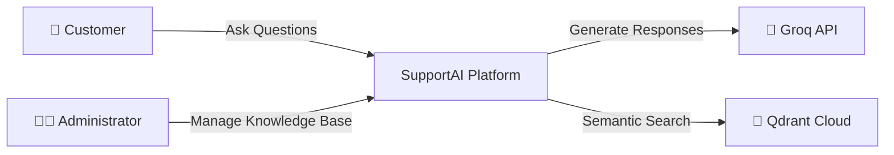

**Responsibilities**

| Actor/System  | Responsibility                                                         |
| ------------- | ---------------------------------------------------------------------- |
| Customer      | Interacts with the AI assistant to receive support.                    |
| Administrator | Manages documents, analytics, and flagged questions.                   |
| SupportAI     | Coordinates authentication, retrieval, AI generation, and persistence. |
| Groq API      | Generates grounded responses using the retrieved context.              |
| Qdrant Cloud  | Stores and retrieves semantic document embeddings.                     |

### 7.2 Container View

The Container View illustrates the major deployable units of the system and how they communicate. Each container represents an independently deployable application or infrastructure service.

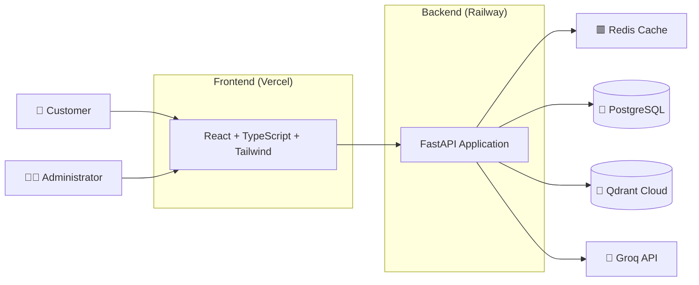

### 7.3 Component View

The Component View shows the internal organization of the FastAPI backend. Each component has a single responsibility and communicates through well-defined interfaces.

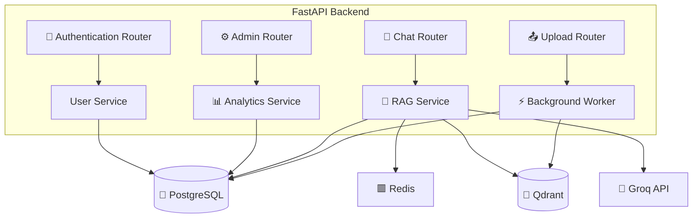

### 7.4 Runtime View

The Runtime View illustrates the end-to-end execution flow of a customer request through the SupportAI platform, showing how the frontend, backend services, cache, retrieval pipeline, and external AI services collaborate to generate a response.

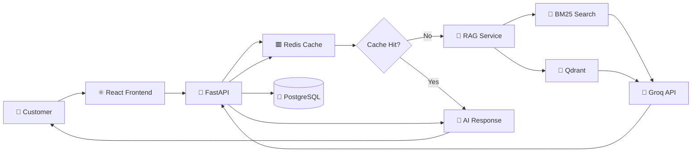

---

## 8. Frontend Architecture

The frontend is a single-page application (SPA) organized by feature, with shared components and a central API layer.

### Frontend Component Architecture

The frontend follows a feature-oriented architecture with reusable UI components, centralized state management, and a shared API client.

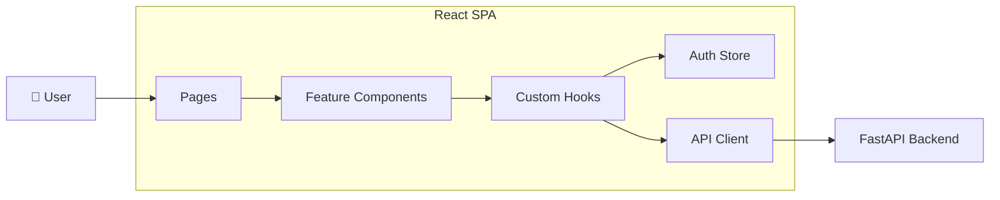

### Folder Structure

```
src/
├── components/
│   ├── ui/              # shadcn/ui base components (Button, Card, etc.)
│   ├── chat/            # ChatWindow, MessageBubble, SuggestedQuestions
│   ├── admin/           # DocumentTable, FlaggedList, AnalyticsChart
│   └── shared/          # Navbar, Sidebar, ConfidenceBadge
├── pages/
│   ├── CustomerChat.tsx
│   ├── ConversationHistory.tsx
│   ├── AdminDashboard.tsx
│   ├── KnowledgeBase.tsx
│   └── Login.tsx
├── hooks/
│   ├── useChat.ts
│   ├── useConversations.ts
│   └── useAdmin.ts
├── api/
│   └── client.ts        # Axios instance with JWT interceptor
├── store/
│   └── authStore.ts     # Auth state (Zustand or Context)
└── types/
    └── index.ts         # Shared TypeScript interfaces
```

### Key Design Decisions

- **Component co-location** — Each feature has its own folder with components, hooks, and local types grouped together.
- **API abstraction** — All HTTP calls go through `api/client.ts`, which automatically attaches JWT tokens.
- **Confidence badges** — Rendered as a color-coded component (green / yellow / red) based on score thresholds.
- **Source cards** — Each AI message includes collapsible source attribution cards linking to document metadata.

---

## 9. Backend Architecture

The FastAPI backend follows a **layered architecture** pattern: routers handle HTTP, services hold business logic, and repositories manage data access.

### Backend Component Architecture

The backend follows a layered architecture separating HTTP routing, business logic, persistence, and external integrations.

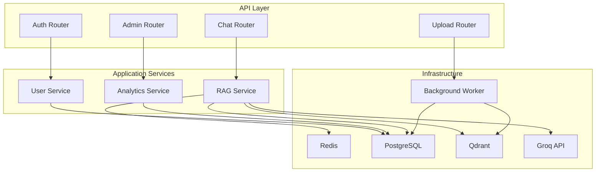

### Folder Structure

```
app/
├── api/
│   └── v1/
│       ├── auth.py
│       ├── chat.py
│       ├── documents.py
│       ├── admin.py
│       └── feedback.py
├── services/
│   ├── rag_service.py       # Orchestrates retrieval + generation
│   ├── search_service.py    # BM25 + vector hybrid search
│   ├── embed_service.py     # Embedding generation
│   ├── llm_service.py       # Groq API interaction
│   └── analytics_service.py
├── models/
│   └── db_models.py         # SQLAlchemy ORM models
├── schemas/
│   └── pydantic_schemas.py  # Request/response validation
├── db/
│   ├── session.py           # DB engine and session factory
│   └── vector_store.py      # Qdrant client wrapper
├── core/
│   ├── config.py            # Environment settings
│   ├── security.py          # JWT helpers, password hashing
│   └── dependencies.py      # FastAPI dependency injection
└── main.py
```

### Request Flow (Chat Query)

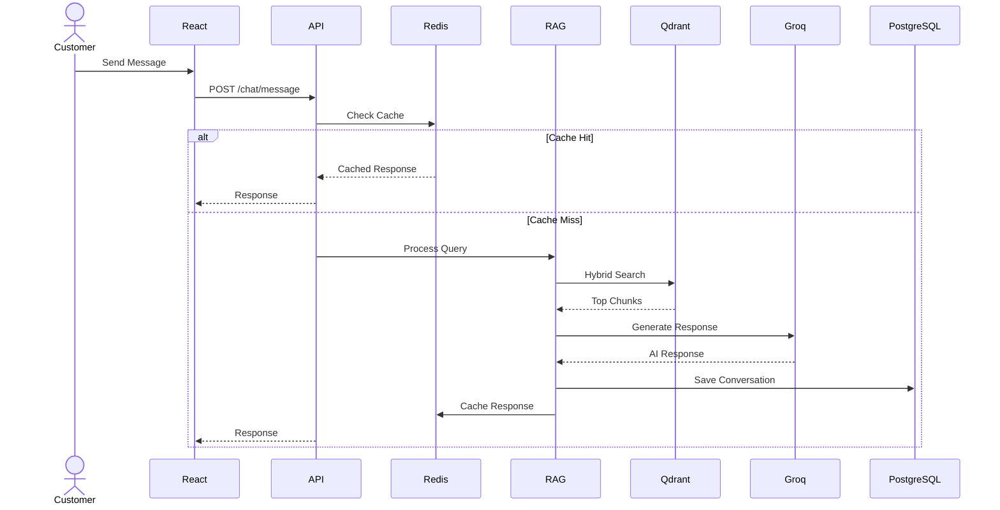

---

## 10. Database Design

All relational data is stored in PostgreSQL, managed via SQLAlchemy ORM and Alembic migrations.

### `users`

| Column            | Type         | Notes               |
| ----------------- | ------------ | ------------------- |
| `id`              | UUID (PK)    | Auto-generated      |
| `email`           | VARCHAR(255) | Unique, required    |
| `hashed_password` | TEXT         | bcrypt hash         |
| `role`            | ENUM         | `customer`, `admin` |
| `created_at`      | TIMESTAMP    | Default: now()      |
| `is_active`       | BOOLEAN      | Default: true       |

- The users table stores both customer and administrator accounts. Role-based access control (RBAC) is enforced at the API layer.

### `documents`

| Column        | Type              | Notes                     |
| ------------- | ----------------- | ------------------------- |
| `id`          | UUID (PK)         |                           |
| `title`       | VARCHAR(255)      | Display name              |
| `filename`    | TEXT              | Original upload filename  |
| `Category`    | VARCHAR(100)      | billing,technical,general |
| `file_type`   | VARCHAR(50)       | `pdf`, `txt`, `md`, etc.  |
| `uploaded_by` | UUID (FK → users) | Admin who uploaded        |
| `created_at`  | TIMESTAMP         |                           |
| `is_active`   | BOOLEAN           | Soft delete flag          |

- Each document is assigned a category during upload. Categories help organize the knowledge base and support future filtering, analytics, and search enhancements.

### `document_chunks`

| Column            | Type                  | Notes                         |
| ----------------- | --------------------- | ----------------------------- |
| `id`              | UUID (PK)             |                               |
| `document_id`     | UUID (FK → documents) | Parent document               |
| `chunk_index`     | INTEGER               | Position in document          |
| `content`         | TEXT                  | Raw chunk text                |
| `token_count`     | INTEGER               | Approx tokens in chunk        |
| `page_number`     | INTEGER               |
| `qdrant_point_id` | UUID                  | Reference to vector in Qdrant |
| `created_at`      | TIMESTAMP             |                               |

- The page_number field enables accurate source attribution by linking retrieved chunks back to their original document page.

### `conversations`

| Column       | Type              | Notes                                   |
| ------------ | ----------------- | --------------------------------------- |
| `id`         | UUID (PK)         |                                         |
| `user_id`    | UUID (FK → users) | Customer who started it                 |
| `title`      | VARCHAR(255)      | Auto-generated or first message snippet |
| `created_at` | TIMESTAMP         |                                         |
| `updated_at` | TIMESTAMP         | Updated on each new message             |

### `messages`

| Column             | Type                      | Notes                   |
| ------------------ | ------------------------- | ----------------------- |
| `id`               | UUID (PK)                 |                         |
| `conversation_id`  | UUID (FK → conversations) |                         |
| `role`             | ENUM                      | `user`, `assistant`     |
| `content`          | TEXT                      | Message body            |
| `source_chunks`    | JSONB                     | Array of chunk IDs used |
| `confidence_score` | FLOAT                     | 0.0 – 1.0               |
| `created_at`       | TIMESTAMP                 |                         |

### `feedback`

| Column       | Type                 | Notes                     |
| ------------ | -------------------- | ------------------------- |
| `id`         | UUID (PK)            |                           |
| `message_id` | UUID (FK → messages) | Message being rated       |
| `user_id`    | UUID (FK → users)    | Who gave feedback         |
| `rating`     | ENUM                 | `positive`, `negative`    |
| `comment`    | TEXT                 | Optional written feedback |
| `created_at` | TIMESTAMP            |                           |

### `flagged_questions`

| Column        | Type                 | Notes                                           |
| ------------- | -------------------- | ----------------------------------------------- |
| `id`          | UUID (PK)            |                                                 |
| `message_id`  | UUID (FK → messages) | The flagged message                             |
| `reason`      | ENUM                 | `low_confidence`, `negative_feedback`, `manual` |
| `status`      | ENUM                 | `open`, `reviewed`, `resolved`                  |
| `admin_note`  | TEXT                 | Optional admin comment                          |
| `created_at`  | TIMESTAMP            |                                                 |
| `reviewed_at` | TIMESTAMP            | Nullable                                        |

---

## 11. Search Architecture

SupportAI uses **Hybrid Search** — combining keyword-based BM25 retrieval with dense vector search — to improve answer quality over either approach alone.

### BM25 (Sparse Retrieval)

BM25 (Best Match 25) is a traditional IR algorithm that scores documents based on term frequency and inverse document frequency.

- **Strengths:** Excellent for exact keyword matches, product names, IDs, and short queries
- **Implementation:** `rank_bm25` Python library; BM25 index built in-memory at startup from all active chunks
- **Refresh:** Re-indexed whenever documents are added or removed

### Vector Search (Dense Retrieval)

Each document chunk is encoded into a high-dimensional embedding using `BAAI/bge-small-en-v1.5` and stored in Qdrant.

- **Strengths:** Captures semantic similarity; handles paraphrases and concept-level queries
- **Embedding dim:** 384 dimensions
- **Distance metric:** Cosine similarity
- **Qdrant:** Used for approximate nearest-neighbor (ANN) search at query time

### Hybrid Fusion (RRF)

Both retrievers return ranked result lists. These are merged using **Reciprocal Rank Fusion (RRF)**:

```
RRF_score(chunk) = Σ [ 1 / (k + rank_i) ]
```

Where `k = 60` (constant) and `rank_i` is each retriever's rank for that chunk. Higher fused score = higher priority in context window.

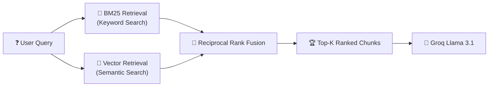

### Why Hybrid?

| Query Type             | BM25 | Vector | Hybrid |
| ---------------------- | ---- | ------ | ------ |
| "reset password"       | ✅   | ✅     | ✅     |
| "I can't log in"       | ❌   | ✅     | ✅     |
| "SKU-3847 specs"       | ✅   | ❌     | ✅     |
| "tell me about refund" | ❌   | ✅     | ✅     |

Hybrid search consistently outperforms either method alone, especially for a mixed real-world query set.

### Knowledge Gap Detection

SupportAI identifies knowledge gaps by analyzing questions that are repeatedly flagged due to low confidence scores or negative feedback.

The system tracks the frequency of flagged questions and groups similar questions together based on semantic similarity. When a topic repeatedly appears without sufficient supporting documentation, it is surfaced to administrators as a potential knowledge gap.
Administrators can use these insights to upload new documentation or add FAQ entries, improving future answer quality.

---

## 12. RAG Workflow

RAG (Retrieval-Augmented Generation) grounds LLM responses in real documents, reducing hallucinations and providing traceable answers.

### Ingestion Pipeline

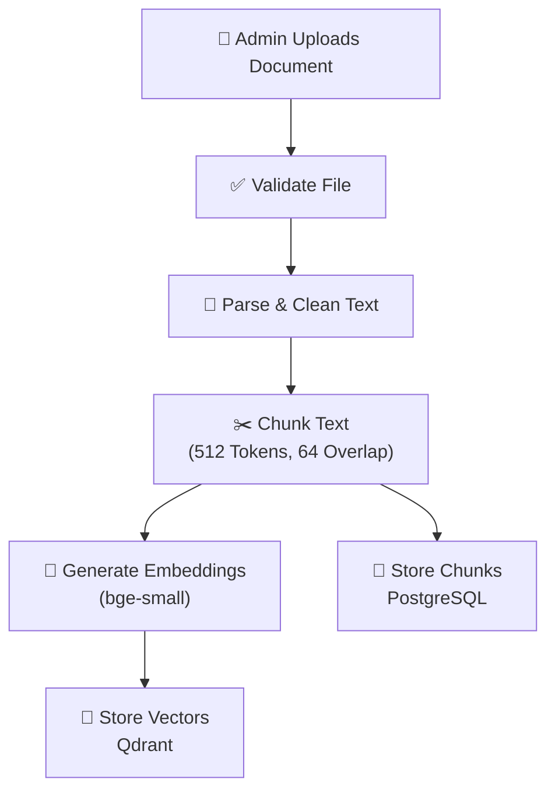

### Query Pipeline

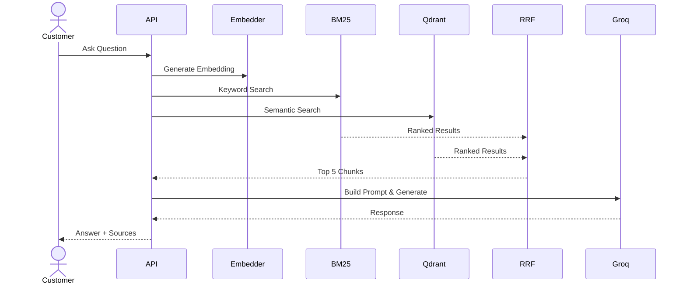

### Confidence Scoring

Confidence is a weighted heuristic based on:

- **Top-chunk similarity score** (0–1, from Qdrant cosine distance)
- **Number of supporting chunks** (more corroborating chunks → higher confidence)
- **Keyword overlap** between answer and top chunks

```python
confidence = (0.6 * top_similarity) + (0.3 * chunk_corroboration) + (0.1 * keyword_overlap)
```

### Human-in-the-Loop Learning

SupportAI incorporates a human-in-the-loop feedback mechanism to continuously improve answer quality.

When a customer question receives a low confidence score or repeated negative feedback, it is added to the flagged questions queue. Administrators can review the question and provide a verified answer.

The verified answer is stored as a knowledge base entry and processed through the standard ingestion pipeline:

Admin Answer
↓
Knowledge Base Entry
↓
Chunking
↓
Embedding Generation
↓
Qdrant Indexing

This enables the system to answer similar questions automatically in future interactions, reducing repeated escalations and continuously expanding the knowledge base.

---

## 13. API Design

All endpoints are prefixed with `/api/v1/`. Auth-protected routes require `Authorization: Bearer <token>`.

### Authentication

| Method | Endpoint         | Description             | Auth     |
| ------ | ---------------- | ----------------------- | -------- |
| POST   | `/auth/register` | Create new user account | Public   |
| POST   | `/auth/login`    | Login, returns JWT      | Public   |
| GET    | `/auth/me`       | Get current user info   | Required |

- Authentication endpoints support both customer and admin accounts. Role-based authorization determines access permissions within the platform.

### Chat

| Method | Endpoint                   | Description                   | Auth     |
| ------ | -------------------------- | ----------------------------- | -------- |
| POST   | `/chat/message`            | Send message, get AI response | Customer |
| GET    | `/chat/conversations`      | List user's conversations     | Customer |
| GET    | `/chat/conversations/{id}` | Get full conversation history | Customer |
| POST   | `/chat/feedback`           | Submit rating on a message    | Customer |

### Documents (Admin)

| Method | Endpoint                 | Description                | Auth  |
| ------ | ------------------------ | -------------------------- | ----- |
| GET    | `/documents`             | List all documents         | Admin |
| POST   | `/documents/upload`      | Upload a new document      | Admin |
| DELETE | `/documents/{id}`        | Soft-delete a document     | Admin |
| GET    | `/documents/{id}/chunks` | List chunks for a document | Admin |

### Admin

| Method | Endpoint              | Description                    | Auth  |
| ------ | --------------------- | ------------------------------ | ----- |
| GET    | `/admin/dashboard`    | Overview stats                 | Admin |
| GET    | `/admin/flagged`      | List flagged questions         | Admin |
| PATCH  | `/admin/flagged/{id}` | Update flag status             | Admin |
| GET    | `/admin/analytics`    | Query trends and feedback data | Admin |
| GET    | `/admin/gaps`         | Knowledge gap detection        | Admin |

### Example Response — Chat Message

```json
{
  "message_id": "uuid-abc123",
  "answer": "To reset your password, go to the login page and click 'Forgot Password'...",
  "confidence_score": 0.87,
  "sources": [
    {
      "chunk_id": "uuid-chunk1",
      "document_title": "User Guide v2.pdf",
      "excerpt": "...click Forgot Password on the login screen...",
      "page": 4
    }
  ],
  "flagged": false
}
```

---

## 14. Design Patterns

| Pattern                   | Where Used                         | Why                                                        |
| ------------------------- | ---------------------------------- | ---------------------------------------------------------- |
| **Service Layer**         | `rag_service`, `analytics_service` | Encapsulates business logic, keeps routers thin            |
| **Dependency Injection**  | FastAPI `Depends()`                | Clean injection of DB sessions, auth, config               |
| **Strategy Pattern**      | Search service                     | BM25 and vector search swappable behind a common interface |
| **DTO / Schema**          | Pydantic request/response models   | Strict validation and serialization at API boundary        |
| **Singleton**             | Embedding model, Qdrant client     | Load once, reuse across requests for efficiency            |
| **Feature-Sliced Design** | React frontend structure           | Co-locate components, hooks, and types per feature         |

---

## 15. Application Security

### Authentication & Authorization

- **JWT tokens** issued on login, short-lived (1 hour expiry)
- Role-based access: `customer` and `admin` roles enforced via FastAPI dependencies
- Passwords hashed with **bcrypt** (never stored in plaintext)
- JWT access tokens are issued during login and used for authenticated requests. Users are required to log in again after token expiration.
- Customers have access only to their own conversations, feedback, and account information. Administrators have elevated permissions to manage documents, analytics, and flagged questions.

### API Security

- **CORS** configured to allow only the Vercel frontend origin in production
- **Input validation** via Pydantic schemas on all endpoints (type coercion + length limits)
- **Rate limiting** on `/chat/message` endpoint (e.g., 20 requests/minute per user) using FastAPI middleware
- **File upload validation** — MIME type check, max file size enforced before processing

### Data Security

- All secrets (DB URL, Groq API key, JWT secret) stored as **environment variables** — never in code
- HTTPS enforced in production (Railway + Vercel handle TLS termination)
- Admin routes protected by both JWT and role check — double-gated

### Threat Model Summary

| Threat                | Mitigation                                     |
| --------------------- | ---------------------------------------------- |
| Unauthorized access   | JWT + role enforcement                         |
| Prompt injection      | Sanitize user input before embedding in prompt |
| Data exfiltration     | CORS policy, no raw DB queries exposed         |
| Credential theft      | bcrypt hashing, env vars, HTTPS only           |
| Malicious file upload | MIME validation, server-side size limits       |

---

## 16. Deployment Architecture

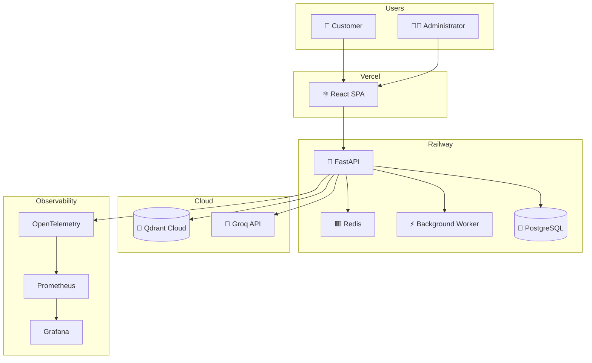

### Docker Setup

```yaml
# docker-compose.yml (local dev)
services:
  api:
    build: ./backend
    ports:
      - "8000:8000"
    env_file: .env
    depends_on:
      - postgres
      - qdrant

  postgres:
    image: postgres:15
    environment:
      POSTGRES_DB: supportai
      POSTGRES_USER: admin
      POSTGRES_PASSWORD: secret

  qdrant:
    image: qdrant/qdrant
    ports:
      - "6333:6333"
```

### Deployment Steps

1. Push backend to GitHub → Railway auto-deploys Docker container
2. Run Alembic migrations on first deploy: `alembic upgrade head`
3. Push frontend to GitHub → Vercel auto-deploys on main branch merge
4. Set environment variables in Railway and Vercel dashboards

---

# 17. CI/CD Architecture

SupportAI follows a Continuous Integration and Continuous Deployment (CI/CD) pipeline to ensure every code change is automatically validated, tested, and safely deployed. The pipeline minimizes manual intervention while maintaining software quality and deployment reliability.

## CI/CD Pipeline

```mermaid
flowchart LR

Developer["👨‍💻 Developer"]

GitHub["GitHub Repository"]

PR["Pull Request"]

Review["Code Review"]

Actions["GitHub Actions"]

Lint["Static Analysis<br/>Linting"]

Tests["Unit & Integration Tests"]

Build["Docker Image Build"]

Registry["Container Registry"]

Deploy["Deploy to Railway"]

Health["Health & Readiness Checks"]

Production["Production Environment"]

Developer --> GitHub

GitHub --> PR

PR --> Review

Review --> Actions

Actions --> Lint

Lint --> Tests

Tests --> Build

Build --> Registry

Registry --> Deploy

Deploy --> Health

Health --> Production
```

## Deployment Workflow

| Stage             | Purpose                                                        |
| ----------------- | -------------------------------------------------------------- |
| Source Control    | Version-controlled development using GitHub                    |
| Pull Request      | Peer review before merging changes                             |
| Static Analysis   | Detect formatting, linting, and code quality issues            |
| Automated Testing | Execute unit and integration tests                             |
| Docker Build      | Produce a reproducible application image                       |
| Deployment        | Deploy backend to Railway and frontend to Vercel               |
| Health Validation | Verify `/health` and `/ready` endpoints before serving traffic |

## Rollback Strategy

In the event of a failed deployment:

- The previous stable container image remains available for rollback.
- Failed health or readiness checks automatically prevent the new version from receiving production traffic.
- Database schema changes are applied through versioned migrations to ensure controlled rollbacks.
- Configuration is managed through environment variables, allowing deployment without code modifications.

## Deployment Principles

- Every deployment must be reproducible.
- Infrastructure configuration is externalized through environment variables.
- Production deployments require successful automated validation.
- All deployments are observable through centralized logging and monitoring.

# 18. Testing Strategy

SupportAI adopts a multi-layered testing strategy to ensure application correctness, reliability, and maintainability. Different testing levels validate individual components, service interactions, APIs, and complete user workflows.

## Testing Pyramid

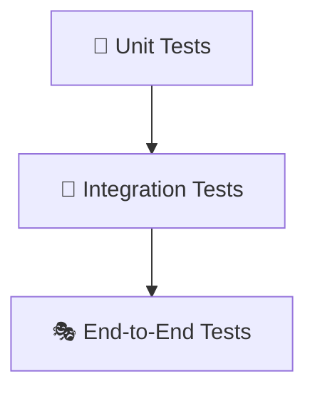

## Testing Coverage

| Test Type           | Scope                             | Examples                                                  |
| ------------------- | --------------------------------- | --------------------------------------------------------- |
| Unit Testing        | Individual functions and services | Authentication service, RAG service, embedding generation |
| Integration Testing | Component interaction             | PostgreSQL, Redis, Qdrant, Groq integration               |
| API Testing         | REST endpoint validation          | Authentication, chat, document upload APIs                |
| End-to-End Testing  | Complete user workflows           | Login → Chat → Response → Feedback                        |
| Performance Testing | Response time and throughput      | Chat latency, search performance, concurrent requests     |
| Security Testing    | Authentication and authorization  | JWT validation, RBAC enforcement, input validation        |

## Quality Gates

Every production deployment must satisfy the following quality requirements:

- All unit tests pass successfully.
- Integration tests validate external service connectivity.
- API contract validation completes successfully.
- Static analysis reports no critical issues.
- Docker image builds successfully.
- Health and readiness endpoints respond correctly after deployment.

## Test Environment

| Environment       | Purpose                                              |
| ----------------- | ---------------------------------------------------- |
| Local Development | Developer testing and debugging                      |
| CI Pipeline       | Automated validation on every pull request           |
| Staging           | Pre-production integration testing                   |
| Production        | Health monitoring and smoke testing after deployment |

## Testing Principles

- Automated tests are executed on every pull request.
- Business logic is validated primarily through unit tests.
- Critical workflows are verified using end-to-end testing.
- External dependencies are mocked where appropriate during unit testing.
- Production deployments require successful completion of automated quality gates.

# 19. Reliability & Resilience

SupportAI is designed to tolerate common infrastructure and third-party failures while maintaining service availability wherever possible. The architecture emphasizes graceful degradation, automated recovery, and operational observability rather than assuming every dependency is always available.

---

## Failure Recovery Matrix

| Component         | Possible Failure      | Detection               | Recovery Strategy                                           |
| ----------------- | --------------------- | ----------------------- | ----------------------------------------------------------- |
| Redis Cache       | Cache unavailable     | Connection timeout      | Bypass cache and continue using PostgreSQL and Qdrant       |
| PostgreSQL        | Database unavailable  | Health/Readiness checks | Stop serving requests until connectivity is restored        |
| Qdrant            | Vector search timeout | Request timeout         | Retry once, then return a friendly error if retrieval fails |
| Groq API          | Rate limit or timeout | HTTP status codes       | Exponential backoff retry followed by graceful failure      |
| Background Worker | Processing failure    | Job status monitoring   | Retry failed ingestion jobs with exponential backoff        |
| Frontend          | Backend unavailable   | API request failure     | Display user-friendly error message and retry option        |

---

## Resilience Patterns

| Pattern                        | Purpose                                                     |
| ------------------------------ | ----------------------------------------------------------- |
| Retry with Exponential Backoff | Recover from temporary network or API failures              |
| Circuit Breaker                | Prevent repeated calls to failing external services         |
| Timeout Protection             | Prevent requests from blocking indefinitely                 |
| Graceful Degradation           | Continue operating with reduced functionality when possible |
| Health Checks                  | Detect unhealthy application instances                      |
| Readiness Checks               | Ensure services receive traffic only when ready             |

---

## Circuit Breaker Strategy

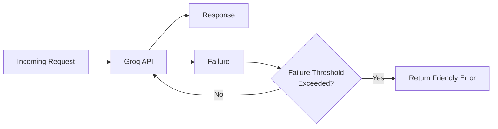

---

## Timeout Configuration

| Component  | Timeout    |
| ---------- | ---------- |
| Redis      | 500 ms     |
| PostgreSQL | 2 seconds  |
| Qdrant     | 3 seconds  |
| Groq API   | 15 seconds |

---

## Reliability Principles

- External services are accessed through retry and timeout policies.
- Cached data is treated as an optimization rather than a requirement.
- Failure of one component should not cascade through the system.
- Critical failures are detected through health and readiness monitoring.
- User-facing errors should always provide meaningful feedback instead of exposing internal implementation details.

# 20. Enterprise Security Architecture

SupportAI applies a defense-in-depth security strategy by combining authentication, authorization, secure communication, input validation, and threat mitigation mechanisms. Security controls are integrated throughout the application lifecycle rather than treated as isolated features.

---

## Security Layers

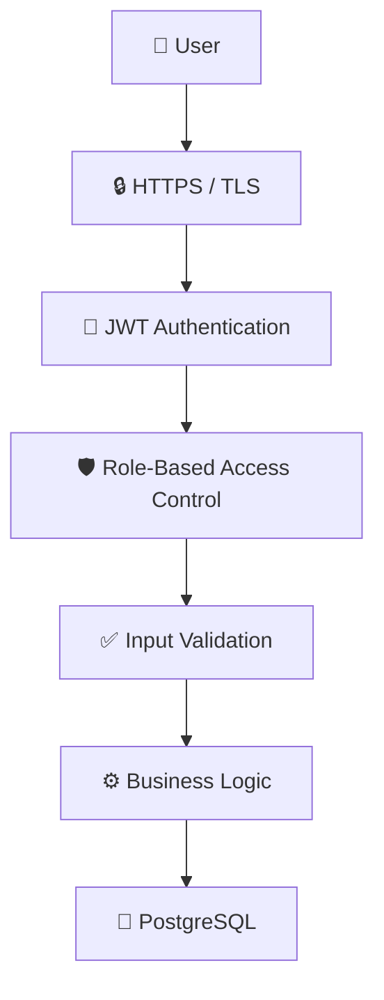

---

## STRIDE Threat Model

| Threat                     | Example                                  | Mitigation                                                     |
| -------------------------- | ---------------------------------------- | -------------------------------------------------------------- |
| **Spoofing**               | Unauthorized user impersonation          | JWT authentication, strong password hashing (bcrypt)           |
| **Tampering**              | Modified requests or uploaded files      | Input validation, request validation, file validation          |
| **Repudiation**            | User denies performing an action         | Audit logging with timestamps and user identifiers             |
| **Information Disclosure** | Unauthorized access to sensitive data    | RBAC, HTTPS, secure configuration, least-privilege access      |
| **Denial of Service**      | Excessive API requests                   | API rate limiting, request timeouts, Redis caching             |
| **Elevation of Privilege** | Customer attempts administrative actions | Role-based authorization and server-side permission validation |

---

## Trust Boundaries

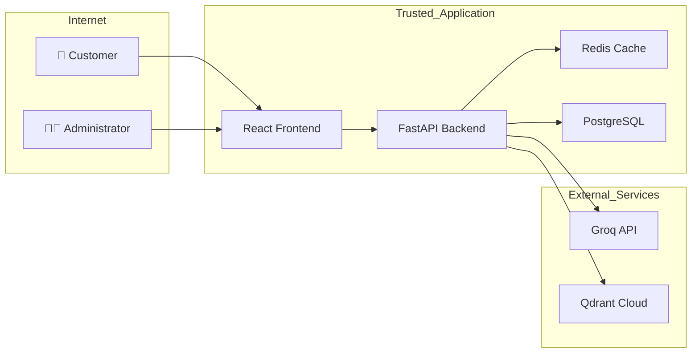

---

## Secrets Management

Sensitive configuration is stored using environment variables and is never committed to source control.

Examples include:

- JWT Secret
- Database Connection String
- Groq API Key
- Qdrant API Key
- Redis Connection URL

---

## Security Principles

- Authentication is required before accessing protected resources.
- Authorization is enforced using Role-Based Access Control (RBAC).
- All communication uses HTTPS/TLS.
- User input is validated on both client and server.
- Sensitive secrets are externally managed through environment variables.
- Security events are recorded through audit logging.

## 21. Risks & Mitigation

| Risk                              | Likelihood | Impact | Mitigation                                                                         |
| --------------------------------- | ---------- | ------ | ---------------------------------------------------------------------------------- |
| Groq API rate limits or downtime  | Medium     | High   | Implement retry logic + fallback error messages; cache common answers              |
| LLM hallucination                 | Medium     | High   | Ground responses strictly in retrieved chunks; show sources; confidence thresholds |
| Slow hybrid search at query time  | Low        | Medium | Limit BM25 corpus size; cap Qdrant top-k at 20 before re-ranking                   |
| Scope creep within 3 weeks        | High       | High   | Lock requirements after Week 1; prioritize core RAG pipeline first                 |
| Poor document chunking quality    | Medium     | Medium | Use overlap chunking (64 tokens); test on real docs early                          |
| JWT secret exposure               | Low        | High   | Use env vars only; rotate key if compromised                                       |
| Vercel / Railway free tier limits | Medium     | Low    | Monitor usage; optimize Docker image size; use lazy loading                        |

---

## 22. Implementation Plan & Team Responsibilities

| Developer | Primary Role        | Responsibilities                                                                                     |
| --------- | ------------------- | ---------------------------------------------------------------------------------------------------- |
| **Dev 1** | Backend & AI Layer  | FastAPI setup, RAG pipeline, hybrid search, Groq integration, Qdrant, document ingestion             |
| **Dev 2** | Frontend Lead       | React app, chat UI, admin dashboard, component library, API integration                              |
| **Dev 3** | Full Stack & DevOps | Database schema, Alembic migrations, auth system, Docker setup, Railway/Vercel deployment, analytics |

All three developers participate in code review, testing, and demo preparation.

---

## 23. Development Roadmap

### Week 1 — Foundation

**Goal:** Core infrastructure and RAG pipeline working end-to-end

| Tasks                                                                            |
| -------------------------------------------------------------------------------- |
| Project setup: repos, Docker, FastAPI skeleton, React + Vite scaffold            |
| Database schema + Alembic migrations; JWT auth (register, login)                 |
| Document ingestion pipeline: upload → chunk → embed → Qdrant                     |
| Hybrid search (BM25 + vector + RRF), basic RAG query flow, test with sample docs |

**Deliverable:** A working CLI/Postman-tested RAG pipeline that takes a question and returns an answer with sources.

---

### Week 2 — Features & UI

**Goal:** Full customer and admin UI connected to the backend

| Tasks                                                                   |
| ----------------------------------------------------------------------- |
| Customer chat interface (message input, response display, source cards) |
| Conversation history, suggested questions, confidence badge             |
| Feedback system (thumbs up/down), auto-flagging low-confidence answers  |
| Admin dashboard: document manager, flagged questions view               |
| Analytics page (query trends, feedback stats, knowledge gap list)       |

**Deliverable:** A fully connected app — customers can chat, admins can manage content.

---

### Week 3 — Polish & Deployment

**Goal:** Production deployment, testing, and demo-ready presentation

| Tasks                                                               |
| ------------------------------------------------------------------- |
| Deploy backend to Railway, frontend to Vercel; connect Qdrant Cloud |
| End-to-end testing with realistic documents and queries             |
| UI polish: responsive design, loading states, error handling        |
| Security review: CORS, env vars, input validation                   |
| Demo preparation: seed data, sample knowledge base, test scenarios  |
| Buffer day: bug fixes, final README, presentation slides            |

**Deliverable:** A live, publicly accessible demo with a seeded knowledge base ready for judges.

---

## 24. Future Enhancements

These features are intentionally out of scope for the 3-week sprint but represent natural next steps:

| Enhancement                  | Description                                                               |
| ---------------------------- | ------------------------------------------------------------------------- |
| **Multi-language support**   | Embed and respond in languages beyond English using multilingual models   |
| **Live chat handoff**        | Escalate unresolved queries to a human agent in real time                 |
| **Voice input**              | Allow customers to speak their questions (speech-to-text integration)     |
| **Email digests for admins** | Weekly summary of flagged questions and knowledge gaps                    |
| **Automated KB suggestions** | Suggest new documentation based on repeated unanswered questions          |
| **SSO / OAuth**              | Allow login via Google or other identity providers                        |
| **Streaming responses**      | Stream LLM output token-by-token for a faster perceived response time     |
| **Fine-tuned model**         | Fine-tune a smaller model on domain-specific Q&A pairs from feedback data |
| **Analytics export**         | Export conversation data and analytics as CSV for business reporting      |

---

_Document prepared by the SupportAI Team_
