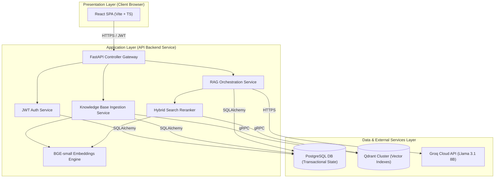
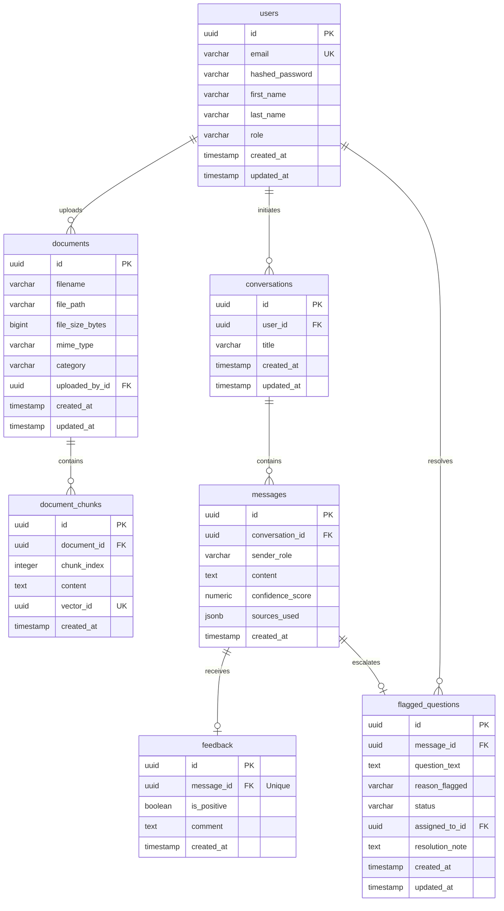

# Project Architecture Document

**Project Name:** SupportAI – AI-Powered Customer Support Platform  
**Document Version:** 1.0.0  
**Date:** June 24, 2026  
**Status:** Software Architecture Review (Draft for Stakeholder Sign-Off)  
**Target Audience:** Technical Mentors, Software Engineering Leads, Technical Stakeholders  

---

## 1. Executive Summary

SupportAI is an enterprise-ready, AI-powered customer support platform designed to optimize customer service efficiency by automating the resolution of routine product and policy queries. Utilizing Retrieval-Augmented Generation (RAG), the system safely and accurately answers customer inquiries using only verified corporate documentation (including FAQs, policies, user guides, product manuals, and knowledge base articles). 

Crucially, the platform guarantees output reliability through a safety-net mechanism: inquiries that yield low confidence scores are bypassed or flagged, then escalated to a human administrator review queue. Administrators are equipped with dashboards to manage documents, review flagged items, inspect analytics, and identify knowledge gaps.

To ensure rapid market delivery and low operational complexity for a small engineering team, the platform is designed around a modern, lightweight, and decoupled technology stack: React/TypeScript for a responsive interface, FastAPI for asynchronous API orchestration, PostgreSQL for transactional state, Qdrant for dense vector search, and Llama 3.1 8B Instruct (accessed via Groq) for low-latency, cost-effective inference. 

---

## 2. System Overview

SupportAI provides two distinct user interfaces: a customer-facing conversational UI and an administrative management dashboard. 

```
┌────────────────────────────────────────────────────────────────────────┐
│                               SupportAI                                │
├───────────────────────────────────┬────────────────────────────────────┤
│           Customer Side           │             Admin Side             │
├───────────────────────────────────┼────────────────────────────────────┤
│ • Full-screen Chat Interface      │ • Dashboard Overview & KPI Metrics │
│ • Conversational History Tracking │ • Knowledge Base Ingestion Engine  │
│ • Source Attribution & Citations  │ • Flagged Question Review Queue    │
│ • Instant User Feedback Toggles   │ • Semantic Knowledge Gap Analytics │
└───────────────────────────────────┴────────────────────────────────────┘
```

### 2.1 Customer Side Features
* **Conversational Interface:** A responsive, full-screen chat interface that tracks conversation context and features automatic thread naming.
* **Suggested Starter Questions:** Common questions displayed on the landing state to prompt immediate user engagement.
* **Source-Grounded Responses:** AI responses include precise document citations, confidence indicators, and feedback controls (Thumbs Up/Down).

### 2.2 Admin Side Features
* **Dashboard Overview:** Displays critical key performance indicators (KPIs) such as total conversations, ticket deflection rates, flagged questions, and average user satisfaction.
* **Knowledge Base Ingestion:** Secure interface for uploading, categorizing, and deleting document files (PDF and TXT format).
* **Flagged Question Review Queue:** A dashboard listing escalated questions (low-confidence queries or negative-feedback responses) to help administrators audit the system.
* **Knowledge Gap Analytics:** Semantic clustering of unanswered queries to identify missing topics in the current knowledge base.

---

## 3. High-Level Architecture

The SupportAI system utilizes a decoupled, service-oriented architecture. The system is split into three main tiers: the Presentation Layer (Frontend), the Application Layer (API Backend), and the Data Layer (Relational & Vector Storage). 



### 3.1 Component Architecture Overview
* **Presentation Layer:** A static React Single-Page Application (SPA) compiled with Vite. It communicates with the backend exclusively via JSON-based REST APIs.
* **Application Layer:** Built with FastAPI, executing asynchronously to process multi-user chat sessions, run BM25 search queries, calculate embeddings locally, and handle file streams.
* **Data & AI Layer:**
  - **PostgreSQL:** Stores transactional state (users, metadata, message logs, and feedback).
  - **Qdrant:** Houses the vector index containing text chunk embeddings.
  - **Groq API:** Handles inference requests for the open-weights Llama 3.1 8B model.

---

## 4. Frontend Architecture

The frontend is built as a single-page application (SPA) optimized for low bundle size, fast rendering, and type safety.

```
┌────────────────────────────────────────────────────────────────────────┐
│                          React Single Page App                         │
├────────────────────────────────────────────────────────────────────────┤
│                           Application Router                           │
│                          (React Router Dom v6)                         │
├───────────────────────────────────┬────────────────────────────────────┤
│            Components             │            State Store             │
│   (UI, Chat, Ingestion, Metrics)  │  (Auth Token, Conversations, UI)   │
├───────────────────────────────────┼────────────────────────────────────┤
│          Tailwind CSS             │         Axios API Client           │
│     (Utility Classes & Tokens)    │    (Interceptors, JWT Refresh)     │
└───────────────────────────────────┴────────────────────────────────────┘
```

### 4.1 Technology Stack & Utilities
* **React 18 & TypeScript:** Enables component-driven development with strict compile-time type-safety.
* **Vite:** Serving as the compiler and asset pipeline, providing fast Hot Module Replacement (HMR) and optimized production bundles.
* **Tailwind CSS & shadcn/ui:** Leverages utility-first CSS and accessible, unstyled primitives (Radix UI) styled with Tailwind to build consistent, responsive interfaces.

### 4.2 Application State & Routing
* **Client-Side Routing:** Managed via `React Router DOM` using private routes to restrict access to administrator portals.
* **State Management:** Conversational context and system state are managed using React Context and standard state hooks, avoiding the overhead of Redux.
* **API Client:** Axios handles HTTP requests, configured with global interceptors to attach bearer JWT tokens and automatically handle token refreshes upon encountering `401 Unauthorized` responses.

---

## 5. Backend Architecture

The backend application is designed to support high levels of concurrency, clean separation of concerns, and reliable schema migrations.

```
┌────────────────────────────────────────────────────────────────────────┐
│                        FastAPI Application Core                        │
├────────────────────────────────────────────────────────────────────────┤
│                           ASGI Web Server                              │
│                           (Uvicorn Engine)                             │
├───────────────────────────────────┬────────────────────────────────────┤
│         Routers / Endpoints       │         Pydantic Schemas           │
│      (Auth, Admin, Chat, QA)      │     (Request / Response Models)    │
├───────────────────────────────────┼────────────────────────────────────┤
│         Business Services         │        SQLAlchemy Core ORM         │
│     (RAG, Search, Ingestion)      │    (Repositories & Unit of Work)   │
└───────────────────────────────────┴────────────────────────────────────┘
```

### 5.1 Technology Stack & Integration
* **FastAPI:** Utilizes the Asynchronous Server Gateway Interface (ASGI) standard via Uvicorn to support high-throughput concurrent I/O operations.
* **SQLAlchemy (Async Engine):** Houses the Object-Relational Mapper (ORM), utilizing asynchronous engine adapters (`asyncpg`) to avoid blocking request loops during database queries.
* **Alembic:** Manages incremental database schema updates, ensuring version control of database structures in production.
* **Pydantic v2:** Validates data structures at the API boundary, enforcing strict schemas for request bodies and response payloads.

### 5.2 Middleware Architecture
* **CORS Middleware:** Limits API access to verified frontend domains.
* **Rate Limiting Middleware:** Implements a token-bucket rate-limiting algorithm to protect public endpoints (e.g., chat and authentication) from denial-of-service attempts.
* **Authentication Interceptor:** Parses incoming JWT tokens, validates signatures, checks expiration timestamps, and injects user identities into endpoint dependency flows.

---

## 6. Database Architecture

The relational database stores core application state, audit trails, and transactional records. 

### 6.1 Database Schema Design

#### 6.1.1 Table: `users`
Represents system administrators, support agents, and registered customers.
* `id` (`UUID`, Primary Key, default `gen_random_uuid()`)
* `email` (`VARCHAR(255)`, Unique, Not Null, Indexed)
* `hashed_password` (`VARCHAR(255)`, Not Null)
* `first_name` (`VARCHAR(100)`, Nullable)
* `last_name` (`VARCHAR(100)`, Nullable)
* `role` (`VARCHAR(50)`, Not Null, CHECK constraint: `role IN ('Admin', 'Support_Agent', 'Customer')`)
* `created_at` (`TIMESTAMP WITH TIME ZONE`, default `CURRENT_TIMESTAMP`, Not Null)
* `updated_at` (`TIMESTAMP WITH TIME ZONE`, default `CURRENT_TIMESTAMP`, Not Null)

#### 6.1.2 Table: `documents`
Stores metadata of knowledge base files uploaded by administrators.
* `id` (`UUID`, Primary Key, default `gen_random_uuid()`)
* `filename` (`VARCHAR(255)`, Not Null)
* `file_path` (`VARCHAR(512)`, Not Null)
* `file_size_bytes` (`BIGINT`, Not Null)
* `mime_type` (`VARCHAR(100)`, Not Null)
* `category` (`VARCHAR(100)`, default 'General', Not Null, Indexed)
* `uploaded_by_id` (`UUID`, Foreign Key -> `users(id)`, ON DELETE SET NULL, Nullable)
* `created_at` (`TIMESTAMP WITH TIME ZONE`, default `CURRENT_TIMESTAMP`, Not Null)
* `updated_at` (`TIMESTAMP WITH TIME ZONE`, default `CURRENT_TIMESTAMP`, Not Null)

#### 6.1.3 Table: `document_chunks`
Stores parsed, granular text segments extracted from documents.
* `id` (`UUID`, Primary Key, default `gen_random_uuid()`)
* `document_id` (`UUID`, Foreign Key -> `documents(id)`, ON DELETE CASCADE, Not Null)
* `chunk_index` (`INTEGER`, Not Null)
* `content` (`TEXT`, Not Null)
* `vector_id` (`UUID`, Not Null, Unique) - Represents the unique reference point inside Qdrant.
* `created_at` (`TIMESTAMP WITH TIME ZONE`, default `CURRENT_TIMESTAMP`, Not Null)

#### 6.1.4 Table: `conversations`
Maintains conversational context sessions for both guests and authenticated users.
* `id` (`UUID`, Primary Key, default `gen_random_uuid()`)
* `user_id` (`UUID`, Foreign Key -> `users(id)`, ON DELETE CASCADE, Nullable)
* `title` (`VARCHAR(255)`, default 'New Chat', Not Null)
* `created_at` (`TIMESTAMP WITH TIME ZONE`, default `CURRENT_TIMESTAMP`, Not Null)
* `updated_at` (`TIMESTAMP WITH TIME ZONE`, default `CURRENT_TIMESTAMP`, Not Null)

#### 6.1.5 Table: `messages`
Stores individual chat messages.
* `id` (`UUID`, Primary Key, default `gen_random_uuid()`)
* `conversation_id` (`UUID`, Foreign Key -> `conversations(id)`, ON DELETE CASCADE, Not Null)
* `sender_role` (`VARCHAR(50)`, Not Null, CHECK constraint: `sender_role IN ('User', 'Assistant')`)
* `content` (`TEXT`, Not Null)
* `confidence_score` (`NUMERIC(4, 3)`, Nullable) - Populated for assistant responses.
* `sources_used` (`JSONB`, Nullable) - Lists document chunks referenced to generate the answer.
* `created_at` (`TIMESTAMP WITH TIME ZONE`, default `CURRENT_TIMESTAMP`, Not Null)

#### 6.1.6 Table: `feedback`
Captures user satisfaction scores for specific assistant messages.
* `id` (`UUID`, Primary Key, default `gen_random_uuid()`)
* `message_id` (`UUID`, Foreign Key -> `messages(id)`, ON DELETE CASCADE, Unique, Not Null)
* `is_positive` (`BOOLEAN`, Not Null) - `True` for thumbs up, `False` for thumbs down.
* `comment` (`TEXT`, Nullable)
* `created_at` (`TIMESTAMP WITH TIME ZONE`, default `CURRENT_TIMESTAMP`, Not Null)

#### 6.1.7 Table: `flagged_questions`
Coordinates review tasks for administrators when responses are problematic.
* `id` (`UUID`, Primary Key, default `gen_random_uuid()`)
* `message_id` (`UUID`, Foreign Key -> `messages(id)`, ON DELETE SET NULL, Nullable)
* `question_text` (`TEXT`, Not Null)
* `reason_flagged` (`VARCHAR(100)`, Not Null, CHECK constraint: `reason_flagged IN ('LOW_CONFIDENCE', 'USER_DISLIKE', 'UNANSWERED')`)
* `status` (`VARCHAR(50)`, default 'Pending', Not Null, CHECK constraint: `status IN ('Pending', 'Reviewed', 'Resolved')`)
* `assigned_to_id` (`UUID`, Foreign Key -> `users(id)`, ON DELETE SET NULL, Nullable)
* `resolution_note` (`TEXT`, Nullable)
* `created_at` (`TIMESTAMP WITH TIME ZONE`, default `CURRENT_TIMESTAMP`, Not Null)
* `updated_at` (`TIMESTAMP WITH TIME ZONE`, default `CURRENT_TIMESTAMP`, Not Null)

---

### 6.2 Database Entity-Relationship (ER) Diagram



---

## 7. Vector Database Architecture

Qdrant serves as the system's vector database, managing high-dimensional semantic search indexes.

### 7.1 Collection Design
The system registers a unified collection named `support_knowledge` configured for dense vector representations.
* **Vector Dimension:** `384` (matching the outputs of the `bge-small-en-v1.5` model).
* **Distance Metric:** Cosine similarity, chosen to measure semantic similarity independently of text length.

### 7.2 Index Configuration
To guarantee sub-second search speeds under continuous ingestion workloads, the collection employs a Hierarchical Navigable Small World (HNSW) index with the following parameters:
* `m`: `16` (the maximum number of connection links per node in the graph, balancing search recall and index size).
* `ef_construct`: `100` (number of neighbors evaluated during index creation; higher values improve search recall at the expense of indexing time).
* `ef_search`: `64` (number of neighbors checked during search queries; balances retrieval speed and accuracy).

### 7.3 Payload Schema
To support fast retrieval and multi-tenant categorization, vectors are stored with metadata payloads containing the following fields:
* `chunk_id` (`string`): Maps to the primary key of the relational database chunk.
* `document_id` (`string`): Reference to the parent document record.
* `category` (`string`): Category label (e.g., 'Billing', 'Setup') used to apply exact metadata filtering during search.
* `content` (`string`): The raw text segment used to populate the prompt context.

```
┌────────────────────────────────────────────────────────┐
│             Qdrant Vector Database Point               │
├────────────────────────────────────────────────────────┤
│ Point ID: UUID                                         │
│ Vector: [0.024, -0.118, ..., 0.089] (384 Dimensions)   │
├────────────────────────────────────────────────────────┤
│                       Payload                          │
│ • chunk_id: "8c7d8b5a..."                              │
│ • document_id: "d9e8f7a6..."                           │
│ • category: "Troubleshooting"                          │
│ • content: "To reset the router, hold the button..."   │
└────────────────────────────────────────────────────────┘
```

---

## 8. AI Architecture

The system uses a grounded generation model that relies on an external inference engine and a local embedding service.

```
┌────────────────────────────────────────────────────────┐
│                     AI Architecture                    │
├───────────────────────────┬────────────────────────────┤
│   Local Embedding Model   │      Inference Engine      │
│   (BAAI/bge-small-en-v1.5)│  (Llama 3.1 8B Instruct)   │
├───────────────────────────┼────────────────────────────┤
│ • Local CPU/GPU Execution │ • Hosted on Groq LPU       │
│ • 384-Dim Dense Vectors   │ • Grounded Prompts         │
│ • Vector Generation       │ • Token Streaming API      │
└───────────────────────────┴────────────────────────────┘
```

### 8.1 Large Language Model: Llama 3.1 8B Instruct
Llama 3.1 8B Instruct is a state-of-the-art open-weights model optimized for multilingual dialogue and task orchestration. It features a native 128k context window, allowing the system to pass extensive context segments without exceeding limits.

### 8.2 Execution Platform: Groq Cloud
Rather than self-hosting the model on expensive, underutilized GPU clusters, SupportAI routes queries to Groq's managed inference engine. Groq's custom LPU (Language Processing Unit) architecture serves tokens at speeds exceeding 200 tokens per second for Llama 3.1 8B, ensuring low latency.

### 8.3 Local Embedding Service: BAAI/bge-small-en-v1.5
The BGE (Beijing Academy of Artificial Intelligence) model runs locally within the FastAPI application process. It processes raw strings and outputs 384-dimensional dense vectors, eliminating external API calls during chunking and search operations.

### 8.4 Prompt Engineering & Grounding Rules
To prevent the model from generating hallucinated responses, the system enforces strict prompt grounding rules. The LLM is instructed to answer questions using only the provided context. If the context does not contain the answer, the model is configured to return a standard fallback response.

---

## 9. Search Architecture

To ensure high retrieval precision, SupportAI implements a Hybrid Search engine that combines keyword matching and semantic search.

```
                  ┌─────────────────┐
                  │   User Query    │
                  └────────┬────────┘
                           │
             ┌─────────────┴─────────────┐
             ▼                           ▼
    ┌─────────────────┐         ┌─────────────────┐
    │   BM25 Search   │         │  Vector Search  │
    │  (Exact Match)  │         │ (Semantic Match)│
    └────────┬────────┘         └────────┬────────┘
             │                           │
             └─────────────┬─────────────┘
                           ▼
              ┌─────────────────────────┐
              │ Reciprocal Rank Fusion  │
              │     (RRF Reranking)     │
              └────────────┬────────────┘
                           ▼
              ┌─────────────────────────┐
              │   Merged Top-K Chunks   │
              └─────────────────────────┘
```

### 9.1 BM25 Keyword Retrieval
BM25 (Best Matching 25) matches exact terms like product SKUs, serial numbers, and error codes.
The BM25 score for a document chunk $D$ relative to a query $Q$ with terms $q_i$ is calculated as:

$$\text{score}(D, Q) = \sum_{i=1}^{n} \text{IDF}(q_i) \cdot \frac{f(q_i, D) \cdot (k_1 + 1)}{f(q_i, D) + k_1 \cdot \left(1 - b + b \cdot \frac{|D|}{\text{avgdl}}\right)}$$

Where:
* $f(q_i, D)$ represents term frequency in chunk $D$.
* $|D|$ and $\text{avgdl}$ are the chunk length and average chunk length in words.
* $k_1 = 1.2$ and $b = 0.75$ are standard tuning parameters.
* The inverse document frequency $\text{IDF}(q_i)$ is computed as:

$$\text{IDF}(q_i) = \ln \left( \frac{N - n(q_i) + 0.5}{n(q_i) + 0.5} + 1 \right)$$

---

### 9.2 Dense Vector Search
Vector search captures the semantic meaning of queries even when users use synonyms instead of exact document terminology.
* The query string $Q$ is converted to vector $\mathbf{v}_Q$ using BGE-small.
* Qdrant calculates the cosine similarity against candidate document vectors $\mathbf{v}_D$:

$$\text{sim}(\mathbf{v}_Q, \mathbf{v}_D) = \frac{\mathbf{v}_Q \cdot \mathbf{v}_D}{\|\mathbf{v}_Q\| \|\mathbf{v}_D\|}$$

---

### 9.3 Reciprocal Rank Fusion (RRF)
To combine search results from BM25 and Vector Search without score normalization issues, the system uses Reciprocal Rank Fusion (RRF). RRF ranks items based on their position in both search results:

$$\text{RRF\_Score}(d \in D) = \sum_{m \in M} \frac{1}{k + r_m(d)}$$

Where:
* $M = \{\text{BM25}, \text{Vector}\}$ is the set of retrieval methods.
* $r_m(d)$ is the rank of chunk $d$ in the output of method $m$. If a chunk is not returned by a method, $r_m(d) \to \infty$.
* $k$ is a constant smoothing parameter (configured to $60$).

---

## 10. RAG Workflow

The system coordinates RAG operations across two primary workflows: **Document Ingestion** and **Query Processing**.

### 10.1 System Sequence Diagram

```mermaid
sequenceDiagram
    autonumber
    actor Admin as Administrator
    actor User as Customer
    participant FE as React Frontend
    participant BE as FastAPI Backend
    database DB as PostgreSQL DB
    database VDB as Qdrant Vector DB
    participant Groq as Groq (Llama 3.1)

    %% INGESTION FLOW
    Note over Admin, VDB: 1. Ingestion Pipeline (Admin Upload)
    Admin->>FE: Select file (PDF/TXT) & Category
    FE->>BE: POST /api/v1/admin/documents (Multipart File)
    activate BE
    BE->>BE: Validate file extension & magic bytes
    BE->>BE: Parse text & split using RecursiveCharacterSplitter
    BE->>BE: Generate 384-dim embeddings locally (BGE-small)
    BE->>DB: Store Document & Document_Chunks metadata
    BE->>VDB: Upsert Embeddings + Chunk Payload (gRPC)
    BE-->>FE: Return Upload Success (201 Created)
    deactivate BE
    FE-->>Admin: Show updated knowledge base table

    %% QUERY FLOW
    Note over User, Groq: 2. Retrieval & Generation Pipeline (Chat session)
    User->>FE: Submit query in Chat UI
    FE->>BE: POST /api/v1/chat/message (Conversation UUID + Query)
    activate BE
    BE->>DB: Log user query in Messages Table
    
    par Sparse Retrieval
        BE->>DB: Run BM25 search query on text chunks
        DB-->>BE: Return top-K keyword-matched chunks
    and Dense Retrieval
        BE->>BE: Embed query vector locally using BGE-small
        BE->>VDB: Query similarity (Cosine Distance)
        VDB-->>BE: Return top-K semantically-similar chunks
    end

    BE->>BE: Merge results using Reciprocal Rank Fusion (RRF)
    BE->>BE: Calculate Confidence Score (CS)
    
    alt Confidence Score < 0.50
        BE->>DB: Log query to flagged_questions (Reason: Unanswered)
        BE->>DB: Store fallback assistant message
        BE-->>FE: Return fallback response & low confidence status
    else Confidence Score >= 0.50
        BE->>BE: Build Prompt using merged contexts
        BE->>Groq: Request LLM Completion (Context + Prompt)
        activate Groq
        Groq-->>BE: Return response text
        deactivate Groq
        alt Confidence Score < 0.65
            BE->>DB: Log query to flagged_questions (Reason: Low Confidence)
        end
        BE->>DB: Store assistant message with sources & score
        BE-->>FE: Return generated response, sources, and score
    end
    deactivate BE
    FE-->>User: Render text response, source tags, and feedback options
```

---

## 11. Deployment Architecture

SupportAI uses a containerized deployment topology designed to scale easily.

### 11.1 Deployment Diagram

```mermaid
graph TB
    subgraph Client_Network["Client Network Edge"]
        Browser["User Browser"]
    end

    subgraph Edge_Hosting["Vercel Cloud Edge CDN"]
        FE_Static["Static Web Files Host"]
        Route_Rules["Edge Rewrite Rules"]
    end

    subgraph Application_PaaS["Railway Container PaaS Cluster"]
        direction TB
        BE_Container["FastAPI App Container (Docker)"]
        Local_InMem_Index["In-Memory BM25 Index"]
        Postgres_Addon["Managed PostgreSQL Instance"]
    end

    subgraph Storage_SaaS["Managed Cloud Providers (SaaS)"]
        Qdrant_SaaS["Qdrant Cloud Managed Cluster"]
        Groq_API["Groq LPU Inference Service"]
    end

    %% Network Connections
    Browser -->|HTTPS (TLS 1.3)| FE_Static
    Browser -->|REST API over TLS 1.3| BE_Container
    FE_Static --> Route_Rules
    
    BE_Container -->|Memory Access| Local_InMem_Index
    BE_Container -->|Internal TCP (Port 5432)| Postgres_Addon
    BE_Container -->|External gRPC (Port 6334) / TLS| Qdrant_SaaS
    BE_Container -->|HTTPS REST / API Key| Groq_API
```

### 11.2 Hosting Node Specifications

| Tier | Platform | Hosting Strategy | Resource Allocation | Scaling Rules |
| :--- | :--- | :--- | :--- | :--- |
| **Frontend UI** | Vercel | Jamstack static CDN deployment. | Edge network nodes (global distribution). | Automatic global scaling. |
| **API Backend** | Railway | Dockerized FastAPI application instance. | 512MB RAM, 1 vCPU (shared). | Scales up to 3 instances based on memory utilization thresholds. |
| **Relational DB** | Railway | Managed PostgreSQL service. | 1GB Dedicated RAM, 10GB SSD storage. | Vertical scaling; automated daily backup captures. |
| **Vector DB** | Qdrant Cloud | Managed Qdrant SaaS database instance. | 1GB RAM, 0.5 vCPU cluster. | Scales dynamically using Qdrant cloud scaling rules. |
| **AI Inference** | Groq Cloud | Managed API endpoint integration. | Pay-per-token API allocation model. | Scaled automatically by Groq's hardware infrastructure. |

---

## 12. Technology Selection Justification

The core technologies were chosen to balance system performance, cost efficiency, and ease of maintenance.

### 12.1 FastAPI
* **Why Selected:** Native asynchronous support, fast execution speeds, and automatic OpenAPI schema generation.
* **Why Alternatives Rejected:** Django is overly complex for microservices, and its synchronous ORM creates connection bottlenecks during asynchronous RAG tasks. Flask lacks built-in async handling and input validation.

### 12.2 PostgreSQL
* **Why Selected:** Strong ACID compliance, support for structured relational tables, and JSONB document support.
* **Why Alternatives Rejected:** NoSQL databases like MongoDB lack cascading constraints and transaction safety. SQLite is limited to single-user workloads and is unsuitable for concurrent production writes.

### 12.3 Qdrant
* **Why Selected:** Fast vector indexing, low memory footprints, and strong payload filtering.
* **Why Alternatives Rejected:** Pinecone is closed-source and lock-in heavy. Milvus is too complex to deploy and maintain, and pgvector introduces resource contention issues on shared database servers.

### 12.4 Llama 3.1 8B Instruct
* **Why Selected:** State-of-the-art open-weights performance, 128k context window, and high cost-efficiency.
* **Why Alternatives Rejected:** GPT-4o and Claude 3.5 Sonnet are too expensive for standard RAG tasks. Running a self-hosted LLM requires expensive dedicated GPU instances that are impractical for small teams.

### 12.5 BGE Embeddings (`bge-small-en-v1.5`)
* **Why Selected:** High rankings on the MTEB leaderboard, 384-dimensional vector outputs, and low memory requirements.
* **Why Alternatives Rejected:** OpenAI's embedding API adds external latency, while larger models like `bge-large` increase vector dimensions to 1024, raising index storage requirements without significant recall improvements.

### 12.6 Hybrid Search
* **Why Selected:** Combines semantic understanding with exact keyword matching (for part numbers, codes, and names).
* **Why Alternatives Rejected:** Pure vector search frequently misses exact alphanumeric matches, while pure keyword search fails when users use synonyms instead of exact terms.

---

## 13. Future Roadmap

The system is designed to support future operational upgrades without requiring major architectural rewrites.

```
┌────────────────────────────────────────────────────────┐
│                     Future Roadmap                     │
├────────────────────────────────────────────────────────┤
│ • Multi-Language Support (Multilingual Embeddings)     │
│ • Voice Support (TTS & STT Integrations)               │
│ • Live Human Handoff (WebSocket Support Routing)       │
│ • AI-Drafted Agent Responses (Copilot Suggestions)     │
│ • Advanced Analytics (Deflection ROI & Usage Trends)    │
└────────────────────────────────────────────────────────┘
```

* **Multi-Language Support:** Transitioning to multilingual embedding models (e.g., `Cohere Multilingual`) to allow customers to query documentation and receive responses in their native languages.
* **Voice Support:** Integrating speech-to-text (STT) and text-to-speech (TTS) engines to support voice-based customer interactions.
* **Live Human Handoff:** Implementing WebSocket gateways to route conversations to live support agents when confidence scores remain low.
* **AI-Drafted Responses:** Providing agents with draft response suggestions based on historical tickets and internal documentation.
* **Advanced Analytics:** Building dashboards to track ticket deflection rates, cost savings, and common search trends.
